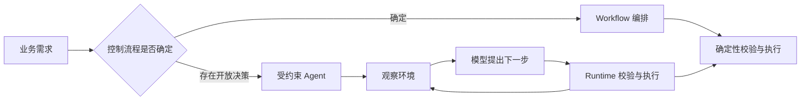

# Agent 和 Workflow 的本质区别是什么？

- ID：Q001
- 难度：基础 / 系统设计
- 标签：Agent、Workflow、架构选型、可靠性

## 同义问法

- 什么情况下用 Agent，什么情况下用 Workflow？
- LangChain Chain、工作流编排和自主 Agent 怎么选择？
- 为什么不把所有业务流程都交给 Agent？
- Agent 是不是比 Workflow 更高级？

## 来源

### 真实面试来源

1. 阿里 AI Agent 应用开发二面：`在开发中，你怎么判断任务该用 Workflow 还是自主决策的 Agent？`
   - https://www.nowcoder.com/feed/main/detail/0586b5317bd04dea80baac76fa027463
2. 美团大模型应用算法一面：`LangChain 框架和 Agent 在设计理念上有什么区别？在什么场景选择哪一种？`
   - https://www.nowcoder.com/feed/main/detail/4f6fe6d5c2954829ab92e6d876f430ec

### 技术依据

- Anthropic, Building Effective Agents：区分预定义代码路径的 workflow 与由模型动态决定过程和工具使用的 agent。
  - https://www.anthropic.com/research/building-effective-agents

## 面试官真正考察什么

表面是在考概念，实际是在判断候选人有没有 **工程边界感**：

- 会不会把 Agent 当成万能方案；
- 是否理解确定性、可靠性和灵活性之间的交换；
- 能不能把业务问题拆成“确定部分”和“不确定部分”；
- 是否做过真实系统，而不是只跑过框架 Demo。

<!-- mermaid-diagram:start -->

## 可视化图解



<!-- mermaid-diagram:end -->

## 先建立直觉

Workflow 是：

> 人提前决定怎么做，程序按步骤执行。

Agent 是：

> 人给出目标和边界，模型在运行时决定下一步做什么。

二者最本质的差异不是“有没有 LLM”，而是 **控制权在设计时还是运行时**。

一个 Workflow 完全可以在某个节点调用 LLM；一个 Agent 也可能运行在一个固定工作流里。因此：

- 使用了 LLM，不代表它就是 Agent；
- 有多个步骤，也不代表它就是 Agent；
- 真正的判断标准是：执行路径是否由模型根据当前环境动态选择。

## 核心回答

Workflow 和 Agent 是两种不同的控制方式。

### Workflow

流程图在设计时基本确定：

```text
输入
  ↓
节点 A
  ↓
条件判断
 ├─→ 节点 B
 └─→ 节点 C
```

它的优势是：

- 行为可预测；
- 容易测试和审计；
- 延迟、成本容易估算；
- 故障边界清晰；
- 适合强规则、强合规、重复性高的任务。

代价是：

- 未知分支需要不断补规则；
- 面对开放环境时流程容易膨胀；
- 很难穷举复杂任务的全部路径。

### Agent

运行时由模型根据目标、状态和观察结果选择动作：

```text
目标
  ↓
观察当前状态
  ↓
选择下一动作
  ↓
执行工具
  ↓
获得新观察
  └────────→ 再次决策
```

它的优势是：

- 能处理路径事先不明确的任务；
- 能根据环境反馈改变计划；
- 对自然语言目标和非结构化信息更友好。

代价是：

- 行为不完全确定；
- 容易误判、乱调工具或循环；
- 测试和复现更困难；
- 成本与延迟波动更大；
- 对权限、安全、评估要求更高。

## 不能只回答“固定和动态”

“Workflow 固定、Agent 动态”只是结论。面试中还需要说明：**动态决策为什么有价值，又为什么有风险。**

例如排查一次 CI/CD 发布失败：

- 确定步骤：获取任务信息、拉取日志、读取发布记录、查询 Pod 状态；
- 不确定步骤：根据异常判断下一步查代码、配置、网络、依赖还是资源；
- 高风险步骤：回滚、修改配置、重启生产服务。

合理设计不是纯 Workflow，也不是让 Agent 全权执行，而是：

```text
Workflow：保证证据采集和审批链路稳定
Agent：决定分析方向、整合证据、提出根因假设
人工/策略：批准高风险操作
```

这是一种混合控制架构。

## 如何做架构选型

可以用五个维度判断。

### 1. 路径的不确定性

- 路径基本可穷举：优先 Workflow。
- 路径依赖大量中间观察，难以穷举：考虑 Agent。

### 2. 错误代价

- 错误只导致一次低价值回答不佳：可提高 Agent 自主度。
- 错误可能导致资金、数据、权限或生产事故：降低自主度，增加审批和确定性约束。

### 3. 环境反馈是否重要

如果任务需要不断观察环境再调整，例如调试代码、浏览网页、故障诊断，Agent 更有价值。

如果只是固定转换，例如“读取合同 → 提取字段 → 写数据库”，Workflow 通常更合适。

### 4. 任务是否能被稳定验收

Agent 最适合结果能够被验证的环境：

- 代码能编译、测试；
- SQL 能校验；
- 页面操作能检查状态；
- 答案能对照事实来源。

如果结果很难验证，Agent 即使表现得很自信，也不等于完成正确。

### 5. 成本和吞吐要求

高频、低延迟、低毛利业务不适合无边界的多轮 Agent。需要限制步骤、缓存结果，或者把成熟路径固化成 Workflow。

## 一个更成熟的观点：Agent 会逐渐“固化”为 Workflow

在探索早期，Agent 可以帮助发现任务路径；当大量轨迹稳定后，可以把高频成功路径抽取成固定 Workflow，只把长尾异常留给 Agent。

因此二者不是静态二选一，而可能形成演化关系：

```text
未知任务
  ↓ Agent 探索
积累成功轨迹
  ↓ 归纳稳定路径
Workflow 固化
  ↓
长尾异常继续交给 Agent
```

这样既保留灵活性，也逐步提高可靠性和成本效率。

## 常见低质量回答

### 回答 1

> Agent 是智能的，Workflow 是死的。

问题：拟人化且没有工程含义。Workflow 的确定性恰恰是很多业务需要的能力。

### 回答 2

> 复杂任务用 Agent，简单任务用 Workflow。

问题：“复杂”没有定义。支付清算很复杂，但通常不能让 Agent 自主决定流程。

### 回答 3

> Agent 比 Workflow 更高级。

问题：把技术选型变成等级判断，暴露出缺乏可靠性和成本意识。

## 可直接口述的回答

> 我认为 Agent 和 Workflow 的本质区别是控制权放在哪里。Workflow 的执行路径主要在设计时由人和代码确定，Agent 则把一部分运行时决策交给模型，让它根据目标和环境反馈选择下一步动作。Workflow 的优势是确定、可测试、可审计，Agent 的优势是能处理路径难以穷举的开放任务，但代价是不确定性、成本和安全风险更高。因此生产系统一般不是二选一，而是混合架构：固定的数据获取、权限、审批和回滚用 Workflow；异常分析、路径探索和非结构化判断交给 Agent；高风险动作再加人工确认。选型时我主要看路径不确定性、错误代价、结果是否可验证、吞吐成本和合规要求。

## 结合个人项目怎么回答

可以结合 CI/CD 故障诊断 Agent：

> 我们一开始容易把所有异常规则都塞进提示词或流程，但发布失败原因组合很多，纯 Workflow 会不断膨胀。后来更合理的拆分是：平台固定完成 Jenkins 信息、日志、代码 Diff 和环境状态的采集；Agent 根据证据动态决定是否继续查依赖、配置或运行时；修改配置、重启、回滚等动作仍然走权限校验和人工确认。这样 Agent 负责不确定性，平台负责确定性和安全边界。

## 可能追问

### 为什么不用更强的模型把所有步骤都交给 Agent？

模型能力提升会降低部分错误，但不会消除权限、审计、幂等、成本和业务责任问题。系统边界不能依赖“模型大概率正确”。

### Workflow 里调用 LLM 算不算 Agent？

不一定。如果 LLM 只完成分类、提取或生成，而执行路径仍由代码决定，它仍然是 LLM Workflow。只有当模型参与运行时动作选择和循环控制时，才更接近 Agent。

### 怎么衡量 Agent 是否值得引入？

比较引入前后的任务成功率、人工处理时长、长尾覆盖率、错误代价、平均步骤数、P95 延迟和单任务成本，而不是只展示几个成功案例。

## 延伸知识

- Agent Runtime：负责循环、状态、工具、超时、恢复和追踪。
- Human-in-the-loop：在关键决策或高风险动作前设置人工断点。
- Evaluator-Optimizer：生成与评审循环，适合结果有明确评价标准的任务。
- Orchestrator-Workers：把可并行子任务分发给多个执行单元。