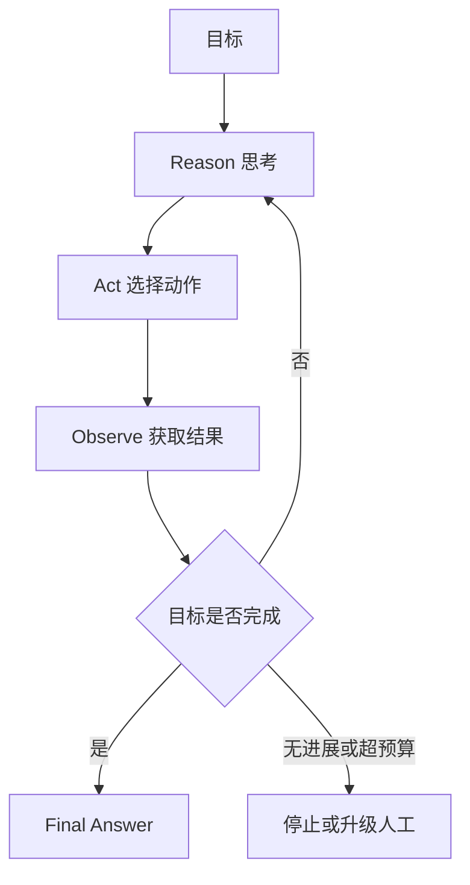

# ReAct 与 Agent Loop 为什么有效，又有什么局限？

- ID：Q002
- 难度：基础 / 进阶
- 标签：ReAct、Agent Loop、Planning、Reasoning、Tool Use

## 同义问法

- ReAct 范式是什么？有什么优缺点？
- 相比 CoT，ReAct 在与外部环境交互时解决了什么问题？
- Agent Loop 是怎么运行的？
- 为什么“思考—行动—观察”能够提高任务成功率？

## 来源

### 真实面试来源

1. 阿里 Agent 面经：`项目中使用了 ReAct，ReAct 范式是什么？有什么优缺点？`
   - https://www.nowcoder.com/enterprise/134/interview
2. 阿里 AI Agent 应用开发二面：`相比于 CoT，ReAct 在模型与外部环境交互时解决了什么问题？`
   - https://www.nowcoder.com/feed/main/detail/0586b5317bd04dea80baac76fa027463

### 技术依据

- ReAct: Synergizing Reasoning and Acting in Language Models
  - https://arxiv.org/abs/2210.03629
  - https://react-lm.github.io/

## 面试官真正考察什么

这道题不只是让你背出 `Thought → Action → Observation`，而是在考：

- 是否理解 LLM 推理和外部环境之间如何闭环；
- 是否知道 ReAct 解决了什么，又没有解决什么；
- 能否从论文范式过渡到生产级 Runtime；
- 是否意识到“让模型多想几步”不等于系统就可靠。

<!-- mermaid-diagram:start -->

## 可视化图解



<!-- mermaid-diagram:end -->

## 先建立直觉

纯 CoT 可以让模型在内部推理，但它所依据的信息仍然主要来自输入上下文和模型参数。

如果模型不知道当前线上 Pod 状态，它可以推理很多步，却仍然可能在错误事实之上继续推理。

ReAct 增加了外部行动：

```text
Reason：我需要确认 Pod 是否发生 OOM
Action：调用 kubectl / 监控查询工具
Observation：Pod 因 OOMKilled 重启
Reason：继续检查内存限制和最近变更
```

它的价值不只是“会调用工具”，而是让推理能够被真实环境持续校正。

## 核心机制

经典 ReAct 轨迹可以抽象为：

```text
目标
  ↓
Reason / Thought：当前知道什么，还缺什么
  ↓
Action：选择工具和参数
  ↓
Observation：获得环境反馈
  ↓
更新状态与计划
  ↓
继续行动或输出结果
```

论文中的关键思想是将 reasoning traces 和 task-specific actions 交错生成：

- 推理帮助模型维护计划、处理异常和决定下一步；
- 行动让模型访问知识库或环境，补充事实；
- 新观察反过来修正后续推理。

这比纯 CoT 多了一个 **可被环境纠错的通道**。

## 为什么 ReAct 有效

### 1. 降低闭门推理造成的事实错误

模型可以先查证再回答，而不是依赖参数记忆猜测。

### 2. 把长任务拆成局部决策

模型不必一开始就生成完整且正确的长计划，只需基于当前状态选择相对合理的下一步。

### 3. 支持异常恢复

工具失败、结果为空或假设被否定后，模型有机会调整路径。

### 4. 轨迹更容易调试

系统可以观察每一次工具选择、参数、结果和状态变化，定位失败发生在哪一环。

但注意：可观察到工具轨迹，不代表必须向用户展示模型完整内部推理。生产系统更应该记录结构化决策依据和事件，而不是依赖自由文本 Thought 作为唯一审计证据。

## ReAct 没有解决什么

### 1. 它不保证推理正确

模型仍可能：

- 选错工具；
- 生成错误参数；
- 错误解释工具结果；
- 过早停止；
- 在失败路径中循环。

ReAct 提供了纠错机会，不提供正确性证明。

### 2. 它不天然具备全局规划能力

局部一步一步走，可能导致：

- 早期方向错误后越走越远；
- 重复查询同一信息；
- 忘记原始目标；
- 为局部最优牺牲整体目标。

长任务通常需要将全局计划、局部执行和阶段性复盘结合起来。

### 3. 它会放大成本和延迟

每一轮都可能包含：

- 一次模型推理；
- 一次或多次外部调用；
- 工具结果重新进入上下文。

任务步数增加后，成本和 P95 延迟会快速上涨。

### 4. 工具反馈可能污染判断

工具结果可能过长、格式混乱、包含恶意文本或不可信内容。模型不应把 Observation 默认当成可信指令。

### 5. 自由循环缺少工程边界

论文范式中的循环在生产中必须补充：

- 最大步数；
- Token 和费用预算；
- 超时；
- 重复动作检测；
- 状态持久化；
- 权限和审批；
- 可重试与不可重试错误分类；
- 终止条件。

## 从 ReAct 范式到生产级 Agent Loop

一个生产级循环更像状态机，而不是简单的 `while true`：

> 对应流程已改为上方 Mermaid 图解。

状态机的价值是：

- 可以恢复中断任务；
- 能区分模型错误和工具错误；
- 能记录每一步的输入输出；
- 能限制循环边界；
- 能对高风险动作设置人工断点。

## Planning 与 ReAct 的关系

二者不是互斥的。

常见组合有三种：

### 1. 纯 ReAct

每次只决定下一步。适合短任务或探索性较强、环境变化快的任务。

### 2. Plan-and-Execute

先生成整体计划，再逐步执行。适合目标较清晰、步骤较多的任务，但计划可能在环境变化后过时。

### 3. 分层规划

先生成粗粒度阶段，每个阶段内部用 ReAct 执行，并在阶段结束时重新规划。

这通常比一次生成几十步计划更稳健。

## 常见低质量回答

### 回答 1

> ReAct 就是模型先思考，再调用工具。

问题：只描述形式，没有说明环境反馈如何纠正推理，也没有讨论局限。

### 回答 2

> ReAct 能解决幻觉。

问题：只能缓解部分因信息缺失导致的幻觉。模型仍可能错误选择、错误解释或编造工具参数。

### 回答 3

> ReAct 比 CoT 更好。

问题：不是所有任务都需要工具。对封闭、短小、纯推理任务，引入工具循环可能只增加复杂度。

## 可直接口述的回答

> ReAct 的核心是把推理和行动交错进行。相比纯 CoT 只在模型内部推理，ReAct 允许模型根据当前信息选择工具，拿到环境反馈后再更新判断，所以它能减少在错误事实上持续推理的问题，也能在工具失败或假设被否定时调整路径。但 ReAct 只是一种交互范式，不等于生产级 Agent。它仍然会选错工具、误解结果、陷入循环，而且多轮调用会增加成本和延迟。工程上我会把它落到有状态的 Runtime 中，补充最大步数、预算、重复动作检测、错误分类、状态持久化、人工审批和明确的终止条件。对于长任务，我更倾向粗粒度 Planning 加阶段内 ReAct，而不是无限自由循环。

## 结合个人项目怎么回答

以 CI/CD 故障诊断为例：

> Agent 初始只知道“发布失败”，它先获取 Jenkins 日志；观察到依赖下载异常后，再检查仓库配置和网络；如果发现错误与最近代码变更无关，就不会继续无意义地分析 Diff。这个过程体现了 ReAct 的价值：下一步由新证据决定。但系统不能让它无限查日志，因此我们还需要设置证据完成度、最大步骤、重复查询检测，并把日志采集、权限校验等确定性动作交给 Runtime。

## 可能追问

### ReAct 和 Function Calling 是什么关系？

ReAct 是决策与交互范式；Function Calling 是模型表达结构化工具调用的一种机制。可以使用 Function Calling 实现 ReAct 的 Action，但二者不是同一个概念。

### 是否必须保存 Thought？

不必须。工程上更重要的是保存任务状态、工具调用、参数、结果、错误、决策标签和终止原因。自由文本 Thought 可能不稳定，也可能包含敏感信息。

### 如何减少 ReAct 的步骤数？

- 改善工具描述和参数设计；
- 在进入循环前检索关键上下文；
- 并行执行互不依赖的查询；
- 对高频路径做 Workflow 固化；
- 阶段性摘要，避免模型反复读取全部历史；
- 使用进度评估器判断是否需要继续。