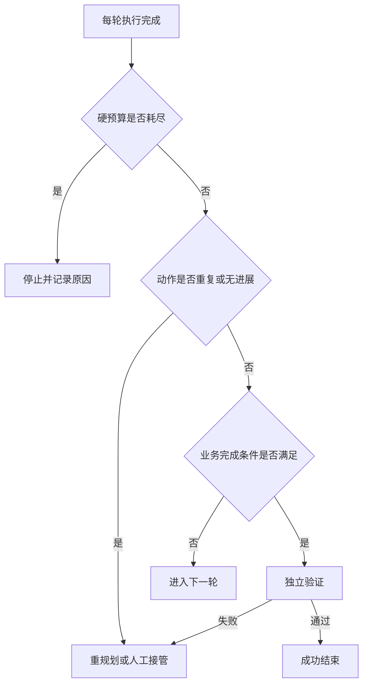

# Agent 如何判断信息已经足够，并避免死循环？

- ID：Q003
- 难度：进阶
- 标签：停止条件、循环控制、证据充分性、预算、故障恢复

## 同义问法

- Agent 如何判断任务完成？
- Agent 如何知道已经收集到足够信息？
- Agent 陷入死循环怎么处理？
- 如何避免 Agent 重复调用同一个工具？
- 长任务什么时候应该停止、降级或交给人工？

## 来源

### 真实面试来源

1. 字节跳动多模态算法面经：
   - `Agent 是如何判断已经收集了足够的信息，并最终给出输出结论的？`
   - `遇到 Agent 陷入死循环时，你是怎么处理的？`
   - 汇总来源：https://www.nowcoder.com/discuss/877151327091027968
2. 阿里 Agent 开发面经：`若发现项目中模型执行不成功，会如何处理？`
   - https://www.nowcoder.com/feed/main/detail/07cdc6940fa94a1d99c24762c56b2b05

## 面试官真正考察什么

这道题在区分两类候选人：

- 只写过 `while model.tool_call` Demo 的人；
- 真正考虑过任务边界、失败恢复、成本和线上可靠性的人。

所谓“Agent 自主完成任务”，最终必须落到两个判断：

1. **什么时候继续？**
2. **什么时候结束，以及以什么状态结束？**

如果这两个问题没有明确设计，Agent 就不是一个可控系统。

<!-- mermaid-diagram:start -->

## 可视化图解



<!-- mermaid-diagram:end -->

## 先建立直觉

人排查故障时，不是“查到不想查了”才停止，而是满足某种条件：

- 已找到能解释现象的根因；
- 关键证据之间相互一致；
- 替代假设已经被排除；
- 后续查询的预期收益很低；
- 时间或权限不允许继续；
- 需要其他人提供信息。

Agent 也需要类似的停止逻辑，但不能只靠模型一句“我认为完成了”。

## 核心回答

停止条件应该是 **模型判断 + 程序约束 + 任务验收器** 的组合。

```text
模型判断：当前是否已有足够证据
程序约束：步数、时间、Token、费用、权限是否超限
任务验收器：结果是否满足可检查的完成标准
```

任何单一机制都不够：

- 只信模型：可能过早结束或无限探索；
- 只看最大步数：只能强行截断，不能判断是否完成；
- 只看工具是否成功：工具成功不代表目标完成。

## 先定义“完成”是什么

停止控制的第一步不是写循环，而是定义任务完成协议。

例如“分析发布失败原因”，完成结果至少应包含：

- 失败阶段；
- 直接错误；
- 根因假设；
- 支撑证据；
- 置信度或不确定项；
- 建议的下一步动作。

可以把它结构化为：

```json
{
  "status": "completed | partial | blocked | failed",
  "root_cause": "...",
  "evidence": ["..."],
  "remaining_uncertainty": ["..."],
  "next_action": "..."
}
```

有了完成协议，系统才能判断输出是否缺字段、证据是否不足，而不是依赖一段看起来流畅的文字。

## 四类停止条件

### 1. 目标满足型

任务已达到验收标准。

示例：

- 代码修改后指定测试通过；
- 工单已经创建并返回 ID；
- 找到错误发生时间、根因和证据链；
- RAG 回答中关键结论都有来源支持。

这是最理想的成功停止。

### 2. 信息收益耗尽型

模型尚不能完全确定，但继续行动很难获得新信息。

可判断：

- 多次查询返回相同结果；
- 候选工具均已调用；
- 剩余假设需要当前系统无法访问的数据；
- 最近若干步骤没有降低不确定性。

这时应以 `partial` 或 `blocked` 结束，而不是编造确定结论。

### 3. 资源边界型

达到硬限制：

- 最大步骤数；
- 最大运行时间；
- Token 或金额预算；
- 最大工具调用数；
- 单工具重试上限。

硬限制是安全护栏，不是任务完成标准。触发后应该输出已经得到的证据和未完成原因。

### 4. 风险升级型

下一步涉及：

- 修改生产配置；
- 删除数据；
- 发送外部消息；
- 支付、转账；
- 提权或读取敏感信息。

这时不是失败，而是进入 `waiting_approval`，由人工或策略系统决定是否继续。

## 如何判断“证据已经足够”

### 方法一：覆盖必要槽位

为任务定义必需信息槽位。

例如故障诊断：

```text
现象、时间、影响范围、错误位置、直接原因、变更关联、证据
```

只有关键槽位达到要求才允许生成最终结论。

优点：可控、容易实现。
缺点：对开放任务需要人工设计任务 Schema。

### 方法二：假设—证据表

让 Agent 维护候选假设：

| 假设 | 支持证据 | 反对证据 | 状态 |
|---|---|---|---|
| 代码异常 | 新版本刚发布 | 错误发生在发布前 | 排除 |
| 依赖仓库故障 | 多服务同时下载失败 | 无 | 高可能 |

当一个假设能够解释主要现象，且关键替代假设已被排除时，可以结束。

这比“模型觉得够了”更透明。

### 方法三：独立验收器

由规则、测试或另一个模型评估：

- 答案是否回应原目标；
- 是否缺少关键证据；
- 是否存在未验证的断言；
- 是否需要继续调用工具。

但要注意，另一个模型也会犯错。验收器最好尽量依赖可验证信号，例如测试结果、Schema、引用覆盖率，而不是纯主观打分。

### 方法四：边际信息增益

比较最近动作是否带来了新事实或降低了不确定性。

如果连续 N 次动作：

- 没有新增证据；
- 没有改变假设排序；
- 没有推进任务状态；

则判定为停滞。

## 如何检测死循环

死循环不只是一模一样的工具重复调用，还包括语义上的重复。

### 1. 动作指纹

对 `工具名 + 规范化参数` 生成指纹：

```text
hash(tool_name, normalized_arguments)
```

同一指纹重复超过阈值，且环境版本未变化，直接阻止或要求解释为什么重试。

### 2. 状态无进展检测

记录每一步是否产生：

- 新证据；
- 新状态；
- 新文件变更；
- 新的假设更新。

连续多步无进展，比只检查重复调用更有效。

### 3. 轨迹模式检测

识别循环：

> 对应流程已改为上方 Mermaid 图解。

即使参数略有不同，也可能是策略振荡。

### 4. 工具错误分类

不要对所有错误无脑重试：

- 临时错误：超时、限流、网络抖动，可退避重试；
- 参数错误：先修正参数；
- 权限错误：重试无意义，应升级；
- 资源不存在：需要换路径或结束；
- 业务拒绝：必须尊重，不可绕过。

### 5. 预算递减

每一步都消耗预算。Agent 决策时应能看到剩余步数、时间或费用，避免在最后阶段启动无法完成的新分支。

## 生产级状态设计

建议至少区分：

```text
SUCCEEDED：满足验收条件
PARTIAL：有可用结果，但仍有不确定性
BLOCKED：缺权限、缺数据或等待外部依赖
WAITING_APPROVAL：等待人工审批
FAILED：发生不可恢复错误
BUDGET_EXHAUSTED：达到资源上限
CANCELLED：用户或系统取消
```

“不是成功就是失败”的二元状态会丢失大量有价值信息。

## 常见低质量回答

### 回答 1

> 设置最大循环次数，比如 10 次。

问题：只能防止无限运行，不能判断信息是否充分，也无法解释为什么结束。

### 回答 2

> 让模型自己判断是否完成。

问题：模型可能过早自信，也可能不断探索。完成判断需要外部可验证信号。

### 回答 3

> 工具失败就重试三次。

问题：权限错误、参数错误和业务拒绝重试三次都没有意义，甚至可能产生副作用。

## 可直接口述的回答

> 我不会把停止条件只交给模型，也不会只设一个最大步数。比较稳妥的做法是三层：第一层先定义任务完成协议，例如故障诊断必须包含根因、证据和剩余不确定性；第二层通过规则、测试或独立验收器检查结果是否满足标准；第三层设置最大步骤、时间、Token 和费用等硬边界。为了避免死循环，我会对工具和规范化参数做动作指纹，同时检测连续步骤是否产生新证据或状态变化，并区分临时错误、参数错误、权限错误和业务拒绝，只有临时错误才自动重试。最终状态也不只成功或失败，还包括 partial、blocked、waiting approval 和 budget exhausted，这样系统能够可控地结束并保留已有成果。

## 结合个人项目怎么回答

> 在发布故障分析中，不能因为日志里出现一个 Exception 就宣布找到根因。我们可以要求至少确认失败阶段、第一条关键异常、异常与上下游错误的因果关系，以及是否和最近变更相关。Agent 每次查日志或代码都要更新假设—证据表；连续查询没有新增证据时就停止。如果缺少生产监控权限，则返回 blocked，并明确需要哪项数据，而不是继续猜测。

## 可能追问

### 最大步数设置多少合适？

没有通用数字。应基于离线成功轨迹的步骤分布、任务价值、单步成本和 P95 延迟设置，并按任务类型分级。

### 用另一个 LLM 做 Judge 就够了吗？

不够。LLM Judge 适合评估语义质量，但对代码、数据和操作结果，应优先使用测试、Schema、约束检查和环境状态等确定性信号。

### 用户中途修改目标怎么办？

把目标版本化。新指令到达后重新判断现有计划是否仍有效，必要时取消未执行动作，避免旧计划继续产生副作用。