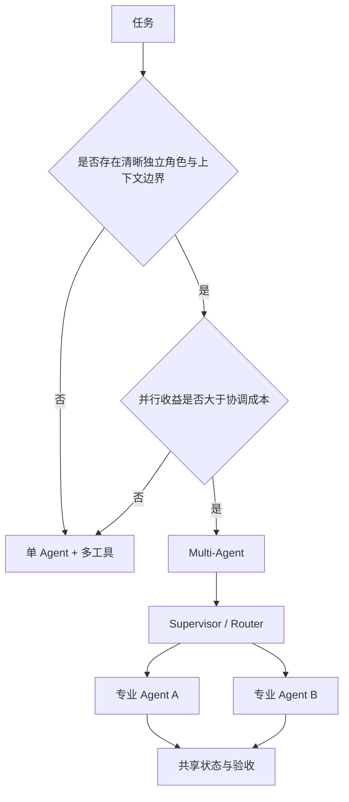

# 什么时候用单 Agent，什么时候用 Multi-Agent？

- ID：Q006
- 难度：进阶 / 系统设计
- 标签：Multi-Agent、Orchestrator、Handoff、并发、状态一致性

## 同义问法

- 单 Agent 的瓶颈是什么？
- Multi-Agent 常见协作模式有哪些？
- 多 Agent 怎么编排和通信？
- Router 如何选择子 Agent？
- 多 Agent 一定比单 Agent 效果好吗？

## 来源

### 真实面试来源

1. 蚂蚁 Agent 开发一面：
   - `什么情况下用单 Agent，什么情况下用多 Agent？`
   - `多 Agent 之间的数据传输或通信怎么做？`
   - `多个 Agent 并发操作数据库或文件怎么处理？`
   - https://www.nowcoder.com/discuss/877151327091027968
2. 阿里 AI Agent 应用开发二面：
   - `单 Agent 面对长任务时，引入 Multi-Agent 的优势是什么？`
   - `Router 节点如何决定分发给哪个子 Agent？`
   - https://www.nowcoder.com/feed/main/detail/0586b5317bd04dea80baac76fa027463

## 面试官真正考察什么

这道题在考候选人是否会因为“多 Agent”听起来高级就过度设计。

真正要回答的是：

- 任务为什么需要拆分；
- 拆分后是否真的带来能力、并行度或上下文隔离收益；
- 协作成本、错误传播和状态一致性如何控制；
- 多 Agent 是模型角色，还是普通的软件模块换了名字。

<!-- mermaid-diagram:start -->

## 可视化图解



<!-- mermaid-diagram:end -->

## 先建立直觉

多 Agent 不是让多个模型开会。

它更接近分布式系统中的职责拆分：

- 每个执行单元有清晰输入、输出和权限；
- 通过协议传递结构化结果；
- 编排器负责依赖、超时、失败和合并；
- 只有拆分收益大于协作成本时才值得使用。

如果一个 Agent 加几个工具就能稳定完成任务，多 Agent 通常只会增加成本和故障点。

## 核心判断标准

### 适合单 Agent 的场景

- 目标单一，步骤数量有限；
- 工具集不大，权限边界相近；
- 上下文可以由一个执行器管理；
- 子任务强依赖，难以并行；
- 结果验收简单；
- 调试和成本优先。

例如：查询订单状态并解释原因，没有必要拆成“订单 Agent”“解释 Agent”“回复 Agent”。

### 适合 Multi-Agent 的场景

#### 1. 子任务天然可以并行

例如调研任务可以同时检索：

- 市场信息；
- 竞品信息；
- 技术方案；
- 法规风险。

并行能显著降低总耗时或增加搜索覆盖率。

#### 2. 上下文和工具域差异很大

代码 Agent、数据库 Agent、运维 Agent 各自需要不同工具、权限和领域上下文。拆分可以避免一个 Agent 的工具列表和 Prompt 无限膨胀。

#### 3. 需要独立生成与审查

例如：

```text
Coder → Reviewer → Fixer
```

审查者与生成者独立，能降低同一上下文中的确认偏差。但 Reviewer 仍需要可靠标准，不能只是换一个提示词重复判断。

#### 4. 权限必须隔离

读取生产日志与执行回滚可以由不同 Agent/执行域承担，后者拥有更严格的授权和审批。

#### 5. 单 Agent 出现稳定的能力瓶颈

例如长任务中持续发生：

- 目标漂移；
- 工具选择混乱；
- 上下文干扰；
- 无法并行；
- 专业领域错误。

应先通过数据证明瓶颈，再拆分，而不是从架构图开始。

## 常见协作模式

### 1. Router / Handoff

根据请求将任务交给一个专业 Agent。

```text
用户请求 → Router → Coding / Data / Ops Agent
```

适合领域边界清晰的场景。

风险：Router 错分后，后续 Agent 可能在错误域内自信执行。

### 2. Orchestrator-Workers

主 Agent 拆解任务，Worker 并行执行，主 Agent 汇总。

适合子任务数量和内容在运行时才能确定的复杂任务。

风险：任务拆解错误会系统性影响所有 Worker；汇总阶段可能丢失证据。

### 3. Pipeline

前一个 Agent 的输出是下一个的输入。

```text
需求分析 → 代码生成 → 测试 → Review
```

适合阶段明确、每阶段专业能力不同的任务。

风险：早期错误会逐级放大，需要每个阶段有验收和回退。

### 4. Parallel Voting / Debate

多个 Agent 独立产生答案，再聚合。

适合高价值且可比较的判断，但成本高，而且多个 Agent 可能共享同样的模型偏差。

### 5. Shared Blackboard

Agent 通过共享状态或任务板协作，适合动态任务分配。

风险接近分布式系统：并发写、过期状态、重复消费和冲突合并。

## Multi-Agent 的代价

### 1. 通信成本

每次 Handoff 都需要重新提供目标、上下文和产物。传太少会丢信息，传太多又回到上下文膨胀。

### 2. 错误传播

上游错误输出可能被下游当成事实。需要区分：

- 原始证据；
- 上游结论；
- 未验证假设。

### 3. 可观测性更复杂

必须追踪：

- 谁创建了子任务；
- 输入上下文版本；
- 使用的模型与工具；
- 依赖关系；
- 重试和取消；
- 汇总时采用或丢弃了哪些结果。

### 4. 成本和延迟

并行能降低墙钟时间，但通常增加总 Token 和调用量。串行 Multi-Agent 甚至可能同时增加延迟和成本。

### 5. 状态一致性

多个 Agent 修改同一文件或数据库时会产生冲突。LLM 编排不能替代：

- 事务；
- 锁；
- 乐观并发控制；
- 版本号；
- 幂等键；
- 单写者原则。

## Agent 之间应该传什么

优先传结构化任务包，而不是整段聊天记录：

```json
{
  "task_id": "subtask-03",
  "goal": "分析最近一次发布的依赖变化",
  "constraints": ["只读"],
  "inputs": [
    {"type": "git_diff", "uri": "artifact://diff/123"}
  ],
  "expected_output": {
    "findings": "array",
    "evidence": "array",
    "uncertainty": "array"
  },
  "deadline": "..."
}
```

传递引用而非复制大文件；传事实、约束和验收标准，而不是要求子 Agent 猜主 Agent 的真实意图。

## Router 如何设计

可从简单到复杂：

1. 规则路由：明确关键词、资源类型、权限域。
2. 轻量分类模型：输出固定类别和置信度。
3. LLM 路由：适合语义复杂场景，但必须限制候选和输出 Schema。
4. 混合路由：规则处理高确定性请求，LLM 处理长尾。

低置信度时可以：

- 询问用户；
- 选择只读通用 Agent；
- 并行请求两个候选但禁止副作用；
- 返回无法路由，而不是随机选一个。

## 如何判断拆分是否有效

做 A/B 或离线轨迹对比：

- 任务成功率是否提升；
- 端到端 P95 是否下降；
- 总 Token 和成本是否可接受；
- 错误定位是否更容易；
- 子任务失败是否可独立重试；
- 上下文是否明显缩小；
- 是否出现更多通信和一致性问题。

如果只让架构图更复杂，没有指标收益，就不应该拆。

## 常见低质量回答

### 回答 1

> 复杂任务用 Multi-Agent，简单任务用单 Agent。

问题：没有说明复杂度来自哪里，也没有权衡协作成本。

### 回答 2

> 多 Agent 可以互相纠错，所以更准确。

问题：多个相同模型可能共享同一偏差，讨论也可能产生错误共识。

### 回答 3

> 每个角色一个 Agent。

问题：把提示词角色扮演当成系统边界。职责拆分必须对应独立上下文、工具、权限或执行收益。

## 可直接口述的回答

> 我默认先用单 Agent，因为它更容易调试、成本更低。只有出现明确收益时才引入 Multi-Agent，主要包括：子任务可以并行、工具和上下文域差异很大、需要独立生成与审查、权限必须隔离，或者单 Agent 已被数据证明存在目标漂移和工具混乱。常见模式有 Router、Orchestrator-Workers、Pipeline 和独立评审。拆分后 Agent 之间应传结构化任务包和产物引用，而不是整段对话。多个 Agent 并发操作文件或数据库时仍要用版本控制、事务、锁和幂等，不能让 LLM 自己协调。最后需要通过成功率、P95、总成本、上下文大小和故障定位能力证明多 Agent 确实优于单 Agent。

## 结合个人项目怎么回答

> 在 Coding/CI/CD 场景里，可以先让一个主 Agent 负责目标和证据整合，把日志分析、代码 Diff 分析、环境状态查询作为工具，而不是马上拆多个 Agent。只有当各部分上下文明显独立、可以并行，或者代码修改和生产操作需要权限隔离时，再拆成分析 Worker、代码 Worker 和执行 Agent。生产写操作采用单写者和审批机制，避免多个 Agent 同时修改环境。

## 可能追问

### 主 Agent 挂了怎么办？

任务状态和子任务结果应持久化在 Runtime，不应只存在主 Agent Context 中。新的 Orchestrator 可以从状态恢复。

### 子 Agent 返回冲突结论怎么办？

优先比较原始证据、数据时间和来源可信度；必要时触发定向验证任务，不要只让主 Agent凭语言风格选一个。

### Multi-Agent 和微服务有什么区别？

微服务主要按确定性业务能力拆分；Agent 拆分强调模型决策域、上下文、工具和权限。二者都需要清晰协议、可观测性和故障隔离。