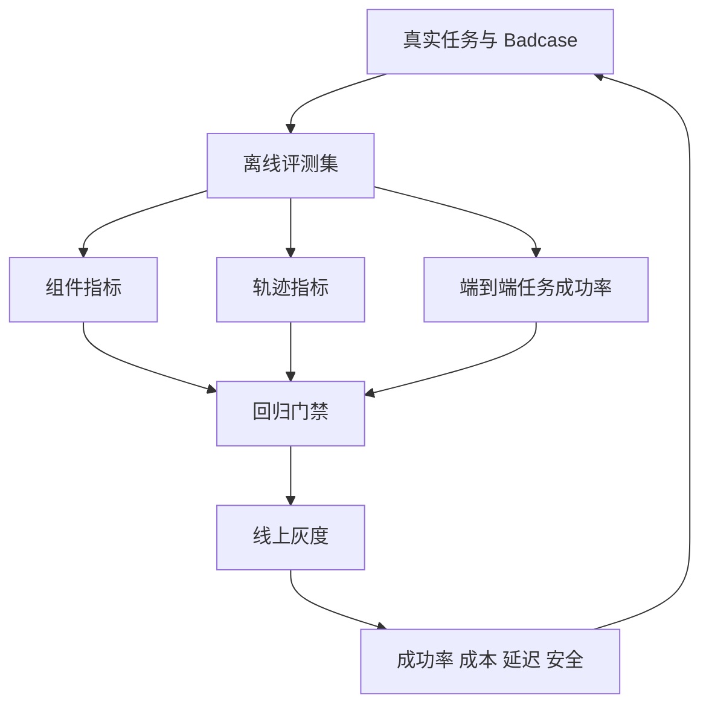

# 如何建立 Agent 评估体系？

- ID：Q007
- 难度：进阶 / 系统设计
- 标签：Evaluation、Trace、成功率、轨迹评估、LLM Judge、线上指标

## 同义问法

- 如何量化评估一个 Agent 系统的好坏？
- Agent 评估应该包含哪些维度？
- 如何分别衡量 Planning、工具调用和幻觉？
- 除了生成质量，还应该关注什么？
- Agent 上线后如何持续迭代？

## 来源

### 真实面试来源

1. 阿里淘天 Agent 面经：`Agent 评估体系包括哪些维度？如何衡量 planning 能力 vs hallucination rate？`
   - https://www.nowcoder.com/feed/main/detail/78d6c8c30f1741e6b0a1a02d7b4bbfab
2. 阿里 AI Agent 应用开发二面：
   - `如何量化评估一个 Agent 系统的好坏？`
   - `除了生成质量，还应该关注哪些维度？`
   - https://www.nowcoder.com/feed/main/detail/0586b5317bd04dea80baac76fa027463
3. 阿里 Agent 面经：`如何设计评价 Agent 系统好坏的指标体系？`
   - https://www.nowcoder.com/enterprise/134/interview

### 技术依据

- OpenAI Agents SDK Tracing：记录模型生成、工具调用、Handoff、Guardrail 和自定义事件。
  - https://openai.github.io/openai-agents-python/tracing/

## 面试官真正考察什么

这道题不是问“准确率多少”，而是在考候选人是否理解 Agent 是一个多步骤系统：

- 最终答案错误，可能是检索、规划、工具、参数、执行、观察解释或终止判断中的任何一环；
- 只评最终文本，无法定位系统应该改哪里；
- 只看几个 Demo，无法证明线上可靠性；
- 指标必须和业务风险、成本、延迟一起权衡。

<!-- mermaid-diagram:start -->

## 可视化图解



<!-- mermaid-diagram:end -->

## 先建立直觉

评估 Agent 类似评估一条生产流水线：

- 最终产品是否合格；
- 中间每道工序是否正确；
- 出错后能否恢复；
- 生产一个合格结果需要多少时间和成本；
- 是否发生安全或合规事故。

因此 Agent 评估至少要同时看 **结果、过程、系统和业务**。

## 四层评估框架

### 第一层：任务结果

回答“最后有没有把事情做成”。

常见指标：

- Task Success Rate；
- 完成质量；
- 事实正确性；
- 约束满足率；
- 代码测试通过率；
- 操作后目标状态达成率；
- 人工验收通过率。

任务成功必须有明确判定器。

例如 Coding Agent：

```text
修改完成 ≠ 输出了代码
成功 = 目标测试通过 + 未破坏已有关键测试 + Diff 符合范围
```

### 第二层：执行轨迹

回答“它是怎么做成或做错的”。

可评估：

- Planning 步骤是否覆盖必要子目标；
- 工具选择准确率；
- 参数正确率；
- 不该调用工具时的克制能力；
- 重复调用率；
- 无进展步骤比例；
- 错误恢复成功率；
- 终止判断准确率；
- 证据是否真正支持结论。

轨迹指标用于定位问题，不一定都直接成为业务 KPI。

### 第三层：系统质量

回答“能否稳定、经济地运行”。

- 平均和 P95/P99 延迟；
- Token 与金额成本；
- 工具调用次数；
- 超时率、失败率、重试率；
- 状态恢复成功率；
- 并发和吞吐；
- 缓存命中率；
- 可观测性覆盖率。

平均延迟往往不够，Agent 的长尾步骤会让 P95 更重要。

### 第四层：安全与业务价值

- 越权调用率；
- 敏感信息泄漏率；
- Prompt Injection 成功率；
- 高风险操作误执行率；
- 人工升级率；
- 用户任务完成时间下降；
- 人工节省时长；
- 业务转化或故障恢复时间改善；
- 错误造成的实际损失。

技术指标提高，不代表业务一定受益。

## Planning 能力怎么评估

不能只让 LLM Judge 判断“计划看起来合理”。可以拆成：

### 1. 子目标覆盖率

计划是否覆盖完成任务所需的关键步骤。

例如故障诊断是否包含：现象确认、时间线、关键错误、变更关联和证据验证。

### 2. 依赖正确性

是否在前置信息缺失时执行了后续动作。

### 3. 动作必要性

是否存在明显冗余步骤。

### 4. 动态调整能力

新证据否定原计划后，能否及时修改，而不是继续机械执行。

### 5. 可执行性

计划中的工具和数据是否真实可用，参数是否能从上下文获得。

## 幻觉怎么评估

Agent 幻觉不能只看最终答案，还包括：

- 编造不存在的工具；
- 编造工具参数；
- 声称执行了实际上没执行的动作；
- 虚构工具返回结果；
- 把假设写成已确认事实；
- 引用与结论不一致。

可以按声明进行事实核验：

> 对应流程使用 Mermaid 图解展示。

“有引用”不等于“引用支持结论”。

## 离线评估集怎么构建

### 数据来源

- 历史真实任务和故障单；
- 线上失败轨迹；
- 专家设计的边界场景；
- 工具异常和权限场景；
- 对抗样本；
- 合成数据补充低频分支。

### 数据结构

每个 Case 最好包含：

```json
{
  "input": "任务输入",
  "environment_fixture": "固定环境或 Mock 数据",
  "expected_outcome": "最终目标",
  "required_evidence": ["..."],
  "forbidden_actions": ["..."],
  "acceptable_paths": ["..."],
  "risk_level": "high"
}
```

不要强制 Agent 必须走唯一轨迹，只要结果正确、约束满足、过程安全即可。

## 确定性评估与 LLM Judge

### 优先确定性评估

能用以下方式判断时，不要先用 LLM：

- 单元测试、集成测试；
- Schema 校验；
- 数据库状态；
- API 返回；
- 精确字段匹配；
- 权限策略；
- 规则和静态分析。

### LLM Judge 适用场景

- 回答完整性；
- 解释是否清楚；
- 计划是否合理；
- 语义是否忠实；
- 多个可接受答案之间的质量比较。

### LLM Judge 的风险

- 偏爱冗长和特定写法；
- 同源模型偏差；
- 分数漂移；
- 对事实错误不敏感；
- Prompt 轻微变化影响结果。

需要：

- 明确 Rubric；
- 与人工标注校准；
- 盲测；
- 多次采样或多评委；
- 定期检查 Judge 与业务指标的一致性。

## 轨迹可观测性

没有 Trace，就很难评估 Agent。

至少记录：

- task/run/span ID；
- 模型和 Prompt 版本；
- 输入上下文摘要和引用；
- 每次工具名、参数、结果、耗时和错误；
- Handoff；
- Guardrail 结果；
- 状态变化；
- Token、费用和缓存；
- 最终状态与终止原因。

敏感数据应脱敏或关闭采集，不能为了调试无限记录用户数据。

## 上线前后的闭环


评估集必须吸收线上失败，否则很快与真实问题脱节。

## 如何做版本对比

同一批 Case 下比较：

- 成功率变化；
- 安全指标是否退化；
- P95 和成本；
- 失败类型分布；
- 统计置信区间；
- 高风险 Case 是否全部通过。

不能只报告总体分数提升，因为平均值可能掩盖关键场景退化。

## 常见低质量回答

### 回答 1

> 用准确率、召回率、F1。

问题：没有明确这些指标对应 Agent 的哪个环节，也没有任务、轨迹和系统分层。

### 回答 2

> 用 GPT-4 打分。

问题：把 Judge 当成万能真值，没有确定性校验和人工校准。

### 回答 3

> 看最终回答是否正确。

问题：无法区分偶然答对和过程可靠，也无法定位工具、规划或终止错误。

## 可直接口述的回答

> 我会把 Agent 评估分成四层。第一层是任务结果，例如任务成功率、事实正确性、约束满足和测试通过；第二层是执行轨迹，例如计划覆盖、工具选择和参数正确率、重复调用、错误恢复和终止判断；第三层是系统指标，包括 P95 延迟、Token 成本、超时、重试和恢复；第四层是安全与业务价值，例如越权率、敏感信息泄漏、人工节省时间和真实业务效果。能用测试、Schema 和环境状态判断的优先用确定性评估，语义质量再用经过人工校准的 LLM Judge。所有运行需要有 Trace，线上失败要回流成新的离线 Case，形成回归闭环。

## 结合个人项目怎么回答

> 对 CI/CD 故障诊断 Agent，我不会只看根因答案像不像。结果层要看根因是否被后续人工确认、证据是否正确；轨迹层看是否定位第一关键异常、是否重复读取日志、是否错误关联代码 Diff；系统层看 30 秒内完成比例、成本和失败率；安全层确保它只读且不越权。每次人工推翻 Agent 结论，都应该沉淀成回归 Case。

## 可能追问

### Agent 路径很多，怎么定义标准轨迹？

不要求唯一轨迹。定义必要证据、禁止动作、资源预算和最终结果，允许多条合法路径。

### 线上没有 Ground Truth 怎么办？

结合延迟反馈、用户修正、人工抽检、任务后状态、客服或工单结果构造弱标签，并对高风险任务保留人工审核。

### 成功率和成本怎么权衡？

按任务价值和风险分层。高价值任务允许更高 test-time compute；低价值高频任务限制步骤，必要时降级到 Workflow 或小模型。