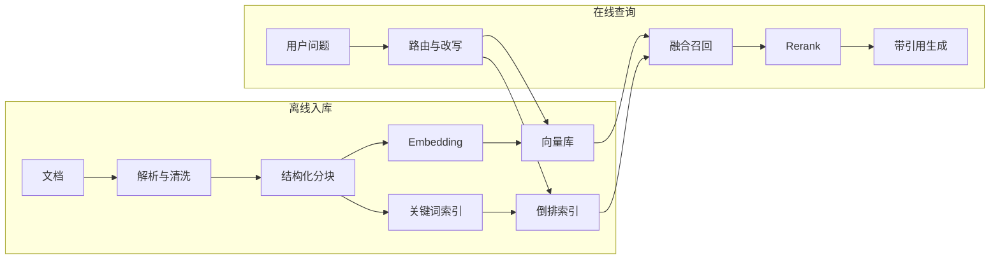

# 如何设计一个生产可用的 RAG 系统？

- ID：Q008
- 难度：进阶 / 系统设计
- 标签：RAG、切分、混合检索、Rerank、评估、知识治理

## 同义问法

- 介绍 RAG 全流程，最难的环节是什么？
- RAG 为什么召回不到？如何优化？
- 如何评估 RAG 是否有效？
- 一万个长文档如何构建知识库？
- RAG 知识库如何不停服更新？
- 大上下文会不会取代 RAG？

## 来源

### 真实面试来源

1. 阿里大模型 Agent 一面：RAG 流程、分类、评估、GraphRAG 与增量场景。
   - https://www.nowcoder.com/feed/main/detail/9d63b88b260c4aa9876a62e435de3c3f
2. 阿里 Agent 面经：`处理一万个长文档构建 RAG 知识库，怎么做？`
   - https://www.nowcoder.com/enterprise/134/interview
3. 字节相关面经：`RAG 知识来源、清洗、打标、上线、清退的完整运维路径是什么？`
   - https://www.nowcoder.com/discuss/857726328517169152
4. 美团大模型应用算法一面：混合检索、HyDE、结构感知切分、Reranker 与 Golden Dataset。
   - https://www.nowcoder.com/feed/main/detail/4f6fe6d5c2954829ab92e6d876f430ec
5. 阿里 AI Agent 应用开发二面：`随着上下文窗口扩大，RAG 会被完全取代吗？`
   - https://www.nowcoder.com/feed/main/detail/0586b5317bd04dea80baac76fa027463

## 面试官真正考察什么

宽泛地问“介绍 RAG”，通常不是想听：

> 对应流程使用 Mermaid 图解展示。

真正考察的是：

- 是否把 RAG 当成端到端信息系统，而不是向量数据库 Demo；
- 是否能区分检索失败、上下文构造失败和生成失败；
- 是否考虑数据质量、权限、增量更新、引用和评估；
- 是否知道不同数据和查询需要不同检索方法；
- 是否能用指标定位瓶颈。

<!-- mermaid-diagram:start -->

## 可视化图解



<!-- mermaid-diagram:end -->

## 先建立直觉

RAG 的本质不是“给模型外挂知识库”，而是：

> 在回答或决策前，从受控数据源中找到与当前问题真正相关的证据，并以模型能正确使用的方式提供给它。

RAG 质量取决于一条链路中最弱的环节：

```text
数据是否正确
  ×
文档是否被合理解析和切分
  ×
查询是否表达准确
  ×
召回是否覆盖证据
  ×
排序是否把关键证据放前面
  ×
上下文是否清晰
  ×
模型是否忠实使用证据
```

如果检索没找到证据，再强的生成模型也只能猜。

## 生产链路

### 1. 数据接入与治理

需要记录：

- 来源系统；
- 文档 ID 和版本；
- 所有者；
- 生效与失效时间；
- 权限；
- 数据质量状态；
- 更新方式；
- 原文 URI。

先解决“什么数据可信、谁能看”，再讨论向量库。

### 2. 解析与规范化

不同格式需要不同处理：

- PDF：标题、段落、表格、页码、脚注；
- HTML：正文与导航噪声分离；
- Wiki/Docs：层级结构和链接；
- 代码：文件、类、函数、调用关系；
- 图片和图表：OCR、视觉描述或多模态表示。

解析错误会在后续被放大，尤其是表格、公式和多栏 PDF。

### 3. 切分

切分目标不是固定 Token 数，而是保持语义和引用边界。

常见策略：

- 固定窗口 + overlap：简单，但容易切断结构；
- 按标题、段落、列表和章节切分；
- 父子块：小块用于检索，大块用于生成；
- 代码按符号和依赖切分；
- 表格整表或行列结构化；
- Query-aware 动态展开。

切分过小：缺上下文，语义破碎。
切分过大：向量表达模糊，噪声多，成本高。

### 4. 索引

通常不只一个向量索引：

- BM25 / 倒排：专有名词、错误码、精确字段；
- Dense Embedding：语义相似；
- 元数据索引：时间、部门、产品、权限、版本；
- 图索引：实体关系和跨文档连接；
- 代码符号索引：定义、引用、调用关系。

企业知识中精确术语很多，纯向量检索往往不够。

### 5. Query Understanding

用户问题可能需要：

- 意图分类；
- 实体识别；
- 时间范围解析；
- 多轮指代消解；
- Query Rewrite；
- 多查询扩展；
- 将复杂问题拆成多个可检索子问题。

但 Query Rewrite 也可能改变原意，所以要保留原查询并评估改写效果。

### 6. 召回与融合

常见混合检索：


RRF 的优势是不用直接比较不同检索器的原始分数，按排名进行融合，对分数尺度差异更稳健。

不是所有场景都需要 HyDE。它适合短查询与文档表达差异较大的情况，但生成的假想答案如果偏离用户意图，也会把检索带偏。

### 7. Rerank

Embedding 双塔通常适合高效召回；Cross-Encoder Reranker 联合编码查询和候选文档，相关性判断更精细但成本更高。

典型结构：


Rerank 不能补回第一阶段完全漏掉的文档，因此首先要保证召回率。

### 8. Context Construction

不是简单拼接 Top K。

需要：

- 去重；
- 保留标题、来源、版本和时间；
- 合并相邻块；
- 按问题子部分组织证据；
- 控制冲突和过期内容；
- 防止单一长文档占满上下文；
- 明确外部内容是数据，不是指令。

### 9. 生成与引用

要求模型：

- 仅基于证据回答关键事实；
- 结论附引用；
- 证据不足时明确说不知道；
- 区分事实、推断和建议；
- 不把过期或低可信来源混成确定结论。

引用质量需要单独评估：引用存在不代表真正支持结论。

### 10. 反馈与运营

生产 RAG 需要：

- 无结果查询分析；
- 低分和用户纠错回流；
- 过期内容清退；
- 文档更新与重建；
- 索引版本管理；
- 权限变更同步；
- 数据血缘和审计。

## RAG 失败如何定位

### 情况一：Gold 文档没有被召回

检查：

- 切分是否破坏语义；
- Query 与文档措辞是否差异过大；
- Embedding 是否适配领域；
- Metadata Filter 是否误过滤；
- Top K 是否过小；
- 文档是否进入正确索引；
- 权限或版本是否错误。

### 情况二：召回了，但排序靠后

考虑：

- 混合检索；
- Query Rewrite；
- Rerank；
- 领域 Embedding 微调；
- 更好的负样本；
- 调整融合策略。

### 情况三：证据进入上下文，但模型答错

检查：

- 上下文是否过长或冲突；
- 关键证据是否被噪声淹没；
- Prompt 是否要求忠实回答；
- 模型是否能理解表格、代码或专业术语；
- 是否需要结构化提取或工具计算。

### 情况四：回答正确但引用错误

说明生成与证据对齐不足，需要对 claim-citation 做细粒度验证。

## 如何评估

### 检索层

- Recall@K：关键证据是否进入候选；
- MRR / NDCG：关键证据排序；
- Metadata Filter 准确率；
- 无结果率；
- 去重和覆盖率。

### 生成层

- Faithfulness：结论是否被证据支持；
- Answer Relevance：是否真正回答问题；
- Correctness：事实是否正确；
- Citation Precision / Recall；
- 拒答准确率。

### 系统层

- P95 延迟；
- 索引新鲜度；
- 单查询成本；
- 权限泄漏率；
- 更新失败率；
- 线上用户纠错率。

### Golden Dataset

应来自真实业务问题，包含：

- 问题；
- 标准答案或必要事实；
- 必须召回的证据；
- 可接受替代证据；
- 用户权限；
- 时间版本；
- 无答案场景。

只用 LLM 合成问题容易让查询与文档措辞过于接近，离线分数虚高。

## 大规模文档如何构建

处理一万个长文档时，应做批处理流水线：


关键设计：

- 内容哈希，未变更文档不重复处理；
- 文档和 Chunk 稳定 ID；
- 失败可重试且幂等；
- 批量 Embedding 和限流；
- 死信队列；
- 新旧索引双写或蓝绿切换；
- 版本和血缘可追踪；
- 增量删除和权限变更同步。

## 不停服更新

一种常见方案：

1. 文档变更写入事件流；
2. 后台构建新版本 Chunk；
3. 在新命名空间完成索引；
4. 运行抽样和 Golden Case 验证；
5. 原子切换 Alias；
6. 延迟清理旧版本。

小规模更新也可以按文档 ID 做 upsert，但必须处理删除、旧 Chunk 残留和并发版本冲突。

## GraphRAG 什么时候有价值

适合：

- 问题需要跨多个文档和实体进行关系推理；
- 需要全局主题总结；
- 文档之间连接比单段语义相似更重要。

代价：

- 实体和关系抽取成本高；
- 图谱更新和去重复杂；
- 错误关系会传播；
- 增量构建困难；
- 不一定优于高质量混合检索。

不要因为普通 RAG 没做好就直接上 GraphRAG。

## 大上下文会取代 RAG 吗

不会完全取代，二者解决的问题不同。

大上下文解决“单次能放多少”；RAG 解决：

- 从海量数据中选择相关信息；
- 权限过滤；
- 数据新鲜度；
- 成本控制；
- 引用和可追溯；
- 动态更新。

在文档集合很小、任务一次性且需要全局阅读时，大上下文可能替代部分检索。但企业知识持续变化且有权限边界，RAG 仍然重要。

## 常见低质量回答

### 回答 1

> RAG 就是把文档切块存向量库，然后相似度搜索。

问题：忽略数据治理、混合检索、权限、评估和更新。

### 回答 2

> 召回不好就把 Top K 调大。

问题：可能引入更多噪声和成本，没有定位失败发生在哪一层。

### 回答 3

> RAG 可以解决幻觉。

问题：如果检索错误、上下文冲突或模型误读，RAG 同样会生成有引用的错误答案。

## 可直接口述的回答

> 我会把生产 RAG 看成完整的信息链路，而不是向量库。前面先做数据来源、版本、权限和过期治理；解析后按文档结构切分，建立倒排、Dense、元数据甚至代码符号等多种索引；查询侧做实体和时间解析，使用混合检索保证召回，再用 Reranker 提高排序；进入模型前还要去重、合并相邻块、处理冲突并保留来源。评估要拆成检索 Recall@K、排序、生成忠实度、引用正确性、拒答和系统延迟。大规模更新用稳定 ID、内容哈希、幂等任务、新旧索引和原子切换。大上下文只能提高容量，不能替代检索选择、权限、新鲜度和引用，因此不会完全取代 RAG。

## 结合个人项目怎么回答

> 对 CI/CD 故障知识库，我不会只把历史日志做 Embedding。错误码、依赖名、服务名和文件路径更适合 BM25 或精确检索；语义相似用于召回历史案例；时间、环境和应用作为元数据过滤；Rerank 后再把关键日志片段和修复记录交给 Agent。最终结论必须区分当前任务证据和历史相似案例，不能因为过去一次是网络问题就直接判定本次也是。

## 可能追问

### Chunk 大小怎么确定？

通过文档结构和离线评估确定，不存在通用最佳值。比较 Recall、答案忠实度、Token 和延迟，并对不同文档类型使用不同策略。

### RAG 和微调怎么选择？

需要动态知识、引用和权限控制时优先 RAG；需要改变模型行为、格式或稳定掌握领域模式时考虑微调。二者可以组合。

### 如何防止权限泄漏？

权限过滤必须在检索执行层完成，不能只在 Prompt 中要求模型不要展示。索引、缓存、日志和引用访问都要继承权限。