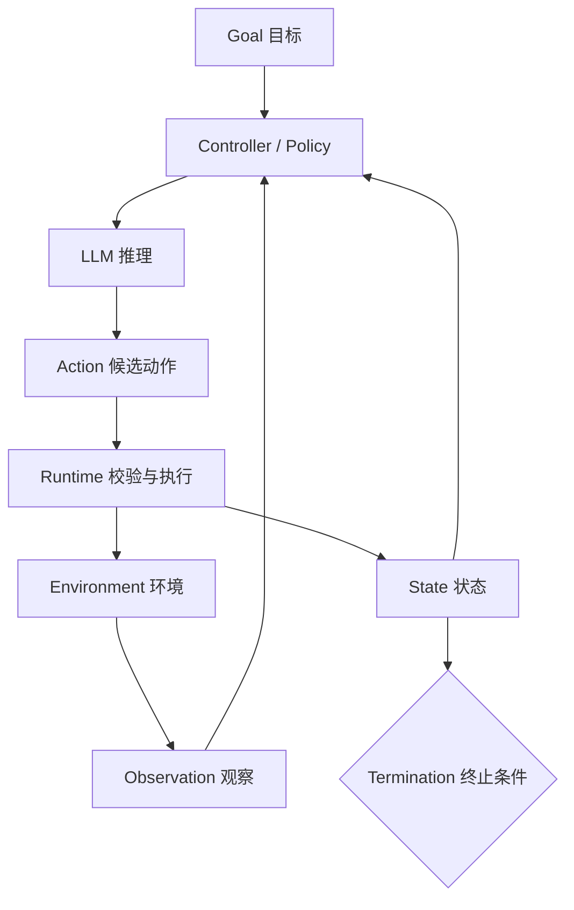

# Agent 与大模型的本质区别是什么？一个 Agent 至少需要哪些组件？

- ID：Q009
- 难度：基础 / 架构
- 标签：Agent、LLM、Runtime、Tool、State、Verification

## 同义问法

- 什么是 Agent？
- Agent 和普通大模型、ChatBot 有什么区别？
- Agent 的四大要素是什么？
- 一个最小 Agent 系统需要哪些模块？

## 来源

### 原始题目线索

- 用户提供的二手题库：`1.1 什么是 Agent？与大模型有什么本质不同？`
- 用户提供的二手题库：`1.2 Agent 四大要素？`
- 原始题库没有提供可追溯链接，因此不能把其中的简答视为标准答案。

### 技术依据

- Anthropic, *Building Effective Agents*：区分预定义代码路径的 workflow 与由模型动态决定过程和工具使用的 agent。
  - https://www.anthropic.com/engineering/building-effective-agents
- Anthropic, *Trustworthy agents in practice*：将 Agent 描述为能够自主决定过程和工具使用，并在计划、行动、观察、调整之间循环的系统。
  - https://www.anthropic.com/research/trustworthy-agents

## 面试官真正考察什么

这道题看起来很基础，但面试官通常在判断三件事：

1. 你是否把 Agent 错误地理解成一种新模型；
2. 你能否从“模型能力”上升到“系统控制闭环”；
3. 你是否知道 Demo Agent 与生产 Agent 之间缺少哪些工程模块。

只回答“规划、记忆、工具、执行”通常不够，因为它没有解释这些组件如何形成闭环，也忽略了验证、状态、权限和停止条件。

<!-- mermaid-diagram:start -->

## 可视化图解

<!-- mermaid-diagram:end -->

## 核心结论

**大模型是一个概率式决策与生成组件；Agent 是把模型放进环境反馈闭环中的任务执行系统。**

同一个模型可以被用成三种不同形态：

> 对应流程使用 Mermaid 图解展示。

因此，Agent 与大模型不是同一层概念：

- **模型**决定“基于当前输入，下一段输出最可能是什么”；
- **Agent 系统**决定“模型能看见什么、能做什么、结果如何反馈、何时停止、失败如何恢复”。

模型能力决定 Agent 的上限，Runtime 和约束系统决定 Agent 的下限。

## Agent 的最小闭环

一个能称为 Agent 的最小系统，至少需要：

这里最关键的不是“能调用工具”，而是 **动作结果会重新进入决策过程**。如果模型只生成一次 JSON，业务代码执行后就结束，它更接近一次 Function Calling；如果模型能根据结果改变下一步策略，才形成 Agentic Loop。

## 生产级组件拆解

### 1. Goal 与任务契约

系统必须明确：

- 用户最终想得到什么；
- 什么结果算完成；
- 哪些约束不能违反；
- 哪些动作需要用户确认。

没有完成标准，Agent 只能凭语言直觉宣布“完成”，容易出现假完成。

### 2. Decision Policy

通常由 LLM 负责：

- 理解当前状态；
- 判断缺少什么信息；
- 选择工具或直接回答；
- 必要时制定或修改计划。

但不是所有决策都应该交给 LLM。超时、重试上限、权限、幂等和事务边界应由确定性代码控制。

### 3. Tools 与 Environment

工具把语言决策转成真实能力，例如：

- 查询 Git、日志、数据库和监控；
- 修改文件、执行测试；
- 创建工单或调用业务 API。

工具不是越多越好。工具描述越相似、权限越大、返回越长，Agent 的错误空间越大。

### 4. State 与 Context

状态用于记录：

- 当前目标和子任务；
- 已执行动作及结果；
- 已确认事实与仍待验证的假设；
- 预算、权限和进度。

Context 是某一轮送给模型的信息视图，State 是系统持久维护的真实任务状态。两者不能混为一谈：状态可以很大，但每轮只选择必要部分进入上下文。

### 5. Verification 与 Stop Condition

这是“Agent 四要素”说法最容易漏掉的部分。

系统需要判断：

- 输出是否满足任务验收条件；
- 工具结果是否真实成功；
- 测试、规则或外部事实是否支持结论；
- 是否已超时、超步数、超成本；
- 是否需要人工介入。

对于 Coding Agent，“代码已生成”不是完成，“目标测试通过且 Diff 符合范围”才可能是完成。

### 6. Runtime 与 Governance

生产环境还需要：

- 调度和持久化；
- 超时、重试、取消与恢复；
- 权限控制和沙箱；
- Trace、日志、指标和审计；
- 模型路由、限额和成本控制；
- Human-in-the-Loop。

这些模块通常不提高模型智商，但决定系统能否上线。

## “规划、记忆、工具、执行”为什么不够准确

这四项可以帮助记忆，但不应作为严格定义：

1. 有些简单 Agent 不需要显式长期记忆；
2. Planning 可能只是每轮局部决策，不一定先输出完整计划；
3. “执行”过于宽泛，没有区分提议动作与真实执行；
4. 缺少环境反馈、验证和停止条件；
5. 缺少权限、安全、成本和可观测性。

更准确的记忆方式是：

> **目标 + 决策 + 行动 + 观察 + 状态 + 验证/停止。**

## Agent 的“自主性”不是开关，而是连续谱

不要把系统简单分成“完全自主”与“完全固定”。实际系统可以逐级增加自主性：

自主性越高，任务覆盖能力越强，但错误代价、审计难度和安全要求也越高。

## 常见低质量回答

### 低质量回答一

> Agent 就是有规划、记忆、工具和执行能力的大模型。

问题：把模型与系统混为一谈，也没有反馈闭环和完成标准。

### 低质量回答二

> 大模型只能聊天，Agent 可以调用 API。

问题：大模型本身可以输出工具调用；区别不只是有没有 API，而是系统是否让模型根据环境反馈持续决策。

### 低质量回答三

> Agent 可以完全自主解决问题。

问题：生产系统通常是受预算、权限、审批和停止条件约束的有限自主系统。

## 可直接口述的回答

> 我不会把 Agent 当成一种新的大模型。大模型只是 Agent 的决策组件，Agent 是围绕模型构建的任务执行闭环。它接收目标，根据当前状态决定下一步动作，调用工具影响外部环境，再把真实结果作为 Observation 更新状态，直到满足可验证的完成条件或触发人工介入。
>
> 一个最小 Agent 至少需要目标、决策策略、工具或环境、状态、反馈和停止条件。生产环境还需要 Runtime、权限、沙箱、超时重试、持久化、可观测性和评估。模型决定能力上限，但真正让 Agent 从 Demo 走向生产的是围绕模型的工程控制系统。

## 结合个人项目回答

可以结合 CI/CD 故障诊断 Agent：

> 在 CI/CD 故障分析场景里，LLM 本身只能根据给定日志生成判断。Agent 系统则会维护当前诊断状态，按需获取 Jenkins 构建信息、启动日志、代码 Diff 和环境状态，再根据每一步结果决定下一步。我们不会让模型直接控制所有行为：日志获取、超时、权限和最大分析步数由 Runtime 管理，最终根因还要绑定证据。这个例子说明，Agent 的本质不是“会聊天的模型加几个工具”，而是模型驱动、环境反馈、系统约束共同形成的执行闭环。

## 继续追问

1. 只调用一次工具的应用算不算 Agent？
2. Agent 的完成条件应该由模型判断还是代码判断？
3. State、Memory 和 Context 有什么区别？
4. 自主性提高后，首先需要补哪些安全机制？
5. 为什么很多生产系统最终是 Workflow 与 Agent 的混合架构？