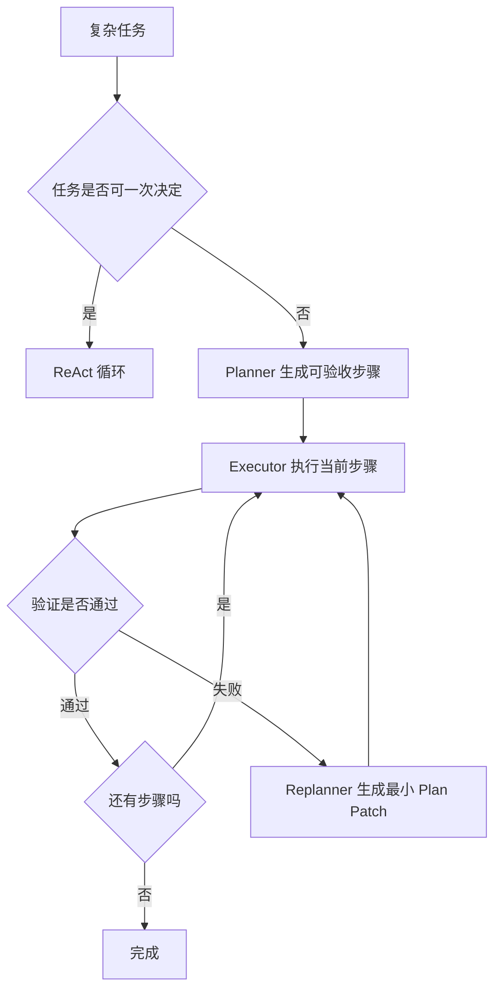

# Agent 有哪些常见设计范式？复杂任务如何拆分与动态重规划？

- ID：Q010
- 难度：进阶 / 系统设计
- 标签：ReAct、Plan-and-Execute、Reflection、Orchestrator、Replanning

<!-- mermaid-diagram:start -->

## 可视化图解

<!-- mermaid-diagram:end -->

## 同义问法

- Agent 设计范式有哪些？
- Plan-and-Execute 一定按原计划执行吗？
- 复杂任务应该如何拆分？
- Agent 如何决定串行、并行和重新规划？

## 来源

### 原始题目线索

- 用户提供的二手题库：`1.4 Agent 设计范式有哪些？`
- 用户提供的二手题库：`1.5 Plan-and-Execute 一定会执行预定规划吗？`
- 用户提供的二手题库：`1.6 复杂任务拆分怎么做？`

### 技术依据

- Anthropic, *Building Effective Agents*：总结 Prompt Chaining、Routing、Parallelization、Orchestrator-Workers、Evaluator-Optimizer 与自主 Agent 等模式。
  - https://www.anthropic.com/engineering/building-effective-agents
- Yao et al., *ReAct: Synergizing Reasoning and Acting in Language Models*。
  - https://arxiv.org/abs/2210.03629

## 先纠正两个常见误区

### 误区一：Agent 范式只有 ReAct、Plan-and-Execute、Reflection

这三个是常见模式，但不是完整分类，也不是互斥框架。真实系统通常组合：

- 用 Router 判断任务类型；
- 用 Planner 生成阶段计划；
- 每个阶段内部用 ReAct 获取信息；
- 关键产物再经过 Evaluator-Optimizer；
- 高风险动作进入人工审批。

### 误区二：Plan-and-Execute 必须由两个 Agent 实现

不一定。它的本质是 **把全局规划与局部执行分离**，可以使用：

- 同一个模型、不同 Prompt；
- 一个 Planner 模型加一个 Executor 模型；
- 确定性 Planner 加 Agent Executor；
- 一个 Supervisor 加多个专业 Worker。

“两个 Agent”只是实现方式，不是定义。

## 常见设计范式

## 1. Prompt Chaining

把任务拆成固定步骤，上一步输出作为下一步输入：

> 对应流程已改为上方 Mermaid 图解。

适合：

- 流程稳定；
- 每一步验收标准明确；
- 需要较强可预测性。

优点是容易测试、定位和控制；缺点是无法应对未知分支。

## 2. Routing

先判断任务类型，再选择不同路径、模型、知识库或工具集：

Router 可以是规则、分类模型、向量检索或 LLM。高频、边界清晰的路由优先使用规则或小模型，模糊意图再交给 LLM。

## 3. Parallelization

将互不依赖的子任务并行执行：

- 同时检索多个数据源；
- 多个 Reviewer 从安全、性能、正确性角度独立审查；
- 对大量独立对象进行 Map，再汇总 Reduce。

并行的前提不是“看起来能拆”，而是：

1. 子任务没有读写依赖；
2. 不会对同一资源产生冲突副作用；
3. 结果可以独立验证和合并；
4. 并行收益大于模型调用和协调成本。

## 4. Orchestrator-Workers

Orchestrator 根据任务动态拆分并分发给 Worker，再聚合结果。

适合：

- 子任务数量和类型无法预先确定；
- 不同子任务需要不同能力；
- 任务天然可并行。

它与固定 Workflow 的区别在于：任务拆分和 Worker 选择由运行时根据输入动态决定。

## 5. Evaluator-Optimizer

一个生成器产生产物，另一个评估器基于明确标准给出反馈，生成器再修改：

适合：

- 有明确质量标准；
- 首次输出通常不够好；
- 改进结果可以被评估，例如代码测试、文章要求、SQL 校验。

如果没有可靠 Rubric 或外部验证，Evaluator 可能只是在用另一个模型表达主观意见。

## 6. ReAct

ReAct 在推理与动作之间交替：

适合路径无法预先确定、需要不断获取外部信息的任务，例如故障诊断、浏览器操作和代码探索。

它的缺点是局部决策容易漂移、重复调用工具、上下文膨胀，并可能在没有明确完成标准时长期循环。

## 7. Plan-and-Execute

先形成较高层计划，再逐步执行：

它比纯 ReAct 更强调全局结构，适合依赖关系明显、步骤较多的任务。但计划不是合同，环境变化或假设被证伪后必须允许重规划。

## 8. Human-in-the-Loop

人工不是失败兜底的同义词，而是系统中的一个正式决策节点：

- 澄清模糊目标；
- 审批高风险动作；
- 选择多个可行方案；
- 在系统缺少证据时接管。

高风险业务中，合理的 HITL 往往比增加一个 Reviewer Agent 更可靠。

## 复杂任务如何拆分

任务拆分不能只靠“尽量原子化”。过粗和过细都会失败。

## 第一步：先定义完成标准

拆任务前先回答：

- 最终产物是什么？
- 如何验证完成？
- 哪些约束必须满足？
- 哪些失败可以重试，哪些必须终止？

如果最终目标不可验证，拆出的步骤再漂亮也可能走向错误目标。

## 第二步：按信息和副作用边界拆分

一个好的子任务通常具备：

1. **输入明确**：知道需要什么上下文；
2. **输出明确**：产生结构化结果或可验证产物；
3. **副作用可控**：修改范围和权限清楚；
4. **失败可观察**：能区分成功、重试和不可恢复失败；
5. **可恢复**：必要时能够回滚或从 Checkpoint 重试。

例如“修复这个项目”太粗，可以拆为：

但也不应把每次 `grep`、`cat` 都提前写成计划节点，那属于执行层局部动作。

## 第三步：显式表示依赖关系

使用 DAG 或状态图标记：

- 前置依赖；
- 可并行节点；
- 条件分支；
- 汇合点；
- 补偿和回滚路径。

## 第四步：决定静态还是动态拆分

### 静态拆分适合

- 流程和分支长期稳定；
- 合规要求强；
- 每一步都能被代码定义；
- 错误代价高。

### 动态拆分适合

- 输入差异大；
- 分支无法穷举；
- 需要探索未知环境；
- 可以低成本验证中间结果。

生产系统通常采用混合方案：外层阶段固定，阶段内部动态探索。

## 动态重规划何时触发

重规划不应该每一步都发生，否则 Planner 变成昂贵的自言自语。常见触发条件：

1. **前置假设被证伪**：目标文件不存在、服务并未部署；
2. **工具返回新约束**：权限不足、接口限流、依赖不可用；
3. **连续无进展**：相似动作重复、证据没有新增；
4. **计划已不经济**：剩余预算不足，需缩小目标；
5. **用户改变目标**；
6. **验证失败**：测试结果说明当前修复方向不成立。

重规划时不要丢弃全部历史，而应保留：

- 已确认事实；
- 已排除假设；
- 已完成产物；
- 失败原因；
- 剩余预算和约束。

## 如何判断拆分粒度

可以用四个问题检查：

1. 一个子任务能否在有限上下文和有限步数内完成？
2. 输出能否被下游独立消费和验证？
3. 失败后能否只重跑这个节点，而不是全局重来？
4. 拆分带来的协调成本是否小于收益？

“原子操作”不是越小越好。理想粒度是 **可验收、可重试、上下文内聚**。

## 常见失败模式

### 计划幻觉

Planner 在缺少环境信息时生成很完整但不可执行的计划。

解决：先做最小信息探测，再规划；计划节点必须绑定工具能力和前置条件。

### 过度规划

简单任务生成十几步计划，延迟和 Token 成本超过任务本身。

解决：根据任务复杂度选择直接执行、轻量计划或完整计划。

### 重规划失忆

重新规划时丢失已验证事实，重复执行旧动作。

解决：状态中分离 `facts`、`hypotheses`、`completed_steps` 与 `failed_attempts`。

### 错误并行

把存在依赖或副作用冲突的任务并行执行。

解决：代码层检查资源读写集合、参数依赖和幂等属性，不完全依赖 LLM 判断。

## 可直接口述的回答

> Agent 设计不是只有 ReAct。常见模式包括固定的 Prompt Chaining、Routing、Parallelization，以及动态的 Orchestrator-Workers、Evaluator-Optimizer、ReAct 和 Plan-and-Execute。它们可以组合使用，选型取决于流程确定性、验证能力、错误代价和协调成本。
>
> 对复杂任务，我会先定义可验证的完成标准，再按输入输出、副作用和依赖边界拆分。外层阶段尽量固定，内部无法穷举的探索步骤交给 Agent。可并行任务必须没有数据和副作用依赖。Plan-and-Execute 的计划不是必须原样执行，当假设被证伪、验证失败、连续无进展或预算变化时需要重规划，但重规划应继承已确认事实和失败记录，避免从头重复。

## 结合个人项目回答

在 CI/CD 故障诊断 Agent 中，可以这样表达：

> 我不会让模型一开始生成几十步完整计划，因为很多步骤依赖真实日志。外层流程固定为信息收集、根因分析、修复建议和验证；信息收集内部使用动态决策。Jenkins 状态、部署记录、日志和代码 Diff 可以在无依赖时并行获取。拿到证据后再生成较短计划。如果发现原假设不成立，例如不是代码错误而是环境配置问题，就保留已排除的假设并触发重规划。这样比纯 ReAct 更有全局结构，又比固定 Workflow 更能覆盖未知异常。

## 继续追问

1. Planner 和 Executor 应该使用同一个模型吗？
2. 如何防止 Planner 生成系统不存在的工具？
3. 什么时候 Parallelization 反而更慢？
4. Evaluator 与生成器使用同一模型有什么风险？
5. 如何存储计划，使任务能够暂停后恢复？
