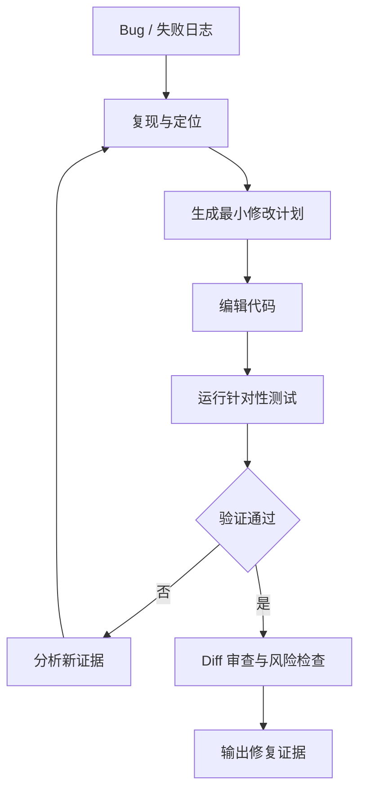

# Coding Agent 经常生成错误代码时，如何建立可验证的修复闭环？

- ID：Q012
- 难度：进阶 / 系统设计
- 标签：Coding Agent、Sandbox、Test、Repair Loop、Harness

<!-- mermaid-diagram:start -->

## 可视化图解



<!-- mermaid-diagram:end -->

## 核心结论

**Coding Agent 的可靠性不能依赖“让模型自检”，而要把代码变更放入可执行、可观察、可回滚的工程 Harness 中。** 模型负责提出修改和解释，编译器、测试、静态分析、运行环境和 Review Gate 提供外部真值。

## 一、最小闭环

> 对应流程已改为上方 Mermaid 图解。

“生成 → 执行 → 报错 → 再生成”只是起点；生产系统还需要控制修改范围、验证目标、循环预算和副作用。

## 二、任务验收条件

Agent 开始前先形成可检查的 Definition of Done：

- 哪些行为必须改变；
- 哪些兼容性不能破坏；
- 必须通过哪些测试；
- 允许修改哪些目录；
- 性能和安全要求；
- 输出应包含哪些 Artifact。

若没有验收标准，Agent 可能通过删除测试、吞掉异常或硬编码结果“修复”。

## 三、隔离工作区

使用容器、Sandbox 或 Git Worktree：

- 固定代码快照和依赖；
- 限制文件系统和网络；
- 最小凭证；
- 资源和时间限制；
- 所有变更通过 Git Diff 记录；
- 失败后可重置。

不要直接让 Agent 在共享主工作区或生产机器修改。

## 四、验证金字塔

按成本从低到高执行：

1. 语法和格式；
2. 类型检查、Lint、AST / 安全规则；
3. 单个相关测试；
4. 模块测试；
5. 构建与启动冒烟；
6. 集成 / E2E；
7. 人工 Review。

优先运行最小相关验证，获得快速反馈；提交前再根据风险扩大范围。不能为了省成本永远不跑集成验证，也不能每次小改都先跑全量套件。

## 五、错误分类

```json
{
  "stage": "compile",
  "error_type": "missing_symbol",
  "location": "src/A.java:18",
  "evidence_ref": "artifact://build-log#L88-L101",
  "retryable_by_edit": true
}
```

区分：

- 代码错误；
- 测试预期错误；
- 环境 / 依赖错误；
- 权限和网络；
- 非确定性测试；
- 任务理解错误；
- 验收标准不完整。

不是所有失败都应让模型继续改代码。环境错误继续改代码会越修越偏。

## 六、Repair 与 Replan

局部语法和测试失败可以 Repair；出现以下信号应 Replan：

- 连续两次修改同一区域仍无进展；
- 错误从一个模块扩散到多个模块；
- 验收条件与现有架构冲突；
- Agent 开始改测试来适配实现；
- 发现初始根因判断错误；
- 修改范围显著超预算。

Replan 需要回到目标、证据和架构约束，不是简单换一句 Prompt。

## 七、循环控制

设置：

- 最大编辑轮次；
- 最大测试次数；
- Token、时间和费用；
- 修改文件数量；
- Diff 行数；
- 重复错误签名检测；
- 无进展检测。

达到阈值时输出当前状态、失败证据和人工接管建议，不能无限尝试。

## 八、防止作弊式通过

检查：

- 是否删除或跳过测试；
- 是否降低断言；
- 是否捕获并忽略异常；
- 是否硬编码测试数据；
- 是否修改构建配置绕过检查；
- 是否引入过宽权限；
- 是否产生无关大面积重构。

测试通过只是必要条件，不是充分条件。

## 九、Diff Review

Review Gate 关注：

- 修改是否与任务一致；
- API 和兼容性；
- 安全；
- 错误处理；
- 性能；
- 测试质量；
- 无关改动；
- 可维护性。

可以使用另一个模型做初筛，但高风险代码仍需人工。Reviewer 必须看到原任务、Diff、测试结果和关键源码，而不是只看 Agent 摘要。

## 十、经验回流

失败案例应先归因，再决定沉淀位置：

- 工具或环境问题 → Harness；
- 仓库规范 → AGENTS.md / Skill；
- 常见错误 → 静态规则或测试；
- 模型行为问题 → Few-shot / 评测 / 微调；
- 业务架构知识 → 文档和代码结构。

不要把每次修复对话都直接写入向量库。

## 常见错误回答

> 沙箱执行，报错后让模型反思，直到测试通过。

还缺错误分类、验收标准、无进展、作弊检测、Diff Review 和预算。

## 面试口述版

> Coding Agent 要运行在隔离 Workspace 中，先明确 Definition of Done，再按格式、编译、静态分析、相关测试、构建和冒烟逐级验证。失败结果结构化并绑定日志证据，代码错误进入 Repair，环境或任务理解错误进入 Replan。Runtime 限制轮次、时间、Diff 和重复错误，检测删除测试、吞异常等作弊式通过。最终由 Diff Review 和验收 Gate 决定完成，经验再按 Harness、Skill、测试或模型问题分类回流。模型负责提出修改，外部验证系统负责证明修改成立。

## 结合个人项目

CI/CD 修复 Agent 可以先在 OpenSandbox 复现并修改，执行单个相关构建和启动冒烟；只有证据、测试和 Diff 都通过后才生成 PR，不能直接修改生产配置。