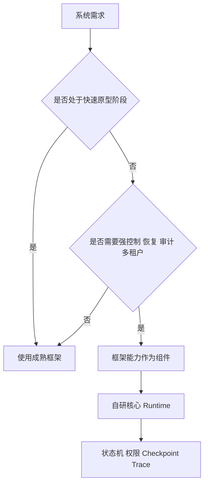

# 生产环境什么时候使用 Agent 框架，什么时候自己实现核心 Runtime？

- ID：Q013
- 难度：进阶 / 架构选型
- 标签：LangChain、LangGraph、Runtime、Framework、Build vs Buy

## 同义问法

- LangChain Agent 和手写 Agent 各有什么优劣？
- Agent 什么时候应该手搓？
- 生产环境是不是都要去框架化？
- 如何避免 Agent 框架版本升级和黑盒问题？

## 来源

### 原始题目线索

- 用户提供的二手题库：`1.10 LangChain Agent 和从零手写 Agent 各有什么优劣？`
- 用户提供的二手题库：`1.15 Agent 什么时候手搓？`
- 原文包含具体重试次数、成本和迁移经历，但没有可追溯证据，因此不作为通用事实。

### 技术依据

- LangChain 官方文档：当前高层 Agent API 构建在 LangGraph Runtime 之上。
  - https://docs.langchain.com/oss/python/langchain/agents
- LangGraph 官方文档：定位为长时间运行、有状态 Agent 的低层编排框架，强调 durable execution、persistence、streaming 和 human-in-the-loop。
  - https://docs.langchain.com/oss/python/langgraph/overview
- Anthropic, *Building Effective Agents*：建议从最简单、可组合的模式开始，只在收益值得时增加复杂度。
  - https://www.anthropic.com/engineering/building-effective-agents

<!-- mermaid-diagram:start -->

## 可视化图解



<!-- mermaid-diagram:end -->

## 核心结论

**生产环境不是“框架”与“手写”的二选一。更合理的做法是分层决定哪些能力复用、哪些边界必须自己掌握。**

典型分层：

> 对应流程已改为上方 Mermaid 图解。

“使用框架”不代表把所有逻辑交给框架；“手写 Runtime”也不代表重新实现模型 SDK、协议、遥测和存储。

## 先区分框架解决的层次

很多争论混在一起，是因为把不同能力都叫 LangChain 或 Agent Framework。

### 1. 适配与组件层

例如：

- 多模型统一调用；
- Prompt 模板；
- Tool schema；
- 文档 Loader、Splitter；
- Vector Store 集成。

这一层复用价值高，替换成本通常可控。

### 2. Agent Loop 与 Runtime 层

例如：

- 状态图；
- Checkpoint；
- Pause / Resume；
- Human-in-the-Loop；
- 重试和异常传播；
- 长任务持久化。

这一层与业务可靠性强相关，需要重点评估控制能力和语义是否匹配。

### 3. 平台层

例如：

- 部署；
- Trace；
- 评估；
- Prompt 和数据集管理；
- 权限、租户和配额。

平台能力通常不是简单 import 一个库，而是涉及组织流程和基础设施集成。

## 使用成熟框架的价值

## 1. 快速验证系统假设

POC 阶段最大的风险不是框架锁定，而是方向错误。成熟框架能快速验证：

- 模型是否能完成任务；
- 工具设计是否合理；
- 哪些状态需要持久化；
- 是否真的需要 Agent，而不是 Workflow。

## 2. 复用难而通用的基础能力

例如 durable execution、checkpoint、streaming、HITL 和 Trace，看似简单，真正处理进程重启、重复执行和状态恢复时会迅速复杂。

## 3. 获得生态集成

模型、向量库、工具和监控平台变化较快，适配层由社区维护可以减少重复工作。

## 4. 统一团队开发方式

对于经验不足的团队，框架提供共同概念和样例，能避免每个项目发明一套不兼容的 Agent Loop。

## 框架的主要风险

## 1. 抽象语义与业务不一致

最危险的不是“代码层数多”，而是框架默认语义与你的业务可靠性要求不同：

- 自动重试是否会重复有副作用操作；
- 状态保存发生在工具执行前还是后；
- 异常是否被包装后丢失关键信息；
- 中断恢复是否保证幂等；
- 并行节点如何合并状态。

## 2. 调试边界变长

故障可能来自：


没有完整 Trace 时，框架越丰富，定位越困难。

## 3. 升级与兼容性成本

快速演进生态中，API 和推荐模式会变化。关键不是拒绝升级，而是：

- 锁定版本；
- 包一层自己的接口；
- 有回归数据集；
- 升级前跑行为和轨迹对比。

## 4. 隐性成本

框架可能为了通用性引入额外序列化、模型调用、状态复制和复杂依赖。是否构成问题必须通过 Trace 和压测判断，不能凭感觉。

## 什么时候优先使用框架

- 需求仍在探索，目标和流程可能快速变化；
- 需要 durable execution、HITL、streaming 等复杂能力；
- 团队规模小，希望快速形成统一实现；
- 生态集成多，自己维护适配器不划算；
- 框架允许注入自定义状态、重试、权限和工具执行器；
- 非核心链路，错误代价可控。

## 什么时候应自己掌握核心 Runtime

- 任务是公司核心能力，长期迭代；
- 对状态语义、恢复、幂等和审计有严格要求；
- 工具带有高风险副作用；
- 延迟、吞吐或资源成本是核心约束；
- 需要兼容特殊的内部基础设施和权限体系；
- 框架抽象持续阻碍定位、测试和演进；
- 已经通过真实 Trace 明确知道需要替换哪些部分。

注意：这意味着掌握核心控制面，不是把所有基础组件从头写一遍。

## 推荐的演进路线

### 阶段一：用最小框架验证

- 只选择必要组件；
- Tool、State 和业务接口从一开始就使用自己的类型；
- 打开完整 Trace；
- 不把业务逻辑写进框架特有回调深处。

### 阶段二：稳定边界

定义内部接口：

```text
ModelClient
ToolExecutor
StateStore
Planner
PolicyEngine
CheckpointStore
Evaluator
```

框架只是这些接口的一种实现。

### 阶段三：基于证据拆除或替换

只有出现明确问题时才替换：

- 某层导致不可接受延迟；
- 状态恢复语义无法满足要求；
- 升级成本持续高于自维护成本；
- 安全策略无法下沉到代码层；
- 无法获得必要的可观测性。

不要因为网上说“生产必须手搓”就提前重写。

## 选型检查表

| 维度 | 要问的问题 |
|---|---|
| 控制力 | 能否自定义状态、停止、重试、审批和工具执行？ |
| 可观察性 | 是否能看到每次模型调用、状态变化、工具输入输出？ |
| 持久化 | 进程重启后能否安全恢复？是否会重复副作用？ |
| 测试 | 能否对节点、轨迹和端到端任务分别测试？ |
| 升级 | 是否有版本锁定、迁移指南和稳定接口？ |
| 性能 | 额外延迟、内存和模型调用是否可测？ |
| 安全 | 权限和参数校验能否放在确定性代码中？ |
| 退出成本 | 能否逐层替换，而不是一次性重写？ |

## 常见低质量回答

### 低质量回答一

> POC 用框架，生产一定手写。

问题：过度绝对。成熟 Runtime 的持久化和恢复能力可能比临时手写代码可靠，关键是业务要求和控制边界。

### 低质量回答二

> LangChain 太重，所以完全不用。

问题：没有区分组件层、高层 Agent API 和 LangGraph Runtime，也没有量化“重”的影响。

### 低质量回答三

> 框架功能多，生产直接使用最省事。

问题：忽略默认重试、状态语义、权限和升级风险。

## 可直接口述的回答

> 我不会用“POC 用框架、生产全部手写”作为固定结论。我会先把系统分成业务状态机、Agent Runtime、模型与工具适配、可观测和平台几个层次。业务目标、验收标准、权限和有副作用操作的语义必须由自己掌握；模型 SDK、Tool schema、持久化 Runtime 或 Trace 可以按成本复用。
>
> 早期我倾向用成熟框架快速验证，但会从第一天定义自己的 ModelClient、ToolExecutor 和 State 接口，避免业务代码绑定框架。上线后根据 Trace 判断是否存在不可接受的恢复语义、黑盒重试、延迟或升级成本，再逐层替换。是否自研的依据应是控制力、可靠性和长期总成本，而不是框架口碑。

## 结合个人项目回答

> 在内部 CI/CD Agent 中，日志采集、Jenkins 查询、代码拉取和沙箱执行都与企业基础设施强绑定，这些工具和权限控制应该自己掌握。Agent 图编排、Checkpoint 和 Trace 可以先复用成熟能力。随着场景稳定，如果发现框架的状态恢复会重复执行写操作，或者很难和我们的会话、容器生命周期对齐，再把 Runtime 中对应部分下沉到 Go 服务，而不是一开始就重写全部生态。

## 继续追问

1. 自己写一个 Agent Loop 最容易漏掉什么？
2. 如何验证框架的 Checkpoint 恢复不会重复副作用？
3. 为什么要定义内部 ModelClient 和 ToolExecutor 接口？
4. LangChain 与 LangGraph 当前分别处在哪一层？
5. 如何为框架升级建立回归测试？