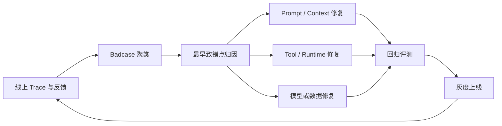

# Badcase 如何定义、归因并形成数据飞轮？

- ID：Q015
- 难度：进阶 / 系统设计
- 标签：Badcase、Root Cause、Golden Set、SFT、DPO、Data Flywheel

<!-- mermaid-diagram:start -->

## 可视化图解



<!-- mermaid-diagram:end -->

## 核心结论

**Badcase 不是“用户没采纳”，也不是“答案看起来不好”。它是相对于明确任务标准的失败样本。** 数据飞轮的核心不是把线上数据都送去微调，而是：捕获失败、定位系统层、选择最便宜可靠的修复方式、回归验证并持续监控。

## 一、先定义失败标准

按影响分级可以，但必须结合业务：

- 红线：越权、隐私泄露、错误业务动作、安全与法规违规；
- 核心失败：任务未完成、事实错误、工具错误、关键步骤遗漏；
- 体验问题：表达、格式、冗余和延迟。

每种任务需要 Rubric。例如故障诊断：

- 是否定位最早根因；
- 是否提供日志证据；
- 是否把后续连锁异常误判为根因；
- 修复动作是否可执行；
- 是否存在危险操作。

## 二、Badcase 来源

- 自动化 Eval；
- 用户点踩和文字反馈；
- 用户重复提问或改写；
- 人工 Review；
- 工具错误和异常 Trace；
- 业务结果失败；
- 安全拦截；
- 线上抽样；
- 版本回归。

这些只是候选信号。用户不采纳可能因为需求变化、格式或主观偏好，不能直接标记模型错误。

## 三、归因树

> 对应流程已改为上方 Mermaid 图解。

先定位第一处错误，而不是看到最终答案错就改 Prompt。

## 四、Trace 与复现包

每个 Badcase 保存：

```json
{
  "case_id": "bc-19",
  "input": {},
  "expected": {},
  "actual": {},
  "trace_ref": "...",
  "model_version": "...",
  "prompt_version": "...",
  "tool_versions": {},
  "knowledge_version": "...",
  "environment_snapshot": "...",
  "root_cause": "retrieval_miss",
  "severity": "core"
}
```

没有版本和环境，后面无法稳定复现。

## 五、修复优先级

优先采用确定性、局部修复：

1. 数据和权限；
2. 解析、分块、索引；
3. Tool Schema 和业务校验；
4. 状态机、重试、停止；
5. Prompt / Few-shot；
6. 模型路由；
7. 微调。

微调不是默认终点。若错误是工具超时或知识过期，SFT 无法修复。

## 六、Golden Set

确认后的 Badcase 进入回归集，包含：

- 原始输入；
- 关键事实 / 标准答案；
- 允许变体；
- 相关证据；
- 风险等级；
- 预期轨迹或关键步骤；
- 禁止行为。

每次 Prompt、模型、检索、工具或 Runtime 变化都运行。红线用例必须全部通过，不能被平均分抵消。

## 七、高质量样本去哪

### Eval Set

第一用途是回归验证，不是训练。

### Few-shot / Skill

稳定、典型且能表达规则的案例，可作为动态示例或 SOP。

### SFT

适合大量一致的绝对行为目标，例如结构化输出、领域表达和工具使用模式。训练样本应是正确目标输出，不是把错误答案一起喂进去。

### DPO / Preference Optimization

适合相对偏好，例如简洁度、风格、多个合法答案的选择。需要高质量 Chosen / Rejected 对。

## 八、何时微调

满足：

- 同类错误重复出现；
- Prompt 和系统修复已到瓶颈；
- 目标行为稳定；
- 有足够高质量、去重且分布合理的数据；
- 有独立验证集；
- 能处理灾难性遗忘和版本回滚。

不能使用固定“50～100 条就训练”的通用阈值。数据质量、任务复杂度和模型方法不同。

## 九、线上反馈闭环


修复后还要监控：原 Badcase 是否消失、相邻任务是否退化、成本和延迟是否变化。

## 十、避免数据污染

- 去除重复和相互矛盾样本；
- 区分用户偏好与事实错误；
- 敏感数据脱敏；
- 防止攻击输入进入训练；
- 不把模型自生成答案未经审核当标签；
- 训练集、验证集、测试集按用户和时间隔离，避免泄漏。

## 常见错误回答

> 点踩和 Review 拒绝都进 Badcase 库，高质量样本进 Golden Set 和 SFT。

流程方向对，但必须先二次归因；同一数据不能未经治理同时承担评测和训练，否则会泄漏。

## 面试口述版

> Badcase 必须相对于任务 Rubric 定义。点踩、重问和工具失败只是候选信号，我会结合 Trace 和版本快照定位第一处错误，分到数据、检索、Context、模型、工具或 Runtime。修复优先使用局部确定性方案，确认后的样本进入独立 Golden Set 做回归。只有重复、稳定且系统方法难以解决的模型行为问题才考虑 SFT；相对偏好更适合 DPO。上线经过离线回归、Shadow、灰度和监控，避免只修一个案例却让整体退化。

## 结合个人项目

Tomcat 启动诊断若误把后续 Spring Bean 异常当根因，应沉淀为“最早因果异常识别”评测样本，并改进日志分析脚本和因果规则，而不是先微调模型。