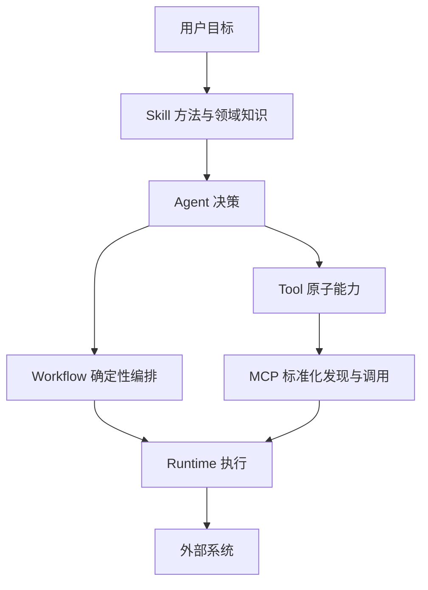

# Skill、Tool、MCP Server 和 Workflow 的边界是什么？

- ID：Q019
- 难度：基础 / 工程设计
- 标签：Skill、Tool、MCP、Workflow、Progressive Disclosure

## 同义问法

- 什么是 Agent Skill？
- Skill 是不是一个大粒度 Tool？
- 一个 Skill 能否调用多个 MCP 工具？
- Skill、Prompt、Workflow 和 MCP 应该怎么选？

## 来源

### 原始题目线索

- 用户提供的二手题库：`2.5 什么是 Skill？`
- 原文将 Skill 概括为“SOP 和一堆脚本”，方向基本合理，但“Skill 一定比 MCP Tool 粒度更粗”不是协议级定义，不能作为绝对结论。

### 技术依据

- Anthropic Agent Skills 官方文档：Skill 是可复用、基于文件系统的模块化能力，包含指令、元数据和可选资源，如脚本、模板。
  - https://platform.claude.com/docs/en/agents-and-tools/agent-skills/overview
- MCP 官方架构与 Server Primitives：Server 可暴露 Resources、Prompts 和 Tools。
  - https://modelcontextprotocol.io/specification/2025-11-25
  - https://modelcontextprotocol.io/specification/2025-06-18/architecture
- Anthropic, *Building Effective Agents*：Workflow 使用预定义代码路径编排模型和工具。
  - https://www.anthropic.com/engineering/building-effective-agents

<!-- mermaid-diagram:start -->

## 可视化图解



<!-- mermaid-diagram:end -->

## 核心结论

这四个概念解决的是不同问题：

| 概念 | 主要解决的问题 | 典型内容 | 谁控制 |
|---|---|---|---|
| Skill | 如何复用领域方法、SOP 和配套资源 | 指令、示例、参考资料、脚本、模板 | Agent 按需加载并遵循 |
| Tool | 如何执行一个可描述、可验证的外部能力 | 函数/API/命令及输入输出 schema | 模型提议，Runtime 执行 |
| MCP Server | 如何用标准协议向 Agent 暴露工具和上下文 | Tools、Resources、Prompts、会话能力 | Host/Client/Server 协同 |
| Workflow | 如何按照预定义路径编排步骤 | 节点、条件、状态、重试、审批 | 代码或流程引擎控制 |

一句话概括：

> **Skill 教 Agent“这类任务通常怎么做”，Tool 让 Agent“真正做一步”，MCP 规定“能力如何标准化接入”，Workflow 规定“步骤按什么路径运行”。**

## 1. Skill：可复用的领域工作方法

以 Agent Skills 为例，一个 Skill 通常包含：

> 对应流程已改为上方 Mermaid 图解。

Skill 的价值不只是复用 Prompt，而是把以下内容打包：

- 什么时候使用；
- 任务应该按什么方法推进；
- 哪些检查项不能漏；
- 可调用哪些脚本和模板；
- 输出需要符合什么标准；
- 哪些失败需要停止或转人工。

### Skill 的核心特征

1. **可复用**：跨会话、跨任务共享；
2. **按需加载**：只有相关时才把完整说明放进上下文；
3. **领域化**：将通用 Agent 变成某类任务专家；
4. **可组合**：复杂任务可能同时使用多个 Skill；
5. **可以包含确定性资源**：脚本、模板、检查表不必每次由模型重新生成。

## 2. Tool：一个有契约的执行能力

Tool 通常由以下部分组成：

```text
name
+ description
+ input schema
+ output contract
+ side-effect metadata
+ permission policy
+ executor
```

例如：

```text
get_build_log(build_id, start_line, max_lines)
run_test(target, timeout)
create_ticket(title, severity, evidence)
```

模型并不直接执行函数，而是生成调用意图和参数；Runtime 校验权限与参数后执行，再把结果返回模型。

Tool 应尽量满足：

- 单一职责；
- 输入输出明确；
- 失败可分类；
- 副作用和幂等性清楚；
- 返回结果可裁剪和引用。

## 3. MCP Server：能力接入协议，不是 Agent 逻辑

MCP 采用 Host-Client-Server 架构。Server 可以暴露：

- **Tools**：可执行函数；
- **Resources**：文件、数据库模式等上下文；
- **Prompts**：可发现的提示模板。

MCP 解决的是：

- 工具与上下文的标准化发现；
- Client 与 Server 的能力协商；
- 本地或远程连接；
- 生命周期、消息和错误的统一格式。

MCP 不自动解决：

- 任务应该如何规划；
- 哪个工具业务上应该被允许；
- 多步任务何时结束；
- 写操作的事务和补偿；
- Agent 的效果评估。

这些仍属于 Agent Runtime、Policy Engine 和业务系统。

## 4. Workflow：把步骤和控制流写进系统

Workflow 负责：

- 节点顺序；
- 条件分支；
- 并行与汇合；
- 状态持久化；
- 重试、补偿和审批；
- 超时和失败处理。

例如发布故障分析：


其中“获取日志”可以是 Tool，“如何分析日志”可以由 Skill 指导，工具可以通过 MCP 接入，整个稳定流程由 Workflow 管理。

## 它们如何组合

以代码审查为例：

```text
Workflow
  1. 获取 PR
  2. 运行 code-review Skill
  3. 执行测试
  4. 汇总并发布结果

code-review Skill
  - 阅读变更范围
  - 按正确性、安全、性能检查
  - 使用 review template
  - 必要时调用静态分析工具

Tools / MCP
  - fetch_diff
  - search_code
  - run_test
  - post_review_comment
```

这个结构里：

- Workflow 控制阶段；
- Skill 提供方法；
- Tool 执行原子能力；
- MCP 负责能力接入。

## Skill 是不是“大粒度 Tool”

只能说 **很多 Skill 在任务语义上比单个 Tool 更粗**，但不能当成严格定义。

原因：

- 一个 Skill 可能只是几条写作规范，没有调用任何 Tool；
- 一个 Tool 可能启动长时间、复杂的工作流；
- Skill 的脚本也可能直接完成大量确定性工作；
- 不同产品对 Skill 的实现和生命周期并不相同。

更准确的区别是：

- Skill 主要描述“方法与知识”；
- Tool 主要暴露“执行接口”。

## Skill 与 Prompt 的区别

Prompt 通常是当前请求中的一次性或会话级指令；Skill 是可管理、可版本化、可发现、按需加载的能力包。

把所有 SOP 塞进 System Prompt 会导致：

- 每轮重复消耗 Token；
- 无关规则稀释注意力；
- 修改和回归困难；
- 多团队规则冲突。

Skill 通过 Progressive Disclosure 只加载必要内容，但 Skill 太多同样会增加发现成本，因此需要清晰名称、描述、标签和路由。

## 什么时候用哪一个

### 使用 Prompt

- 一次性任务要求；
- 当前会话的输出格式和临时约束；
- 不值得长期复用的说明。

### 使用 Skill

- 同类任务反复出现；
- 有稳定 SOP、检查表或模板；
- 需要按需加载领域知识；
- 希望持续沉淀成功经验。

### 使用 Tool

- 需要访问真实数据或执行操作；
- 输入输出可以定义契约；
- 结果需要进入 Agent 决策闭环。

### 使用 MCP

- 希望跨 Agent、IDE 或框架复用能力；
- 工具由独立团队维护；
- 需要动态发现 Resources、Prompts、Tools；
- 标准化收益高于协议和部署开销。

### 使用 Workflow

- 步骤和控制流应由代码确定；
- 要求可靠恢复、审批、补偿和审计；
- 业务路径稳定或错误代价高。

## 安全和治理

Skill 和 MCP 都会扩大供应链风险：

### Skill 风险

- 指令包含恶意或过度权限要求；
- 脚本执行任意命令；
- 参考资料夹带 Prompt Injection；
- 自动更新后行为变化。

应做：版本锁定、代码审查、签名或来源校验、脚本沙箱、最小权限和回归评测。

### MCP 风险

- 恶意工具描述诱导模型读取敏感数据；
- Server 暴露超出预期的 Tool；
- 工具参数和结果泄露数据；
- 远程 Server 被替换或权限扩大。

Host 必须独立控制 Server 信任、工具授权和用户同意，不能因为协议标准化就默认安全。

## 常见低质量回答

### 低质量回答一

> Skill 就是一个可以调用多个 MCP 工具的大工具。

问题：忽略 Skill 主要承载方法和知识，也把产品实现经验说成协议定义。

### 低质量回答二

> MCP 可以替代 Function Calling 和 Workflow。

问题：MCP 解决连接标准化，不负责模型如何决策和业务控制流。

### 低质量回答三

> 把所有经验都写成 Skill，Agent 就会越来越强。

问题：Skill 数量、冲突、过时内容和错误经验会增加路由和上下文负担，需要准入、版本和评测。

## 可直接口述的回答

> Skill、Tool、MCP 和 Workflow 不在同一层。Skill 是可复用的领域方法包，通常包含指令、参考资料、脚本和模板，解决 Agent 这类任务应该怎么做；Tool 是有输入输出契约的执行能力；MCP 是让工具、资源和提示以标准协议被 Host 发现和调用；Workflow 则由代码控制步骤、状态和异常路径。
>
> 在实际系统里它们经常组合：Workflow 管大阶段，Agent 按 Skill 分析，调用通过 MCP 接入的 Tool。Skill 不一定比 Tool 粒度大，也不一定调用 Tool。权限和执行安全仍由 Runtime 与 Tool Gateway 控制，不能因为使用 Skill 或 MCP 就默认可信。

## 结合个人项目回答

> 对 CI/CD Agent，我会把“Tomcat 启动失败分析流程”沉淀为 Skill，包括日志去噪方法、最早异常链规则、报告模板和分析脚本；Jenkins 查询、日志拉取、Git Diff、容器命令分别做成 Tool；跨团队通用工具可以通过 MCP 暴露；任务受理、信息收集、人工审批和结果回调由 Workflow 或平台 Runtime 管理。这样知识、执行能力、连接协议和控制流各自有稳定边界。

## 继续追问

1. Skill 如何发现和按需加载？
2. Skill 冲突时如何确定优先级？
3. MCP Tool 与本地原生 Tool 的延迟和安全如何取舍？
4. 什么经验值得沉淀为 Skill，而不是写进 Prompt？
5. 如何对 Skill 做版本管理和效果回归？