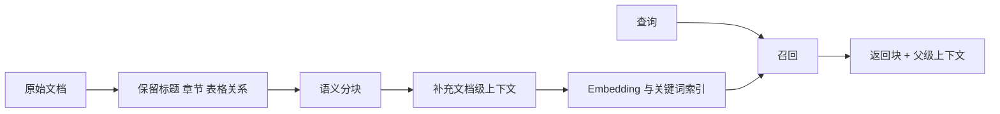

# RAG 如何分块并避免语义截断？Contextual Retrieval 解决了什么问题？

- ID：Q020
- 难度：进阶 / 系统设计
- 标签：RAG、Chunking、Contextual Retrieval、父子块、语义边界

## 同义问法

- RAG 的文档应该怎么切？
- 固定长度、递归、语义分块怎么选？
- 小块检索准但上下文不完整怎么办？
- 父子分块和滑动窗口有什么区别？
- Contextual Retrieval 的原理是什么？

## 来源

### 原始题目线索

- 用户提供的二手题库：`3.2`、`3.3`、`3.7`

### 技术依据

- Anthropic, Contextual Retrieval：在索引前给每个 chunk 增加与全文相关的简短上下文，再构建向量与关键词索引。
  - https://www.anthropic.com/engineering/contextual-retrieval

<!-- mermaid-diagram:start -->

## 可视化图解



<!-- mermaid-diagram:end -->

## 核心结论

**分块不是把文档切到某个固定 Token 数，而是在“检索可辨识性”和“回答所需完整性”之间建立映射。**

小块便于精确命中，但容易丢失标题、定义域、主语和前置条件；大块保留上下文，却降低向量表达的聚焦度并增加噪音。生产方案通常把“用于搜索的单元”和“最终提供给模型的上下文单元”分开设计。

## 一、先理解分块真正解决什么

Embedding 通常为一段文本生成一个向量。若一个块同时包含多个主题，这个向量会成为多个语义方向的平均值，查询很难精准命中；若切得太碎，块虽然聚焦，但可能只剩下：

> 该方案不适用于以上场景。

单独看无法知道“该方案”和“以上场景”是什么。

所以分块至少要保证：

1. **语义内聚**：一个块尽量只表达一个核心主题；
2. **最小自包含**：保留理解该块必需的标题、主体和约束；
3. **可追溯**：保存文档、章节、页码、父节点和版本；
4. **可扩展**：命中后能够回取邻居、父块或原始结构。

## 二、常见策略与边界

### 1. 固定长度 + Overlap

实现最简单，适合结构弱、格式比较统一的纯文本。

优点：吞吐高、结果稳定、容易估算索引规模。

缺点：不理解标题、表格和代码结构；Overlap 只能缓解边界截断，也会制造重复召回。

### 2. 递归分割

按章节、段落、句子、字符的优先级递归切分，在超过长度时才进入下一层。

适合 Markdown、网页和普通技术文档，是很好的默认起点，但前提是解析器正确保留了结构。

### 3. 结构感知分块

按标题、列表、表格、代码函数、类、接口或 PDF 布局切分。

这是技术文档、代码库、制度文件的首选。关键不是“按标题切”四个字，而是把标题路径写入元数据或块前缀：

```text
文档：发布规范
章节：故障处理 > Java 服务 > 启动失败
内容：……
```

### 4. 语义分块

根据相邻句子的向量距离或主题变化寻找边界。

它适合段落结构差、但语义连续的文档。代价是索引构建更慢，而且阈值高度依赖领域；若没有评测集，容易得到“看起来高级、实际不可控”的结果。

### 5. 父子分块

- 小块用于检索；
- 命中后返回其父块作为生成上下文。

它把“精准搜索”和“完整阅读”解耦。缺点是需要维护子块到父块的映射，并控制多个子块命中同一父块造成的重复。

### 6. 句子窗口

索引单句或短段，命中后向前后扩展 N 个句子。适合上下文局部连续的说明文档，但对于跨章节关系和表格无能为力。

## 三、Contextual Retrieval 的原理

传统索引只对原始 chunk 做 Embedding。Contextual Retrieval 先让模型基于整篇文档，为 chunk 生成一段简短背景，再把背景与原文组合后建立索引。

```text
原始块：公司本季度收入增长 3%。

上下文增强后：
这段内容来自 2025 年第二季度财报的欧洲市场章节，
描述的是欧洲区订阅业务收入。公司本季度收入增长 3%。
```

它解决的不是“块太短”本身，而是：**块从原文中脱离后缺少足以被查询命中的身份信息。**

注意两个边界：

1. 生成的背景也可能出错，必须与原文一起保存，不能把生成背景当作事实来源；
2. 它增加离线成本，不应替代正确的解析、结构元数据和版本治理。

## 四、生产设计方法

推荐把分块做成可评测的配置，而不是一次拍脑袋：

> 对应流程使用 Mermaid 图解展示。

每个块至少保存：

```json
{
  "document_id": "doc-123",
  "chunk_id": "chunk-18",
  "parent_id": "section-4",
  "heading_path": ["发布规范", "Java", "启动失败"],
  "position": 18,
  "version": 7,
  "content_hash": "...",
  "source_uri": "..."
}
```

## 五、如何选型

不要先问“最佳 chunk size 是多少”，而要先看问题类型：

- 事实定位、术语、错误码：偏小块，强化关键词与元数据；
- 解释型问答：中等块或父子块；
- 多跳问题：分层索引、查询分解和多轮检索；
- 表格、代码、合同：按结构切，不使用统一字符数；
- 文档结构很差：递归分块起步，再评估语义分块或 Contextual Retrieval。

最终由评测集决定：观察 Recall@K、命中块是否足以回答、重复率、上下文噪音和端到端正确率。

## 常见错误回答

> 每 500 字切一块，重叠 50 字就可以。

问题在于它把一个基线参数说成通用方案，没有考虑文档结构和问题类型。

> 语义分块一定比固定分块好。

语义分块更贵、更难稳定，且无法自动修复错误解析、表格断裂和版本冲突。

## 面试口述版

> 我不会把 Chunking 理解成选一个固定长度。它的核心是平衡检索单元的语义聚焦和回答上下文的完整性。生产上我一般先做结构感知解析，按标题、段落、函数或表格形成节点，再用小块检索、父块或邻居扩展来提供完整上下文。对于脱离全文后身份信息不足的块，可以采用 Contextual Retrieval，在索引前生成与全文相关的背景前缀，但生成背景只用于检索增强，事实仍以原文为准。最终通过 Recall@K、上下文充分性、重复率和端到端正确率选择策略，而不是迷信固定的 chunk size。

## 结合个人项目

在 CI/CD 故障诊断知识库中，日志、操作手册和源码不能使用同一种分块：

- 日志按请求、异常链和时间窗口组织；
- 操作手册按故障类型与步骤组织；
- Java/Python/Go 源码按函数、类和调用关系组织；
- 命中小块后，回取完整异常栈、方法或章节用于判断根因。

这能体现你理解的是“检索与理解解耦”，而不是只会调用一个文本切分器。