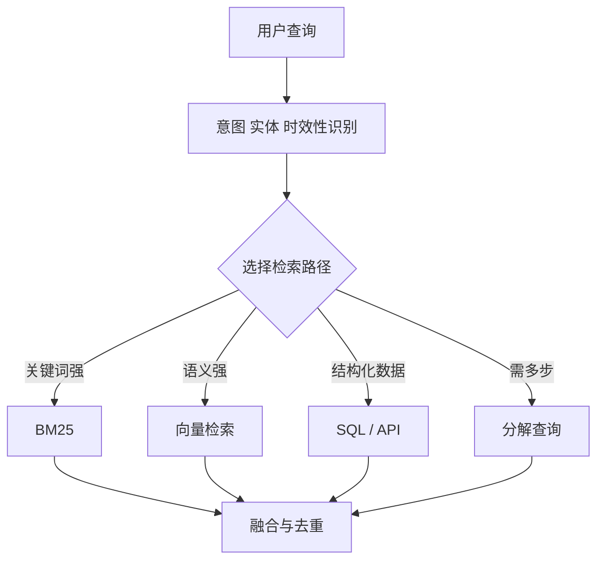

# RAG 的查询路由与查询重写应该怎么设计？

- ID：Q022
- 难度：进阶 / 系统设计
- 标签：Query Routing、Query Rewriting、HyDE、Multi-Query、权限过滤

## 同义问法

- 什么问题不应该走 RAG？
- 多知识库怎么路由？
- 多轮对话中的“这个呢”怎么检索？
- Query Expansion、HyDE、Step-back 有什么区别？
- 查询改写为什么可能降低效果？

## 来源

- 用户提供的二手题库：`3.5`、`3.6`

<!-- mermaid-diagram:start -->

## 可视化图解



<!-- mermaid-diagram:end -->

## 核心结论

**查询路由决定“去哪里查、用什么方式查”；查询重写决定“拿什么表达去查”。** 两者都属于检索前决策，而且都可能破坏原始意图，所以必须保存原 Query、限制改写范围并支持回退。

## 一、查询路由解决什么

一个企业助手可能同时连接：

- 产品知识库；
- 代码仓库；
- 工单与日志系统；
- 数据库；
- 实时搜索；
- 无需检索即可完成的工具。

若所有问题都检索全部数据源，会产生延迟、噪音、权限风险和成本。路由器需要输出的不是一个模糊标签，而是结构化检索计划：

```json
{
  "need_retrieval": true,
  "sources": ["runbook", "deployment_logs"],
  "retrieval_modes": ["keyword", "dense"],
  "filters": {"service": "order-api", "env": "beta"},
  "need_decomposition": false,
  "confidence": 0.86
}
```

## 二、路由的三层方案

### 1. 规则路由

适合强结构信号：订单号、错误码、文件后缀、明确命令、租户和权限。

优点是稳定、便宜、可审计；缺点是覆盖不了模糊语义。

### 2. 轻量分类器或语义路由

把 Query 与数据源描述、意图样例做分类或向量匹配。适合知识库较多但边界相对稳定的系统。

需要设置低置信度回退，不要强行单选。一个问题可能需要多路检索。

### 3. LLM 规划路由

适合复杂问题和动态工具集。模型可以输出子问题、数据源、过滤条件和依赖关系。

风险是路由本身产生幻觉，因此数据源 ID、过滤字段和权限必须由代码校验。

生产系统通常采用：

```text
规则硬路由
   ↓ 未命中
轻量分类 / 语义路由
   ↓ 复杂或低置信度
LLM 规划
```

## 三、查询重写的主要类型

### 1. 对话消歧与独立化

把多轮中的指代补全：

```text
历史：Tomcat 启动失败是因为缺少 dubbo.properties。
当前：那修复后为什么请求还报错？

重写：在补充 dubbo.properties 并成功启动后，Tomcat 应用请求仍报错的可能原因是什么？
```

重写必须保留实体、时间、否定词和用户约束。

### 2. Query Expansion / Multi-Query

生成同义词、缩写或多个视角，提高召回。例如同时检索 `OOMKilled`、`内存超限`、`exit code 137`。

问题是召回量和噪音同步增加，需要去重、融合和总预算控制。

### 3. 查询分解

把多跳问题拆成有依赖的子问题：

```text
“发布失败是否由本次代码变更导致？”
  1. 发布失败的直接错误是什么？
  2. 本次 diff 修改了哪些相关模块？
  3. 错误路径是否经过这些模块？
```

分解不是把句子机械切开，而是明确每一步需要的证据和依赖。

### 4. HyDE

先生成一个假设性答案或文档，再用它的向量检索真实文档。适合 Query 与文档语言风格差异很大的场景。

风险是模型假设会把检索带向错误方向，因此应与原 Query 检索并行，而不是完全替代。

### 5. Step-back

把过于具体的问题提升为更一般的原理问题，用于检索背景知识。例如从某次具体异常退一步检索“JVM 类加载阶段缺失配置文件的常见行为”。

## 四、必须保留双轨

推荐同时保存：

```json
{
  "original_query": "那这个呢？",
  "standalone_query": "...",
  "expanded_queries": ["..."],
  "routing_plan": {...}
}
```

原 Query 用于最终意图校验，改写 Query 用于召回。生成答案前要检查证据是否仍支持原始问题，避免“检索回答了改写后的另一个问题”。

## 五、失败模式

- 丢失否定：`哪些情况不支持` 被重写成 `支持哪些情况`；
- 丢失时间：把“2024 年旧规则”检索成当前规则；
- 实体串线：多轮对话把服务 A 的上下文带到服务 B；
- 过度扩展：召回大量主题相似但无关内容；
- 权限绕过：模型选择了用户无权访问的数据源；
- 无条件 LLM 改写：简单精确 Query 反而被改坏。

## 六、评估方式

路由层：数据源选择准确率、多标签 Recall、无检索误判率、权限违规率。

重写层：实体保持率、约束保持率、检索 Recall 增益、噪音增量和端到端答案正确率。

必须做消融实验：原 Query、重写 Query、两者融合分别跑评测，确认改写确实带来收益。

## 面试口述版

> 查询路由负责决定是否检索、查哪些数据源、使用关键词还是向量检索以及带哪些过滤条件；查询重写负责把当前表达转换为更适合检索的表达。生产上我会用规则、轻量分类和 LLM 规划分层路由，权限和字段由代码校验。重写会保留原 Query，针对多轮指代做独立化，必要时做 Multi-Query、分解、HyDE 或 Step-back，但不会无条件替换原问题。最终通过路由准确率、约束保持率、召回增益和端到端正确率评估，避免模型把问题改成另一个更容易回答的问题。

## 结合个人项目

CI/CD Agent 的路由可以优先使用硬信号：Job ID 查 Jenkins、Pod 名查 Kubernetes、类名查源码、错误码查知识库；只有用户只说“发布怎么又失败了”时，才由模型结合会话状态生成检索计划。