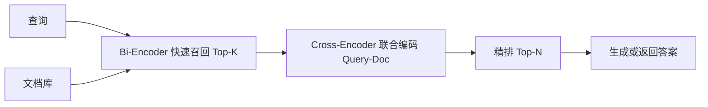

# 为什么需要 Reranker？Bi-Encoder 与 Cross-Encoder 如何取舍？

- ID：Q025
- 难度：进阶
- 标签：Reranker、Bi-Encoder、Cross-Encoder、候选集、延迟

## 同义问法

- 向量检索已经有相似度了，为什么还要精排？
- Embedding 与 Reranker 有什么区别？
- Cross-Encoder 为什么更准但更慢？
- Top-N 召回多少再重排？
- LLM 能不能直接做 Reranker？

## 来源

- 用户提供的二手题库：`3.12`、`3.13`

<!-- mermaid-diagram:start -->

## 可视化图解



<!-- mermaid-diagram:end -->

## 核心结论

**粗召回优化“不要漏掉正确文档”，Reranker 优化“把最能回答问题的文档排到前面”。** 两者目标不同。Embedding 适合在大规模语料中快速生成候选，Reranker 适合在小候选集上做更精细的 Query–Document 联合判断。

## 一、Bi-Encoder 为什么快

Bi-Encoder 分别编码 Query 和文档：

```text
q_vec = Encoder(query)
d_vec = Encoder(document)
score = similarity(q_vec, d_vec)
```

文档向量可以离线预计算，在线只需编码 Query 并进行 ANN 搜索，因此适合百万、亿级候选。

局限是 Query 与文档在编码时没有直接交互。一个文档可能主题很接近，但没有回答具体条件：

```text
Query：JDK 17 下为什么找不到 javax.xml.bind？
文档 A：JDK 17 升级说明
文档 B：JDK 9 后 JAXB 不再默认包含的迁移方式
```

两者都语义相关，但 B 更直接支撑答案。

## 二、Cross-Encoder 为什么更准

Cross-Encoder 把 Query 与文档拼在同一输入中：

```text
score = Encoder([query, document])
```

自注意力可以比较 Query 中每个条件与文档具体内容的关系，能识别：

- 是否真正回答问题；
- 否定和条件是否一致；
- 时间、版本和实体是否匹配；
- 文档只是主题相似还是包含直接证据。

代价是每个 Query–Document 对都要在线推理，无法像文档向量一样预计算。

## 三、标准两阶段架构

```text
Corpus
  ↓
BM25 / Dense / Hybrid Recall
  ↓  Top 50～200 候选（示意，不是固定值）
Reranker
  ↓  Top 5～20
Context Builder
  ↓
LLM Generate
```

候选数量必须由 Recall–Latency 曲线决定。召回太少，正确文档进不来；召回太多，Reranker 延迟和成本上升，而且低质量候选增加排序难度。

## 四、Reranker 的实现选择

### 1. 专用 Cross-Encoder

优点：延迟相对可控、输出稳定、适合批处理。

适合高 QPS 和固定检索任务。

### 2. LLM Pointwise

逐文档判断相关性或打分。

优点：能理解复杂指令和业务标准；缺点：调用量大、分数校准差、成本高。

### 3. LLM Pairwise / Listwise

比较两个文档或直接对列表排序。通常质量更高，但 Token 和计算量更大，长列表还存在位置偏差。

### 4. 规则与业务重排

时间新鲜度、权限、权威来源、文档版本、来源优先级等不应完全交给语义模型。可以在 Reranker 前后增加确定性约束。

## 五、重排不是万能补救

若正确文档没有进入候选集，Reranker 无法找回它。因此排查顺序应是：

```text
答案错误
  → 正确证据是否存在？
  → 是否被正确解析和分块？
  → 是否进入召回候选？
  → 是否被错误重排？
  → 生成模型是否正确使用？
```

不能把所有问题都归因于 Reranker。

## 六、训练数据

Reranker 需要 Query、正样本和高质量 Hard Negative。最有价值的负例通常是：

- 同主题但结论不同；
- 旧版本与新版本；
- 相似错误码但根因不同；
- 包含关键词但无法支撑答案；
- 来自错误租户或错误环境。

随机负例太容易，无法训练模型区分真正困难的候选。

## 七、延迟优化

- 候选批量推理；
- 限制文档长度并保留关键结构；
- 按 Query 类型跳过不必要重排；
- 使用小模型做第一层精排，再让 LLM 处理少量难例；
- 缓存稳定 Query 的结果；
- 设置超时，失败时退化为融合排序。

Reranker 是增强层，不应该成为整个问答不可用的单点。

## 八、评估

看：

- Recall 阶段的 Recall@N；
- 重排后的 MRR、NDCG、Precision@K；
- 正确证据进入最终上下文的比例；
- P95 延迟与每请求成本；
- 端到端 Faithfulness 与答案正确率。

仅看 Reranker 分类准确率不够，因为最终目标是让正确证据进入有限上下文。

## 常见错误回答

> Reranker 是为了把向量相似度再算一遍。

它不是重复计算同一种相似度，而是用联合编码或更强判断标准区分“主题相似”和“能支撑答案”。

> Cross-Encoder 更准，所以直接对全库使用。

计算量随候选数量线性增长，无法替代大规模召回。

## 面试口述版

> Bi-Encoder 将 Query 和文档独立编码，文档向量可预计算，适合大规模粗召回，但缺少 Query–Document 的词级交互。Cross-Encoder 把两者联合输入，能判断条件、否定、版本和证据支撑关系，因此更适合小候选集精排。生产上我会用 BM25 或向量检索保证 Recall，再对 Top-N 候选重排，并通过 Recall@N、NDCG、P95 延迟和最终上下文命中率调候选规模。Reranker 只能重排已召回内容，不能修复缺失文档、错误分块或权限问题。

## 结合个人项目

故障知识库中很多文档都包含“启动失败”，但面试和生产诊断需要区分缺配置、类冲突、端口占用和依赖服务不可用。Reranker 应重点学习这些同主题 Hard Negative，而不是随机拿无关文档做负例。