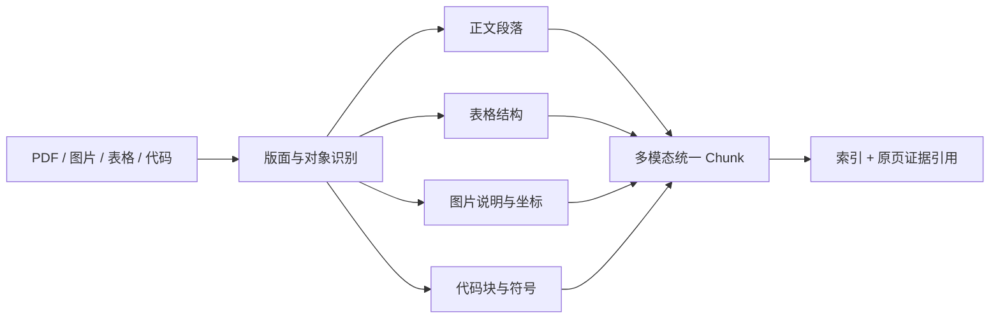

# RAG 如何处理图片、表格、代码和复杂 PDF？

- ID：Q027
- 难度：进阶 / 系统设计
- 标签：Multimodal RAG、PDF Parsing、Table、Code、OCR、Document Intelligence

## 同义问法

- PDF 直接转文本为什么效果差？
- 表格和图片应该怎么入向量库？
- 代码怎么切块和检索？
- 超大表格怎么分块？
- 多表有关联时要不要先 Join？

## 来源

- 用户提供的二手题库：`3.16`、`3.17`、`3.18`

<!-- mermaid-diagram:start -->

## 可视化图解



<!-- mermaid-diagram:end -->

## 核心结论

**复杂文档 RAG 的第一问题不是 Embedding，而是“把原始载体恢复成可验证的语义结构”。** 图片、表格、代码和 PDF 不能统一退化为一串纯文本；需要保留布局、层级、坐标、主键、调用关系和原始附件，检索单元也应按内容类型设计。

## 一、统一处理框架

> 对应流程已改为上方 Mermaid 图解。

每个节点至少保留：

- 文档 ID、版本和来源；
- 页码或代码路径；
- 坐标、标题路径或 AST 位置；
- 内容类型；
- 父子关系；
- 原始文件中的可回溯位置。

生成层引用的是原始证据，而不是解析器生成的二手描述。

## 二、PDF：先区分 PDF 类型

PDF 可能是：

1. 可选中文本 PDF；
2. 扫描图片 PDF；
3. 双栏论文；
4. 表格密集财报；
5. 包含页眉、脚注、公式和图片的混合文档。

直接按读取顺序提取文字常见问题：

- 双栏内容串行错位；
- 页眉页脚重复进入每个 Chunk；
- 表格行列关系丢失；
- 图片标题与图片分离；
- OCR 错字污染索引；
- 页码和引用关系消失。

生产解析应输出布局节点，而不是只输出 `full_text`。扫描件用 OCR，但 OCR 结果需保存置信度和图像坐标；低置信度区域可以进入人工复核或多模态模型路径。

## 三、图片

图片至少有三种检索需求：

### 1. 文字型图片

例如扫描表单和截图。使用 OCR 提取文字，同时保留原图和坐标。

### 2. 语义型图片

例如架构图、曲线图、设备照片。可以生成图片描述并建立文本索引，或使用多模态 Embedding 建立图文共享空间。

### 3. 精确读图

例如问“图中第三季度柱状图是多少”。仅靠图片描述不够，需要把检索到的原图交给视觉模型，并明确标注页码和图号。

图片描述是检索代理，不是原始事实。回答时应回到原图验证。

## 四、表格

表格的核心是行列关系，不能把单元格按普通段落打散。

### 小表格

保持表头和表体整体，转为 Markdown 或结构化 JSON，并附文档标题、单位和时间。

### 长表格

按行或行组切分，每个块重复必要表头：

```json
{
  "table": "课程成绩",
  "student": "张三",
  "course": "数学",
  "score": 95,
  "unit": "分"
}
```

不要生成只有 `95` 的孤立块。

### 超宽表

按业务依赖将列分组，但每组重复主键、时间和必要维度。强依赖列必须保持在同一语义单元，例如课程名与分数、指标名与指标值。

### 多表关系

不建议在索引阶段盲目做大型 Inner Join：

- 可能造成数据膨胀；
- 丢失无匹配行；
- 不同业务实体的语义混在一个向量中；
- 数据更新导致大量重复重建。

更合理的是：

- 保留表级 Schema、主外键和实体 ID；
- 在块元数据中携带关键维度摘要；
- 检索时先定位实体，再用结构化查询或二次检索关联；
- 精确聚合问题直接走 SQL/计算工具，不让 LLM 从大量行中估算。

## 五、代码

代码检索首先保留语法结构：

- 文件；
- 类 / 接口；
- 函数；
- 参数与返回值；
- 注释和 Docstring；
- Import；
- 调用与被调用关系；
- Commit、分支和版本。

切分优先使用 AST 或语言解析器，而不是固定字符数。搜索索引可以组合：

- 代码文本；
- 函数签名；
- 注释；
- 文件路径；
- 符号表；
- 调用图；
- Git diff。

“找定义”更适合符号索引；“这个异常可能由哪里抛出”需要调用图、关键词和语义检索联合。

## 六、复杂内容的多路索引

同一节点可以有多个表示：


路由器根据 Query 选择检索通道，最终统一映射回原始证据 ID。

## 七、验证和质量控制

解析层要有独立评测：

- OCR 字符准确率；
- 阅读顺序；
- 表格结构还原率；
- 标题层级准确率；
- 图片与 Caption 关联；
- 代码语法节点完整性；
- Source Mapping 正确率。

很多所谓“RAG 幻觉”实际是解析阶段已经把数据弄错。

## 常见错误回答

> 图片 OCR 后、表格转 Markdown、代码用 CodeBERT 就行。

只列工具，没有说明信息结构、检索意图和原始证据如何回溯。

> 表格全部转成文本再做向量检索。

精确筛选、排序、聚合和 Join 应优先由数据库或计算工具完成。

## 面试口述版

> 复杂文档 RAG 的重点是先恢复结构，再选择索引。PDF 要保留布局和页码，扫描件 OCR 还要保存坐标和置信度；图片描述只用于召回，回答要回到原图；表格保持表头、主键、单位和依赖列，精确聚合走 SQL；代码按 AST、符号和调用关系切分，并保留 Git 版本。一个节点可以同时进入关键词、向量、结构化和图索引，最后都映射回原始证据。解析质量要单独评测，否则生成层会忠实地引用一份已经解析错误的内容。

## 结合个人项目

诊断 Agent 同时面对日志、源码、Jenkins 页面和架构图。可以把日志按异常事件、源码按 AST、构建配置按结构字段解析，检索后仍返回原始日志行号和代码 Commit，方便开发人员验证。