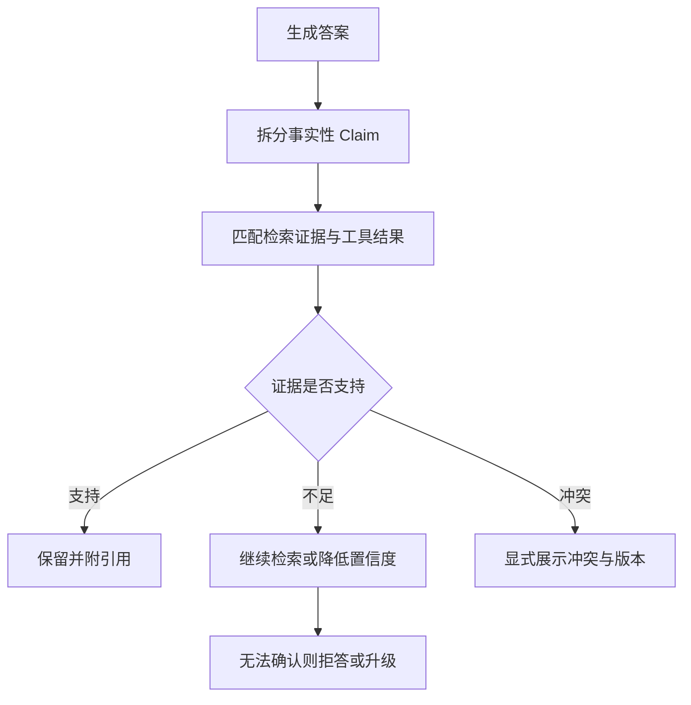

# Agent/RAG 的幻觉从哪里产生？如何检测、归因和抑制？

- ID：Q029
- 难度：进阶 / 系统设计
- 标签：Hallucination、Groundedness、Citation、Agent Trace、Refusal

## 同义问法

- RAG 为什么仍然会幻觉？
- 如何降低引用幻觉？
- Agent 多步执行时哪一步开始出错？
- 幻觉率怎么衡量？
- Prompt 写“只能基于资料回答”够不够？

## 来源

- 用户提供的二手题库：`3.21`、`4.1`、`4.2`、`4.3`、`4.5`

<!-- mermaid-diagram:start -->

## 可视化图解



<!-- mermaid-diagram:end -->

## 核心结论

**幻觉不是单一的“模型编造”，而是系统把不可靠信息包装成确定结论的结果。** RAG 和 Agent 增加了外部证据与行动能力，也增加了解析、检索、工具、状态和多步传播等新的错误来源。

治理方法必须是：先建立细粒度错误分类和 Trace，再在数据、检索、推理、工具、输出和业务动作各层限制错误传播。

## 一、幻觉来源分类

### 1. 参数知识幻觉

模型依据训练记忆补充当前上下文不存在或已经过期的事实。

### 2. 解析幻觉

PDF、OCR、表格或代码解析错误，模型忠实使用了错误输入。此时生成层看起来 Grounded，事实仍然错。

### 3. 检索幻觉

召回主题相似但无法支撑结论的内容，或选择了错误版本、租户和时间范围。

### 4. 引用幻觉

引用不存在、链接错误，或引用文档真实存在但并不支持相邻断言。

### 5. 推理幻觉

证据正确，但模型做了不成立的因果推断、计算或跨文档连接。

### 6. 工具使用幻觉

模型虚构工具成功、误读错误信息、使用错误参数，或工具执行失败后继续生成“像成功一样”的答案。

### 7. 状态幻觉

Agent 使用了过期计划、旧记忆或错误 Checkpoint，把已经失效的信息当成当前状态。

### 8. 多 Agent 传播

上游 Agent 的未经验证结论被下游当成事实，错误经过总结后失去来源并不断放大。

## 二、检测不能只看最终答案

推荐把回答拆成原子断言：

```json
{
  "claim": "服务启动失败是因为缺少 dubbo.properties",
  "evidence_ids": ["log-18", "repo-file-7"],
  "entailment": "supported",
  "confidence": 0.91
}
```

逐条检查：

1. 证据是否存在；
2. 证据是否来自正确版本和权限域；
3. 证据是否蕴含该断言；
4. 断言是否经过额外推理；
5. 推理步骤能否由工具或规则验证。

Agent 还需定位第一处错误：路由、Query、检索、工具参数、工具结果解释、计划还是最终生成。

## 三、主要指标

### Faithfulness / Groundedness

断言是否被给定证据支持。

### Citation Precision

给出的引用中有多少真正支持对应断言。

### Citation Recall

需要引用的断言中有多少附带了充分证据。

### Fact Correctness

与外部真值是否一致。忠实于一份过期文档并不等于事实正确。

### Refusal Quality

证据不足时是否正确拒答，以及是否发生过度拒答。

### Trajectory Error Rate

多步任务中规划、工具选择、参数、观察解释等步骤的错误率和首个错误位置。

不要给出脱离任务和评测集的“工业标准幻觉率”。不同风险领域、断言粒度和 Judge 方法不可直接比较。

## 四、分层抑制

### 数据层

- 清洗重复、错误和过期文档；
- 维护来源、版本、有效时间和责任人；
- 对 OCR 和解析保存置信度；
- 冲突不静默覆盖。

### 检索层

- 结构化分块；
- Hybrid Retrieval + Reranker；
- 时间和权限过滤；
- 低相关度拒答；
- 多证据交叉验证。

### 生成层

- 明确区分事实、推断和建议；
- 强制断言绑定证据 ID；
- 无证据时输出未知，不使用参数知识补齐；
- 对数字、日期、金额和版本做结构化校验。

### 工具层

- 工具成功状态由 Runtime 判断；
- 失败结果使用结构化错误；
- 高风险写操作需验证和审批；
- 关键事实直接查 DB/API，不从 Agent 摘要中继承。

### 输出层

- Citation Verifier；
- Schema 校验；
- 敏感内容与 PII 检测；
- 高风险结论人工 Review；
- 显示来源、时间和不确定性。

## 五、为什么 RAG 不能“消除幻觉”

RAG 只提高获得外部证据的可能性。以下情况仍会出错：

- 正确证据没召回；
- 错误证据排名靠前；
- 文档本身错误；
- 模型忽略证据；
- 模型把相关性误当因果性；
- 引用映射错误；
- 问题本身没有确定答案。

因此“上 RAG”不是治理方案，RAG 的每层都需要独立评估。

## 六、拒答机制

拒答不能只依赖一个相似度阈值。可综合：

- Top 结果分数和分数间隔；
- 多路检索是否一致；
- 是否覆盖答案需要的关键槽位；
- Reranker 判断；
- 是否存在冲突版本；
- 风险等级。

低风险可给出带不确定性的候选答案；高风险问题证据不足则转人工或只返回已知事实。

## 七、Agent 的错误归因

Trace 保存：

```text
Query
→ Route
→ Rewrite
→ Retrieval Candidates
→ Rerank
→ Model Decision
→ Tool Call
→ Tool Result
→ State Update
→ Final Claims + Citations
```

回放时冻结外部依赖或保存工具快照，比较：

- 相同输入下模型决策是否变化；
- 更换检索结果后答案是否修复；
- 工具结果是否被错误解释；
- 首个偏离正确轨迹的步骤。

## 常见错误回答

> 在 Prompt 中要求模型不要编造。

Prompt 只能影响行为概率，无法修复错误数据、漏召回、工具失败和引用映射。

> 让另一个 LLM 再检查一次。

第二个模型可能共享同样偏差。验证器必须获得原始证据、明确 Rubric，并对关键字段使用确定性工具。

## 面试口述版

> 我会把幻觉拆成参数知识、解析、检索、推理、工具、状态和引用等类型。先保存完整 Trace，再把最终回答拆成原子断言，检查每条断言是否有正确版本和权限域的证据支撑。治理上从数据版本、Hybrid Retrieval、Reranker、证据充分性、结构化工具错误、断言引用、拒答和人工审批多层收敛。RAG 只能提供证据，不会自动消除幻觉；真正关键的是定位第一处错误并阻止未经验证的结论继续进入后续状态或业务动作。

## 结合个人项目

故障诊断中需要区分“日志直接证明”“根据代码和日志推断”“经验性建议”。例如缺文件日志可以作为直接证据，但“换 JDK 导致”可能只是相关性，需要结合 Commit、启动参数和复现实验才能升级为根因。