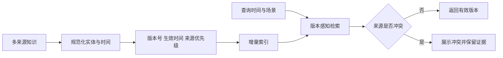

# 新旧知识冲突、文档更新和版本回滚如何设计？

- ID：Q030
- 难度：进阶 / 系统设计
- 标签：Knowledge Versioning、Conflict Detection、CDC、Index Update、Temporal Retrieval

## 同义问法

- 用户上传的新文档与知识库冲突怎么办？
- 新知识一定优先吗？
- 文档更新后如何只更新变化的 Chunk？
- 向量索引怎么做版本回滚？
- 如何避免旧 Chunk 与新 Chunk 同时被召回？

## 来源

- 用户提供的二手题库：`3.22`、`3.23`、`4.4`

<!-- mermaid-diagram:start -->

## 可视化图解



<!-- mermaid-diagram:end -->

## 核心结论

**知识冲突不能用“新文档无条件覆盖旧文档”解决。** 新旧只是时间属性，不代表正确性和权威性。系统需要同时管理来源权威、有效时间、版本、适用范围和审核状态，并在检索与生成阶段显式处理冲突。

## 一、知识条目的版本模型

每个文档和 Chunk 至少保存：

```json
{
  "document_id": "refund-policy",
  "version": 12,
  "valid_from": "2026-07-01T00:00:00Z",
  "valid_to": null,
  "source_type": "official_policy",
  "authority": 100,
  "review_status": "approved",
  "scope": {"region": "CN", "channel": "app"},
  "content_hash": "sha256:...",
  "supersedes": "version-11"
}
```

必须区分：

- `created_at`：文件什么时候进入系统；
- `effective_at`：规则什么时候生效；
- `version`：哪个逻辑版本；
- `authority`：谁发布的；
- `scope`：适用于哪个业务、地区和用户群。

上传时间最新，不等于业务规则最新。

## 二、用户临时知识与主知识库

用户上传文件适合进入会话或任务级临时知识域：

```text
Session Knowledge
  + User / Tenant Knowledge
  + Enterprise Canonical Knowledge
```

检索时可以优先查临时域，但不能静默认定其正确。更合理的规则是：

1. 明确标注“用户提供”；
2. 发现与官方知识冲突时同时返回冲突证据；
3. 低风险任务可按用户指定来源继续；
4. 高风险业务要求用户确认或人工审核；
5. 临时知识未经审核不自动写入全局主库。

## 三、冲突类型

### 1. 真正矛盾

同一作用域、同一时间，对同一事实给出不同结论。

### 2. 时间差异

旧规则和新规则都正确，但有效期不同。

### 3. 作用域差异

不同地区、渠道、租户或产品版本规则不同，不应被当作冲突。

### 4. 粒度差异

一个是总体原则，一个是特殊例外。

### 5. 解析错误

OCR、表格或单位解析错误造成假冲突。

冲突检测需要先做实体、时间、作用域和断言归一化，不能只用向量相似度判定。

## 四、更新链路

> 对应流程使用 Mermaid 图解展示。

### 事件触发

Webhook、数据库 CDC、消息队列或仓库提交事件，适合实时性要求高的数据源。

### 定时校验

对不支持事件的数据源按内容 Hash 或更新时间扫描，作为兜底。

### Chunk 级增量

通过稳定节点 ID 和内容 Hash 判断新增、修改、删除。不要只依赖 Chunk 序号，因为前面插入一段文字可能导致所有序号变化。

建议节点 ID 来自：文档 ID + 标题路径 + 结构位置 + 业务主键，而不是单纯 `chunk_001`。

## 五、索引切换与回滚

不要在生产索引上边删边写后立即对外。使用版本化索引：


同时记录 Embedding 模型、分块器、解析器和 Reranker 版本。否则回滚文档版本，却使用了不兼容的向量空间。

## 六、双版本共存时的检索

文档更新过程中最危险的是旧块和新块同时进入上下文。解决方式：

- 查询只指向一个已发布索引 Alias；
- 每个结果带完整版本；
- 同一 `document_id` 默认只选择一个有效版本；
- 对历史问题显式传 `as_of_time`；
- 生成前执行版本一致性校验。

## 七、知识优先级不是简单排序

可以构建决策矩阵：

```text
适用作用域
  > 有效时间
  > 法规/官方来源权威
  > 审核状态
  > 用户明确指定
  > 新鲜度
```

不同业务顺序可能不同。例如用户问“这份草案写了什么”，草案本身就是目标来源；用户问“当前正式退款政策是什么”，官方已生效版本优先。

## 八、生成层如何表达冲突

若无法自动裁决，应输出：

- 冲突的具体断言；
- 各自来源、版本和有效时间；
- 系统当前采用哪个及原因；
- 需要用户或人工确认的事项。

不能把两份冲突材料混合成一个看似确定的答案。

## 九、验证指标

- 索引新鲜度延迟；
- 增量更新成功率；
- 版本混用率；
- 冲突检测 Precision / Recall；
- 回滚时间；
- Source Mapping 正确率；
- 历史 `as_of` 查询正确率。

## 常见错误回答

> 新知识优先于旧知识。

新知识可能是草稿、错误上传或适用其他地区。优先级必须结合权威、有效期和作用域。

> 更新时删除旧 Chunk，再插入新 Chunk。

如果中间失败，会出现短暂缺失或新旧混合；生产需要版本化构建和原子切换。

## 面试口述版

> 我会把知识管理成带来源、版本、有效时间、作用域和审核状态的实体，而不是只按上传时间排序。用户上传内容进入会话临时域，冲突时同时展示证据，高风险场景不自动覆盖官方主库。更新链路使用稳定节点 ID 和 Hash 做 Chunk Diff，在新索引版本上构建和回归，通过 Alias 原子切换并保留旧版本回滚。检索时保证同一文档只使用一个有效版本，历史问题支持 as-of 查询，生成前检查版本一致性。这样才能避免旧块和新块同时进入模型。

## 结合个人项目

发布排障知识与代码高度版本相关。回答某次历史发布失败时，必须使用当时的 Commit、配置和依赖版本，不能用今天已修复的代码解释过去状态。