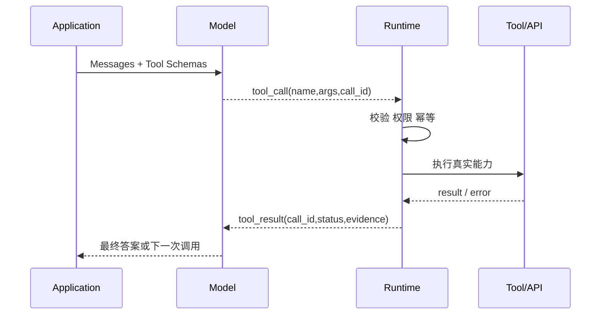

# Function Calling 与 Tool Calling 的机制和边界是什么？

- ID：Q031
- 难度：基础 / 进阶
- 标签：Function Calling、Tool Calling、JSON Schema、Runtime、Tool Result
- 时效性：不同模型厂商的术语会变化，回答日期为 2026-08-01

## 同义问法

- Function Calling 的完整流程是什么？
- 模型真的执行了函数吗？
- Tool Calling 和 Function Calling 有什么区别？
- 模型怎么决定调用哪个工具？
- Function Calling 能力是怎么训练出来的？

## 来源

- 用户提供的二手题库：`5.1`、`5.2`、`5.4`
- [OpenAI Agents SDK：Tools](https://openai.github.io/openai-agents-python/tools/)：模型提出工具调用，本地或托管 Runtime 执行并返回结果。

<!-- mermaid-diagram:start -->

## 可视化图解



<!-- mermaid-diagram:end -->

## 核心结论

**模型通常不直接执行你的业务函数，而是根据工具描述生成一个结构化“调用意图”；Runtime 校验、授权并执行，再把结果作为 Tool Result 返回模型。**

“Function Calling”和“Tool Calling”的术语边界并非跨厂商统一标准。常见用法是：Function Calling 指自定义函数的结构化调用机制；Tool Calling 是更宽泛的能力集合，可能还包含平台内置工具、MCP、代码执行、浏览器操作和 Agent-as-Tool。面试时应先说明术语依赖具体平台，再讲底层共同机制。

## 一、完整链路

```text
1. Application 定义工具 Schema
2. Schema + Messages 发给模型
3. 模型输出：文本、一个或多个 Tool Call，或结束
4. Runtime 解析和校验 Tool Call
5. 权限 / 风险 / 参数 / 幂等检查
6. Runtime 执行真实函数或远程工具
7. 产生结构化 Tool Result
8. Tool Result 关联 tool_call_id 回填模型
9. 模型继续推理或生成最终答案
```

工具 Schema 示例：

```json
{
  "name": "get_deployment_logs",
  "description": "查询指定服务在时间范围内的部署日志",
  "parameters": {
    "type": "object",
    "properties": {
      "service": {"type": "string"},
      "start_time": {"type": "string", "format": "date-time"},
      "end_time": {"type": "string", "format": "date-time"}
    },
    "required": ["service", "start_time", "end_time"]
  }
}
```

模型输出的本质类似：

```json
{
  "tool_call_id": "call-17",
  "name": "get_deployment_logs",
  "arguments": {
    "service": "order-api",
    "start_time": "2026-08-01T10:00:00+08:00",
    "end_time": "2026-08-01T10:10:00+08:00"
  }
}
```

这不是执行结果，只是候选动作。

## 二、模型如何选择工具

模型根据：

- 工具名称和描述；
- 参数 Schema；
- System Prompt 的行为规则；
- 当前对话和观察；
- Few-shot 工具调用样例；
- 模型训练中学习到的工具使用模式。

选择错误常见原因：

- 工具描述重叠；
- 工具粒度和命名不清；
- 一次暴露太多工具；
- 参数语义只写在代码里，没有进入 Schema；
- 当前 Context 缺少必要实体；
- 工具能力边界与业务真实权限不一致。

## 三、训练原理应该怎么回答

不应武断说“只靠 SFT + RLHF”。具体模型训练细节通常不公开。可以从通用机制解释：

1. 监督样本教模型识别何时调用、选择哪个工具、输出什么结构；
2. 偏好优化或强化学习提升工具选择、参数正确性和多步成功率；
3. 结构化解码、Schema 约束或服务端校验提高格式可靠性；
4. 工具执行反馈形成多轮轨迹，用于继续训练和评估。

要区分：模型学会“提出调用”与 Runtime 保证“安全执行”是两件事。

## 四、Runtime 必须承担什么

即使模型支持严格结构化输出，Runtime 仍需：

- JSON Schema 和业务规则校验；
- Tool Registry 查找；
- 租户和权限校验；
- 高风险工具审批；
- 超时、限流、熔断；
- 幂等键；
- 重试分类；
- 输出大小限制和脱敏；
- 审计与 Trace。

模型生成合法 JSON，不代表该操作合法、存在、授权或应该执行。

## 五、Tool Result 设计

不要只返回一段模糊字符串：

```json
{
  "tool_call_id": "call-17",
  "status": "failed",
  "error_type": "permission_denied",
  "retryable": false,
  "message_for_model": "当前用户无生产日志读取权限",
  "evidence_ref": null
}
```

错误语义越清晰，模型越容易选择正确的替代路径；同时重试策略由 Runtime 根据 `retryable` 决定，而不是完全交给模型猜。

## 六、Function Calling 与 API 调用的区别

Function Calling 是模型输出层协议；真实工具可以是：

- 进程内函数；
- HTTP / gRPC API；
- MCP Server；
- 数据库查询；
- Shell 或浏览器；
- 另一个 Agent。

模型通常不需要知道底层连接细节，只需要稳定、语义清晰的 Tool Contract。

## 七、与结构化输出的区别

结构化输出只保证模型返回某个 Schema；Function Calling 还表达“这是一个要由 Runtime 执行的动作”，并需要 Tool Result 回填和后续循环。

如果任务只需要生成 JSON 报告，不需要执行外部动作，使用普通结构化输出更合适。

## 常见错误回答

> Function Calling 就是模型调用函数。

模型多数情况下只生成名称和参数，应用代码才真正调用。

> Tool Calling 比 Function Calling 更高级，支持自主决策。

不同平台术语不同；自主决策来自 Agent Loop 和 Runtime，不是改一个名称自动获得。

## 面试口述版

> 我会先说明不同厂商对 Function Calling 和 Tool Calling 的命名不完全一致。底层共同机制是：应用把工具名称、描述和参数 Schema 发给模型，模型生成结构化调用意图；Runtime 解析后做参数、权限、风险和幂等校验，再执行真实函数或远程工具，把带 tool_call_id 的结果回填模型进入下一轮。模型负责提出动作，Runtime 负责安全执行。工具选择主要由描述、Schema、Context 和训练能力决定，生产可靠性则来自工具路由、错误分类、审批、超时和审计。

## 延伸阅读

- [Q054 手写 Function Calling 完整链路](./54-function-calling-end-to-end.md)
- [Q004 如何让 Tool Calling 在生产环境中可靠](./04-reliable-tool-calling.md)

## 结合个人项目

CI/CD Agent 中模型可以提出“查日志”“拉代码”“执行诊断脚本”，但工具账户、环境、时间范围和生产权限必须由平台 Runtime 注入与校验，不能让模型自行构造高权限连接参数。
