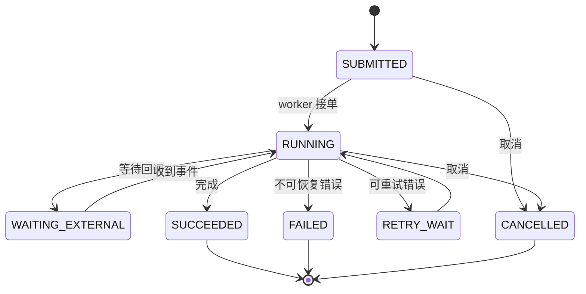

# 慢工具和长任务如何采用异步执行、回调与恢复？

- ID：Q033
- 难度：进阶 / 系统设计
- 标签：Async Tool、Long-running Task、Polling、Webhook、Durable Execution

## 同义问法

- 工具执行很慢时 Agent 阻塞还是回调？
- 如何设计一个需要运行几十分钟的工具？
- Agent 等工具时能否继续做其他事？
- 服务重启后如何继续等待任务？
- Polling、SSE、Webhook 怎么选？

## 来源

- 用户提供的二手题库：`5.6`

<!-- mermaid-diagram:start -->

## 可视化图解



<!-- mermaid-diagram:end -->

## 核心结论

**长工具不应占住一次 LLM 请求或 Web 连接等待到底，而应建模为可持久化的任务。** Tool Call 先返回 `task_id`，Runtime 把 Agent Run 转入等待或并行状态；任务完成后通过轮询、事件、Webhook 或消息队列唤醒，再从 Checkpoint 恢复。

## 一、同步执行的边界

短、稳定、无副作用的工具可以同步执行：

> 对应流程使用 Mermaid 图解展示。

但若工具可能需要数十秒到数小时，同步阻塞会带来：

- HTTP / LLM 请求超时；
- Worker 被占满；
- 进程重启丢失状态；
- 用户断开后任务不可追踪；
- 重试可能重复执行副作用；
- 无法取消、暂停或查询进度。

## 二、任务状态模型


任务记录至少包括：

```json
{
  "task_id": "task-88",
  "run_id": "agent-run-7",
  "tool_call_id": "call-13",
  "status": "running",
  "progress": 0.45,
  "idempotency_key": "...",
  "result_ref": null,
  "error": null,
  "heartbeat_at": "...",
  "deadline": "..."
}
```

Agent Run 可以进入 `WAITING_TOOL`，而不是继续消耗模型轮次。

## 三、启动协议

```json
{
  "status": "accepted",
  "task_id": "task-88",
  "poll_after_seconds": 10,
  "supports_cancel": true
}
```

这个结果表示“已接受”，不是“已成功”。模型最终回答不能把 accepted 当 completed。

## 四、获取结果的方式

### 1. Polling

Runtime 定期查询状态。

优点：简单、容易穿过网络边界；缺点：额外请求和完成延迟。应使用退避、抖动和最大间隔，而不是每秒永久轮询。

### 2. Webhook / Callback

任务服务完成后向回调地址发送事件。

优点：低空转；缺点：回调鉴权、重复投递、乱序、网络失败和公网可达性更复杂。

处理原则：Webhook 至少一次投递，消费端按 `event_id` 幂等。

### 3. Message Queue / Event Bus

适合内部系统和高并发长任务。任务状态变化发布事件，Agent Runtime 订阅并恢复对应 Run。

### 4. SSE

适合前端查看进度和增量输出，不应作为唯一可靠状态存储。连接断开后仍需通过持久化任务状态恢复。

## 五、Agent 等待期间做什么

若任务之间无依赖，可以继续执行其他准备工作；若当前决策依赖结果，则应暂停该分支。


并行由依赖图和 Runtime 控制，不是让模型在等待时无限调用其他工具。

## 六、恢复流程

```text
1. 读取 Agent Checkpoint
2. 查询所有非终态 task_id
3. 对比任务服务真实状态
4. 已完成：写入 Tool Result 并继续
5. 仍运行：重新订阅或安排 Poll
6. 已丢失：根据幂等键重新提交或失败升级
```

Checkpoint 必须保存外部 `task_id` 和幂等键，否则重启后无法知道任务是否已经执行。

## 七、超时、取消和僵尸任务

区分：

- Agent 等待超时；
- 工具业务执行超时；
- 用户主动取消；
- Worker 失联；
- 回调丢失但任务实际成功。

使用 Heartbeat 和租约判断 Worker 是否存活；取消是请求，不一定立即成功。对外部系统必须再次查询最终状态，不能仅根据本地超时认定失败。

## 八、幂等与重复提交

长任务最常见故障是：请求已被服务接收，但响应丢失，Runtime 重试后启动两份任务。

解决：

- 业务幂等键；
- `get-or-create` 语义；
- Tool Call 状态持久化；
- 结果按 `tool_call_id` 只消费一次；
- 副作用任务支持补偿或人工处理。

## 九、用户体验

前端可以展示：

- 已接收；
- 当前阶段；
- 最近心跳；
- 可取消状态；
- 预计不是承诺的完成区间；
- 失败原因和下一步。

对话 Agent 可以先返回“任务已启动”，但后续通知必须由持久任务系统触发，而不是假设当前会话一直在线。

## 常见错误回答

> 慢工具用异步加 Callback 就行。

没有说明任务状态、持久化、回调幂等、重启恢复和取消。

> Agent 可以一边等一边调用其他工具。

只有独立任务才能并行；存在数据依赖时必须等待。

## 面试口述版

> 我会把慢工具建模为独立持久任务。首次调用只返回 accepted 和 task_id，Agent Run 保存 Checkpoint 后进入 WAITING_TOOL。任务状态通过 Polling、Webhook 或消息队列更新，完成后 Runtime 根据 run_id 和 tool_call_id 恢复执行。连接只负责通知，真实状态在任务存储中。系统还要处理回调重复、请求响应丢失、幂等、Heartbeat、取消、超时和重启后对账。只有无依赖分支才继续并行，避免 Agent 在等待期间无目的扩散。

## 延伸阅读

- [Q059 设计异步长工具状态机](./59-async-long-running-tools.md)
- [Q058 Checkpoint、暂停、恢复与幂等](./58-checkpoint-pause-resume-idempotency.md)

## 结合个人项目

Jenkins 构建、镜像构建和 OpenSandbox 环境初始化都属于长任务。Agent 发起后应保存平台任务 ID，异步接收状态，服务重启后通过任务 ID 对账，而不是重新执行一遍构建。