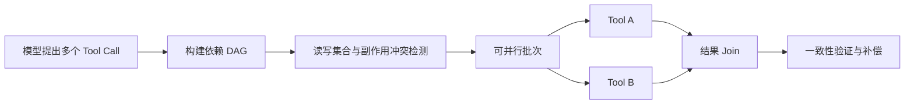

# Parallel Tool Calling 如何处理依赖、冲突和一致性？

- ID：Q035
- 难度：进阶 / 手撕设计
- 标签：Parallel Tool Calling、DAG、Side Effect、Consistency、Scheduler

<!-- mermaid-diagram:start -->

## 可视化图解



<!-- mermaid-diagram:end -->

## 核心结论

**模型一次返回多个 Tool Call，只代表“候选动作可以一起提出”，不代表这些动作可以安全并行执行。** Runtime 必须基于数据依赖、资源冲突、副作用、幂等性和事务边界构建调度计划。

## 一、并行的前提

两个调用可以并行，通常需要满足：

1. 彼此输入不依赖对方输出；
2. 不写同一资源，或写入具备安全并发控制；
3. 失败不会破坏另一个调用的前置条件；
4. 结果可独立关联到各自 `tool_call_id`；
5. 总并发、成本和限流预算允许。

例如同时查询日志和指标通常可并行；“创建发布单”与“执行发布”显然有依赖。

## 二、把 Tool Call 建模为 DAG

```json
{
  "id": "call-B",
  "tool": "analyze_artifact",
  "depends_on": ["call-A"],
  "read_set": ["artifact:A.output"],
  "write_set": [],
  "side_effect": false
}
```

Scheduler 只调度入度为 0、且资源不冲突的节点。模型可以提出依赖，但 Runtime 必须重新校验，不能相信模型声称“无依赖”。

## 三、冲突检测

常见冲突：

- 两个工具写同一配置；
- `delete_user` 与 `get_user` 同时执行；
- 两个操作消耗同一库存；
- 先读取旧状态，另一个调用随后修改；
- 重启和抓取诊断现场并行，导致证据消失。

Tool Metadata 应声明：

```json
{
  "side_effect": true,
  "idempotent": false,
  "resource_keys": ["service:${service}:${env}"],
  "parallel_safe": false
}
```

资源键可在参数绑定后生成，用于加锁或串行化。

## 四、只读也不一定安全并行

只读工具可能：

- 受外部限流；
- 返回不同时间快照；
- 对同一系统造成高负载；
- 依赖一致读；
- 输出规模同时冲击 Context。

因此还需全局并发、每工具并发、每租户配额和结果字节预算。

## 五、失败策略

并行批次可能部分成功。不要只返回“批次失败”，而要记录每个节点状态：

```json
{
  "call-A": {"status": "succeeded", "result_ref": "..."},
  "call-B": {"status": "failed", "retryable": true},
  "call-C": {"status": "skipped", "reason": "dependency_failed"}
}
```

策略包括：

- 独立失败：只重试失败节点；
- 依赖失败：下游跳过或重新规划；
- 副作用部分成功：执行补偿或人工处理；
- 超时：确认外部真实状态后再决定重试。

## 六、一致性模式

### 1. Best-effort

查询型任务允许部分结果，用状态标注缺失。

### 2. Barrier

等待一组调用全部完成后再进入下一步，适合需要统一快照的分析。

### 3. Saga / Compensation

跨服务副作用无法使用单数据库事务时，为每步定义补偿动作。补偿不保证完全回滚，应进入审计。

### 4. Optimistic Concurrency

写操作带版本号或 ETag，若状态已变化则拒绝并重新规划。

## 七、结果顺序

结果按 `tool_call_id` 关联，不依赖返回顺序。Context Builder 可以按依赖拓扑、业务重要性和完成时间组织，而不是按异步 Future 完成顺序直接拼接。

## 八、伪代码

```python
def execute_plan(calls):
    graph = validate_and_build_dag(calls)
    state = {}

    while not graph.done():
        ready = graph.ready_nodes(state)
        batch = select_non_conflicting(ready)
        results = run_with_limits(batch)

        for call_id, result in results.items():
            state[call_id] = result
            persist(call_id, result)

        graph.propagate_failures(state)

    return state
```

关键不在 `asyncio.gather`，而在 `validate_and_build_dag`、冲突选择、状态持久化和失败传播。

## 九、评估

- 并行带来的端到端延迟收益；
- 冲突拦截准确率；
- 部分失败恢复率；
- 重复副作用次数；
- 依赖错误率；
- 外部限流与资源消耗；
- 相同任务串行与并行结果一致性。

## 常见错误回答

> 没有依赖的工具用 `asyncio.gather`。

问题在于“没有依赖”需要结构化判断，还要考虑写冲突、限流、部分失败和持久化。

> 只有读工具才可以并行。

部分写操作可以在不同资源上并行，部分读操作却需要一致快照或限流；关键是资源和语义，不是简单读写标签。

## 面试口述版

> 模型返回多个 Tool Call 不等于可以直接并行。我会把调用转换成 DAG，并根据参数计算读写资源集、副作用、幂等和限流元数据。Scheduler 只执行依赖满足且资源不冲突的节点，结果按 tool_call_id 关联。部分失败时只重试可恢复节点，下游按依赖跳过或重规划；副作用任务使用版本控制、幂等键和 Saga 补偿。并行的收益要和冲突率、限流、结果一致性一起评估，而不是只看延迟。

## 延伸阅读

- [Q060 Parallel Tool Calling 依赖调度器](./60-parallel-tool-dependency-scheduler.md)

## 结合个人项目

故障诊断中查询 Jenkins 日志、Kubernetes Events 和监控指标可以并行；但重启 Pod 必须在现场证据采集完成后执行，否则并行会直接破坏根因证据。