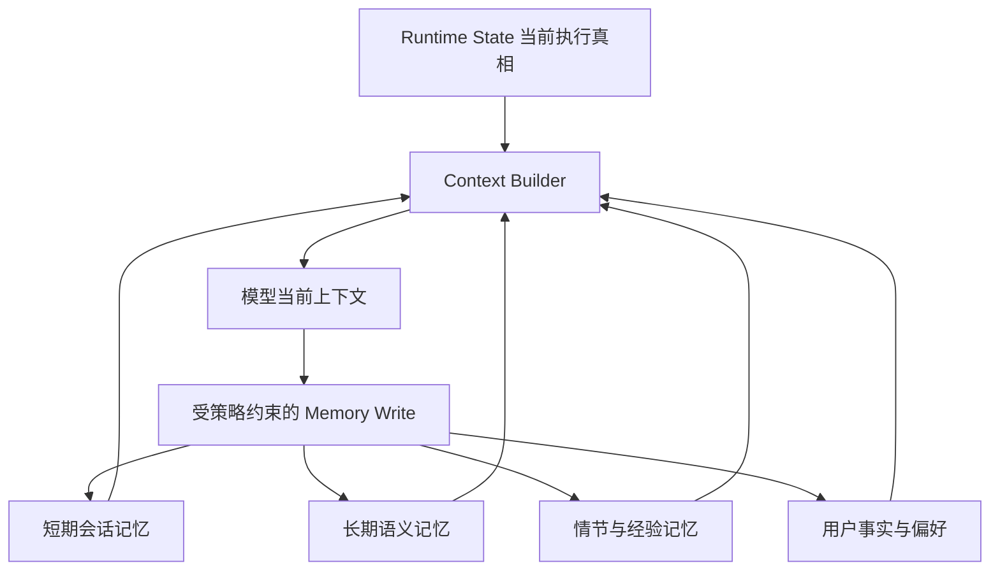

# Agent Memory 应如何分层？短期、长期、情节和程序记忆如何配合？

- ID：Q036
- 难度：进阶 / 系统设计
- 标签：Memory、Working Memory、Semantic、Episodic、Procedural、State

<!-- mermaid-diagram:start -->

## 可视化图解



<!-- mermaid-diagram:end -->

## 核心结论

**Agent Memory 不是一个向量数据库，也不是完整聊天记录。它是按用途、生命周期、正确性要求和访问模式分层管理的信息系统。**

首先必须区分：

- `Runtime State`：当前任务真实执行状态；
- `Working Context`：本轮送给模型的信息；
- `Short-term Memory`：当前会话或任务的近期信息；
- `Long-term Memory`：跨任务复用的事实、经验和流程。

Runtime State 不能只存在自然语言消息里，Memory 也不能替代数据库中的业务真值。

## 一、工作记忆（Working Memory）

指模型当前推理可见的有限 Context：

- 当前目标；
- 当前计划和未完成步骤；
- 最近对话；
- 当前工具结果；
- 必要规则和证据。

它是临时工作区，容量受 Token Window 限制。Context Builder 每轮从其他存储中选择内容构造它。

## 二、短期记忆（Short-term Memory）

服务于当前会话或任务：

- 最近消息；
- 槽位和用户当前意图；
- 中间结论；
- 当前任务摘要；
- 工具调用历史。

可以保存在进程内存、Redis、关系数据库或 Checkpoint Store。它需要 Session/Tenant 隔离，并支持重启恢复。

短期记忆不是简单保留最近 N 轮。对任务型 Agent，更重要的是维护结构化状态：

```json
{
  "goal": "定位发布失败",
  "service": "order-api",
  "environment": "beta",
  "confirmed_facts": [],
  "open_questions": [],
  "next_step": "query_logs"
}
```

## 三、长期语义记忆（Semantic Memory）

保存跨会话稳定事实：

- 用户明确偏好；
- 组织、产品和领域知识；
- 已确认配置；
- 业务规则。

事实应尽量结构化并带来源、版本、有效期和置信度。向量索引只负责检索入口，关系数据库或知识图谱更适合保存可更新事实。

## 四、情节记忆（Episodic Memory）

保存“过去发生过什么”：

- 某次故障的完整轨迹；
- 用户曾如何纠正 Agent；
- 某种方案在哪个上下文中成功或失败；
- 关键决策及结果。

情节记忆应保留时间、参与者、上下文、动作、结果和证据。它适合 Case-based Retrieval 和复盘，但不能把过去案例直接当作当前真值。

## 五、程序记忆（Procedural Memory）

保存“如何做”：

- Skill / SOP；
- 工具使用顺序；
- 诊断脚本；
- 检查清单；
- 组织规范。

相比把 SOP 写成长 Prompt，更适合版本化文件、Skill Registry 或工作流定义。程序记忆需要 Review、测试和发布，不应由 Agent 在一次成功后自动覆盖正式流程。

## 六、实体记忆

实体记忆通常是语义记忆的一种结构化实现：

```json
{
  "entity_type": "user_preference",
  "entity_id": "user-1",
  "key": "answer_style",
  "value": "先给结论和命令，再解释原理",
  "source": "explicit_user_statement",
  "valid_from": "..."
}
```

重要事实使用精确 Key/ID 查找，不要只依赖相似度检索。

## 七、各层如何协作

```text
Long-term Semantic / Episodic / Procedural Stores
                   │ retrieve
                   ▼
Short-term Session State + Checkpoint
                   │ select / compress
                   ▼
Working Context sent to LLM
                   │ actions / observations
                   ▼
State Update → selective memory write
```

读取和写入都需要策略。不是每条消息都进入长期记忆，也不是每次请求都加载全部记忆。

## 八、Memory 与业务真值

用户地址、账户余额、订单状态、生产配置等关键事实应由权威系统提供。Memory 可以保存“用户常用地址偏好”或引用 ID，但执行高风险操作前必须重新查询 Source of Truth。

原则：

> Memory 用于帮助理解和检索，不用于绕过权威系统验证。

## 九、常见混淆

### Checkpoint vs Memory

- Checkpoint：让同一任务从中断处恢复；
- Memory：让未来任务复用信息。

### RAG Knowledge vs User Memory

- 企业知识库通常面向多人共享、经过治理；
- 用户记忆有强身份隔离、隐私和可删除要求。

### KV Cache vs 应用 Memory

模型推理中的 KV Cache 是计算优化，不是业务层可持久化的用户记忆。

## 十、评估

- 正确记忆召回率；
- 错误或过期记忆注入率；
- 跨用户泄漏率；
- 记忆写入 Precision；
- 用户纠正后的更新时延；
- 对任务完成率的真实增益；
- Token 和存储成本。

## 常见错误回答

> 短期记忆放 Redis，长期记忆放向量数据库。

存储技术不是概念定义。短期与长期首先由生命周期和用途区分；长期事实也可能存在关系数据库，短期状态也可能持久化到 PostgreSQL。

## 面试口述版

> 我会先把 Runtime State、Working Context 和 Memory 分开。Working Memory 是本轮模型可见的信息；短期记忆服务当前会话和任务，保存近期消息与结构化任务状态；长期记忆再分语义事实、情节案例和程序流程。重要实体事实使用带版本和来源的结构化存储，向量库只做检索入口。Checkpoint 用于同一任务恢复，程序记忆以 Skill 或 SOP 版本化。执行订单、余额、生产配置等高风险动作前仍需查询权威系统，不能只信 Memory。

## 结合个人项目

CI/CD Agent 的当前日志、计划和已排除原因属于任务状态；历史故障案例属于情节记忆；诊断 SOP 与脚本属于程序记忆；服务负责人和环境配置属于带来源的语义事实。