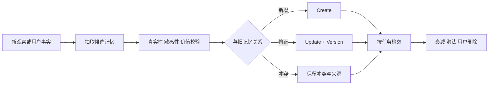

# 记忆何时写入、如何读取、更新、遗忘和防止污染？

- ID：Q037
- 难度：进阶 / 系统设计
- 标签：Memory Policy、Write Gate、Retrieval、Upsert、Forgetting、Pollution

<!-- mermaid-diagram:start -->

## 可视化图解



<!-- mermaid-diagram:end -->

## 核心结论

**长期记忆的难点不是存储，而是写入资格、事实合并、冲突处理和错误遗忘。** 每轮对话都写会产生噪音和污染；完全依赖模型自由写又会把猜测、临时情绪和错误结论固化。

## 一、写入门槛

一条信息进入长期记忆前至少判断：

1. 是否跨任务仍有价值；
2. 是用户明确表达，还是模型推断；
3. 是否包含敏感数据；
4. 是否已有同类事实；
5. 是否需要有效期；
6. 是否有权威来源；
7. 错误写入的代价。

可以把候选记忆分级：

- `explicit_fact`：用户明确说明；
- `verified_fact`：由权威系统确认；
- `inferred_preference`：根据行为推断；
- `temporary_context`：只在当前任务有效；
- `prohibited`：不应持久化。

推断记忆不能伪装成事实，应保存置信度和来源。

## 二、写入触发

- 用户明确说“以后记住……”；
- 用户纠正已有事实；
- 任务完成后沉淀已验证经验；
- 达到会话阶段边界时批量抽取；
- 定时离线归纳历史案例。

不建议每条消息同步调用大模型写长期记忆。可以先进入候选队列，再批量去重、审核和写入。

## 三、读取策略

读取不是简单语义 Top-K，应组合：

```text
身份与租户过滤
  → Memory Type 过滤
  → 时间 / 有效期过滤
  → 精确实体查询
  → 语义召回
  → 重要度与新鲜度重排
  → 冲突检查
  → Context Budget 选择
```

当前问题只加载相关记忆。对于用户风格偏好，可在会话开始精确读取；对于历史案例，根据当前故障语义检索；对于高风险事实，重新查询权威系统。

## 四、更新不是 Append

用户说“地址改了”时，不能只新增一条新地址并保留两条同等有效记录。需要：

```json
{
  "memory_id": "address-home",
  "version": 3,
  "status": "active",
  "supersedes": "version-2",
  "value": "new address",
  "source": "explicit_user_update"
}
```

旧版本可为审计保留，但检索默认只返回当前有效版本。

如果用户只说“改成另一个”，缺少值，应澄清而不是猜测。

## 五、冲突合并

冲突可能来自：

- 用户修改；
- 不同会话并发写；
- 模型推断与用户明确事实冲突；
- 权威系统与记忆冲突；
- 临时偏好与长期偏好不同。

优先级通常是：权威实时数据 > 用户明确更正 > 已确认事实 > 推断。高风险事实不自动合并。

## 六、遗忘与衰减

遗忘不是物理删除所有旧数据，而是降低其进入工作上下文的机会。

常用信号：

- 最后访问时间；
- 访问频率；
- 用户明确的重要性；
- 任务价值；
- 有效期；
- 与当前 Query 的相关性；
- 是否已被新版本替代。

可采用：

```text
retrieval_score = relevance
                + importance
                + recency
                + source_quality
                - conflict_penalty
                - stale_penalty
```

对于法规、地址和配置，过期不是“降权”，而应直接禁止作为当前事实使用。

## 七、记忆污染

主要来源：

- 把模型推断写成用户事实；
- 将一次临时要求写成永久偏好；
- 把失败答案或恶意输入沉淀为经验；
- 不同用户串写；
- 纠正后旧记忆仍被召回；
- 摘要多次压缩后含义漂移。

防护：

- 写入 Schema 与类型；
- 来源和证据；
- Tenant/User 强隔离；
- Upsert 与版本；
- 用户可查看、纠正和删除；
- 高价值记忆人工或规则校验；
- 记忆注入时显示来源和置信度；
- 不让检索到的记忆自动回写。

## 八、重要性评分

重要性可由规则、轻模型或 LLM 判断，但必须有稳定 Rubric。例如：

- 是否影响未来任务决策；
- 是否为明确长期偏好；
- 是否涉及关键实体；
- 重复出现次数；
- 错误遗忘的代价。

所谓“情感强烈就更重要”只适用于特定陪伴型产品，不是企业 Agent 通用规则。

## 九、删除与隐私

用户记忆需要：

- 可枚举；
- 可解释来源；
- 可纠正；
- 可删除；
- TTL；
- 加密与访问审计；
- 删除后同步清理向量索引、缓存和派生摘要。

只删主表但保留 Embedding 和缓存并不算真正删除。

## 十、评估

- Write Precision：写入的内容是否值得长期保留；
- Retrieval Precision / Recall；
- Stale Memory Rate；
- Conflict Resolution Accuracy；
- Cross-user Leakage；
- Correction Success Rate；
- 对任务成功率和 Token 的增益。

## 常见错误回答

> 用 LLM 判断是否值得记忆，重要度高就存向量库。

没有解决类型、来源、版本、冲突和删除。

> 30 天未访问就删除。

有效期和价值取决于业务。长期偏好可能很久不访问仍有效，临时地址可能当天就过期。

## 面试口述版

> 长期记忆写入要经过 Write Gate，区分用户明确事实、权威事实、模型推断和临时上下文，并保存来源、版本、有效期和置信度。读取时先按用户、类型、时间和权限过滤，再做精确实体查询与语义召回。更新采用 Upsert 和 supersedes，不是无限 Append；旧版本可审计但默认不召回。遗忘是相关性、重要度、新鲜度和有效期共同决定，高风险过期事实直接失效。还要支持用户查看、纠正和删除，避免推断、恶意输入和跨用户串写造成记忆污染。

## 结合个人项目

用户说“不要主动跑全量测试”属于明确长期偏好，可以版本化保存；某次任务为了排障临时允许执行一条命令，只应属于当前 Run，不能写成永久授权。