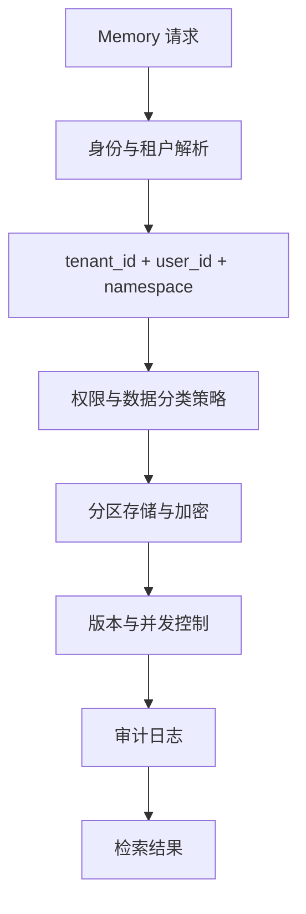

# 多用户高并发下，Memory 如何隔离、扩容和保证一致性？

- ID：Q039
- 难度：系统设计
- 标签：Multi-tenant Memory、Isolation、Consistency、Backpressure、Caching

<!-- mermaid-diagram:start -->

## 可视化图解



<!-- mermaid-diagram:end -->

## 核心结论

**高并发 Memory 系统首先要保证身份与数据边界，其次才是性能。** 会话隔离靠全链路 Tenant/User/Session Key、授权过滤和存储分区；一致性则按业务风险选择“会话内读己所写、跨会话最终一致”或强一致路径，而不是把所有记忆都交给向量库。

## 一、全链路标识

每次读写必须携带：

```text
tenant_id
user_id
session_id / thread_id
memory_namespace
memory_id
version
```

这些字段由可信认证上下文注入，不允许模型或用户文本自由指定。检索、缓存、向量库、日志和对象存储都必须执行相同过滤。

## 二、隔离层次

- **逻辑隔离**：共享表 + 强制 Tenant Filter；
- **分区隔离**：按租户或区域分库分表 / Namespace；
- **物理隔离**：高合规租户独立实例或密钥；
- **加密隔离**：独立 KMS Key、字段加密；
- **运行时隔离**：Context Build 不跨用户取数据。

选择取决于合规、规模和成本。无论哪种，必须有跨租户泄漏测试。

## 三、读写路径

### 写路径

```text
Auth
→ Validate Memory Type
→ Idempotency / Version Check
→ Durable Event Log
→ Update Source Store
→ Async Index / Cache Update
→ Publish Invalidation Event
```

先写权威存储，再异步更新向量索引。不能把向量库当作唯一事实源。

### 读路径

```text
Auth Context
→ Exact KV / Structured Fact Lookup
→ Semantic Retrieval with Tenant Filter
→ Version / Expiry Filter
→ Conflict Resolution
→ Context Budget
```

## 四、一致性模型

### 会话内读己所写

用户刚修改偏好后，本会话必须立即看到。可同步更新会话 State 和权威事实表，再异步刷新向量索引。

### 跨会话最终一致

低风险偏好可以允许短暂延迟，但需要版本号和缓存失效通知。

### 强一致事实

地址、权限、订单状态、生产配置等不能依赖最终一致的语义索引。执行前直接查询业务 Source of Truth。

“Sticky Session”可以降低缓存复杂度，但不能作为唯一一致性保证；实例故障和跨设备请求仍需要共享存储与版本控制。

## 五、并发更新

使用：

- 乐观锁 `expected_version`；
- Compare-and-Swap；
- 事件序号；
- 幂等键；
- 同一实体的串行消费；
- 冲突时重新读取并合并。

两个会话同时修改同一偏好时，不能简单“最后写入覆盖”，除非业务明确接受。关键事实可要求人工确认或基于字段级合并。

## 六、扩容与反压

高并发写入不应同步调用 Embedding 和向量库：

```text
Request
→ Durable Queue / Outbox
→ Batch Extract / Embed
→ Bulk Upsert Index
```

保护层：

- 用户和租户限流；
- 语义 / Hash 去重；
- 批量写入；
- 队列长度和延迟告警；
- 熔断非关键记忆写入；
- 优先保留权威事实，降级个性化；
- Dead-letter Queue。

如果队列堆积，系统可以降级为“当前会话记忆”，但不能对用户声称长期记忆已经持久化成功。

## 七、缓存设计

缓存 Key 必须包含租户和用户。缓存内容带版本和 TTL：

```text
memory:{tenant}:{user}:{namespace}:{id}:{version}
```

更新后发布 Invalidation Event。读取到旧版本时，通过权威存储点查修复，而不是继续把旧记忆注入模型。

## 八、向量索引问题

- Metadata Filter 必须在服务端执行；
- 不能依赖模型过滤越权结果；
- 索引更新有延迟时，精确事实走 KV；
- 删除用户数据时同步删除向量、缓存和派生摘要；
- Embedding 版本变更采用双索引与 Alias 切换。

## 九、资源控制

限制每用户：

- 记忆条数和总字节；
- 单条大小；
- 写入 QPS；
- Embedding Token；
- 检索 Top-K；
- Context 注入 Token；
- 原始历史保留期。

配额超限时应明确淘汰策略或提示用户，不静默串用其他命名空间。

## 十、可观测性与测试

指标：

- 跨租户访问拒绝数；
- 读写延迟、索引延迟；
- 缓存命中和旧版本命中；
- 队列积压；
- 重复写和冲突率；
- 记忆降级率；
- 删除完成时延。

测试包括伪造 tenant_id、缓存键碰撞、并发更新、索引延迟和删除后残留。

## 常见错误回答

> 用 SessionId 分区，Redis 存短期，向量库存长期。

SessionId 不等于用户和租户权限；还缺版本、权威存储、并发更新、索引延迟和删除治理。

> 高并发时 Sticky Session 保证一致性。

只能优化局部缓存，无法解决实例故障、跨设备和共享索引。

## 面试口述版

> 多租户 Memory 要把 tenant_id、user_id、session_id 和 namespace 作为可信认证上下文贯穿缓存、数据库、向量索引和 Trace。权威事实先同步写结构化存储，会话 State 立即更新，实现读己所写；Embedding 和向量索引通过 Outbox 或队列异步批量更新。跨会话低风险偏好可最终一致，高风险地址、权限和生产配置执行前直接查 Source of Truth。并发用版本号和 CAS，缓存做版本失效，写入过载时降级非关键个性化并明确状态，不能把向量库当唯一事实源。

## 结合个人项目

企业 Agent 平台中的会话、工作空间、代码仓库和部署环境都必须带 Tenant/Project/Session 边界。用户 A 的项目摘要和工具结果不能因为语义相似被用户 B 的 Agent 检索到。