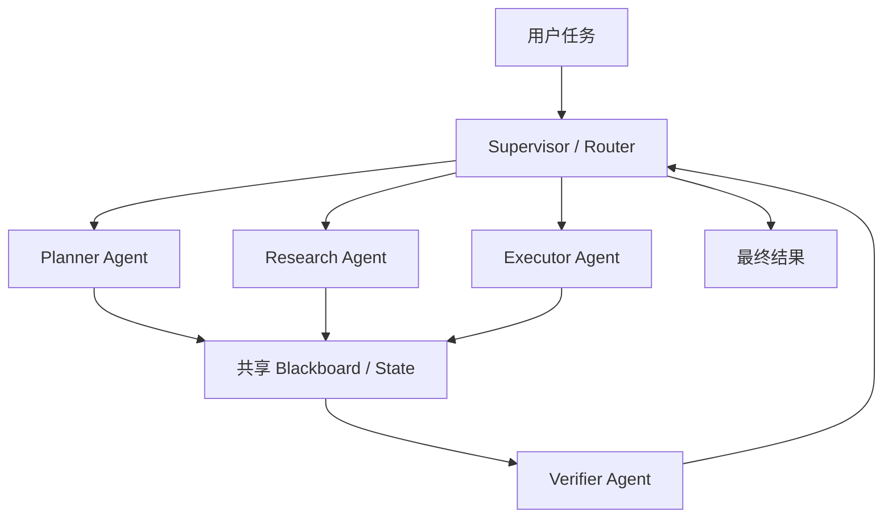

# Multi-Agent 的拓扑、通信、状态管理和路由如何设计？

- ID：Q041
- 难度：进阶 / 系统设计
- 标签：Multi-Agent、Supervisor、Handoff、Shared State、Routing

<!-- mermaid-diagram:start -->

## 可视化图解



<!-- mermaid-diagram:end -->

## 核心结论

**Multi-Agent 的本质不是“创建多个角色”，而是把一个复杂任务拆成多个有边界的决策单元，并明确控制权、状态所有权、通信协议和完成条件。**

若职责和状态边界不清，多 Agent 只会增加 Token、延迟和错误传播。

## 一、先判断是否真的需要多 Agent

适合：

- 子任务需要不同工具、权限或专业上下文；
- 可并行执行；
- 单 Agent Context 被多个领域污染；
- 需要执行与审核职责分离；
- 子任务可独立验收。

不适合：

- 任务短且路径明确；
- 多个“角色”只是不同 Prompt；
- 子任务高度共享状态；
- 没有明确合并标准；
- 单 Agent + Tool 已能完成。

## 二、常见拓扑

### 1. Supervisor / Hub-Spoke

中央 Supervisor 负责拆分、路由和汇总，子 Agent 不直接互相通信。

优点：控制清晰、易审计；缺点：中心可能成为瓶颈和信息压缩点。

### 2. Handoff

当前 Agent 把控制权和必要状态交给另一个 Agent。适合客服分流和阶段式专业处理。

关键是 handoff contract：为什么转、移交哪些事实、谁持有最终响应权。

### 3. Agent-as-Tool

主 Agent 把专业 Agent 当作工具调用，子 Agent 返回结构化结果，控制权仍在主 Agent。

适合专业能力复用和限制子 Agent 权限。

### 4. Pipeline

固定顺序：研究 → 生成 → 审核。确定性强，但更接近 Workflow。

### 5. Peer-to-Peer / Network

Agent 直接协商。灵活但最难控制循环、冲突和成本，生产环境应谨慎。

### 6. Hierarchical

多级 Supervisor 管理大规模团队。只有真正存在组织层级和上下文隔离需求时才值得引入。

## 三、通信协议

Agent 消息不应只有自由文本：

```json
{
  "message_id": "m-17",
  "task_id": "t-9",
  "sender": "log_agent",
  "receiver": "root_cause_agent",
  "type": "evidence",
  "payload": {
    "claims": [],
    "evidence_refs": [],
    "open_questions": []
  },
  "confidence": 0.82,
  "trace_id": "trace-1"
}
```

消息类型可包括：任务委派、澄清、证据、结果、失败、Handoff 和审批请求。

自由文本可以作为说明，但关键事实、状态和引用应结构化。

## 四、状态所有权

推荐三层：

- **Global State**：目标、预算、全局计划、共享事实；
- **Agent-local State**：子 Agent 的工作上下文和中间过程；
- **Artifact / Evidence Store**：大结果和原始证据。

不要让所有 Agent 随意覆盖同一个全局字典。为每个字段定义 owner 和 reducer：

```text
confirmed_facts：只追加带证据的事实
plan：Supervisor 可修改
approval_state：Approval Service 可修改
artifacts：按 ID 追加，不直接覆盖
```

## 五、路由

路由器考虑：

- 任务意图；
- Agent 能力和工具；
- 当前状态；
- 权限；
- 成本与负载；
- 历史成功率；
- 是否已经处理过相同任务。

可采用规则 + 语义检索 + LLM 决策，但最终候选必须由 Registry 和权限控制。

## 六、任务 Contract

每个子任务至少包含：

```json
{
  "goal": "定位启动失败的第一根因",
  "inputs": ["artifact://startup-log"],
  "constraints": ["只读", "不执行重启"],
  "expected_output": {
    "root_cause": "string",
    "evidence_refs": ["string"],
    "confidence": "number"
  },
  "deadline": "...",
  "budget": {"max_steps": 5}
}
```

没有输出 Contract，Supervisor 很难可靠合并结果。

## 七、分歧解决

顺序建议：

1. 权威数据和安全规则优先；
2. 要求各 Agent 提供证据；
3. 针对冲突点重新查询 Source of Truth；
4. Judge / Supervisor 按 Rubric 仲裁；
5. 高风险无法裁决时人工升级。

多数投票不适合事实问题：多个 Agent 可能共享同一错误来源。

## 八、停止与循环控制

需要全局和每 Agent 预算：

- 最大 Handoff 次数；
- 最大消息数；
- 重复路由检测；
- 子任务 Deadline；
- Token 与工具预算；
- 已完成任务不可再次委派；
- 无进展检测。

## 九、可观测性

Trace 应表现为父子 Span：

> 对应流程使用 Mermaid 图解展示。

记录每个 Agent 的输入 Contract、输出、证据、模型、成本、延迟和 Handoff 原因。

## 常见错误回答

> Multi-Agent 通过消息传递和共享状态协作。

还需要说明谁拥有状态、如何约束消息、如何路由、如何处理冲突和停止。

> 去中心化能避免单点故障。

它把单点问题换成一致性、循环和调试复杂度，未必更高可用。

## 面试口述版

> Multi-Agent 设计先明确是否存在真正的职责、权限或上下文边界。生产上我优先用 Supervisor、Handoff 或 Agent-as-Tool，而不是任意 Peer-to-Peer。全局状态、Agent 私有状态和 Artifact 分离，每个字段定义 owner 和 reducer；子任务有目标、输入、约束、输出 Schema、预算和截止时间。路由结合能力 Registry、权限和当前状态，通信保留结构化证据。分歧优先回到 Source of Truth，不依赖简单投票，并设置 Handoff、消息、Token 和无进展停止条件。

## 结合个人项目

CI/CD 诊断可拆成日志 Agent、代码变更 Agent 和环境 Agent，但由 Supervisor 统一维护“已确认事实”和“未解决假设”。修复 Agent 与审批 Agent 分离，避免同一个 Agent 自己提出并批准生产变更。