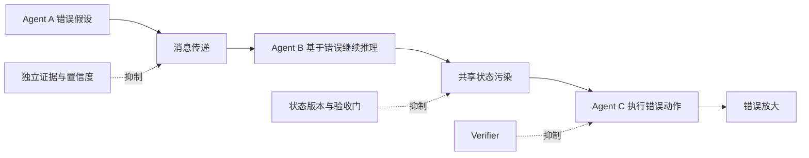

# Multi-Agent 的错误与幻觉为什么会放大？如何控制？

- ID：Q042
- 难度：进阶 / 系统设计
- 标签：Multi-Agent、Error Propagation、Hallucination、Evidence、Consensus

<!-- mermaid-diagram:start -->

## 可视化图解



<!-- mermaid-diagram:end -->

## 核心结论

**Multi-Agent 会放大错误，因为下游通常看不到上游原始证据，只看到已经压缩和解释过的结论。** 当错误结论被写入共享状态、继续规划或触发工具时，它会从“文本错误”升级为“系统状态错误”和“业务动作错误”。

## 一、错误放大的链路

> 对应流程使用 Mermaid 图解展示。

多个 Agent 使用相同模型、相同检索库和相同 Prompt 模式时，它们的错误并不独立。三票一致不代表真实。

## 二、主要放大机制

### 1. 权威错觉

Agent 消息语气确定，下游无法区分直接证据、推断和建议。

### 2. 上下文压缩

Handoff 为节省 Token，只传摘要，原始日志和引用丢失。

### 3. 共享状态污染

错误事实写入 `confirmed_facts`，后续所有 Agent 自动继承。

### 4. 目标偏移

子 Agent 优化局部目标，却偏离用户最终目标；Supervisor 再按局部输出继续拆解。

### 5. 反馈循环

Agent 相互引用对方结果，看起来形成交叉验证，实际是循环依赖。

### 6. 工具副作用

错误规划通过多个执行 Agent 并行扩大影响范围。

## 三、消息必须区分证据层级

```json
{
  "claim": "数据库连接池耗尽",
  "claim_type": "inference",
  "evidence_refs": ["metrics://pool#10:00-10:10"],
  "assumptions": ["指标采集无延迟"],
  "alternatives": ["数据库自身响应变慢"],
  "confidence": 0.68
}
```

`observed_fact`、`inference`、`recommendation`、`unverified` 应分别处理。只有带可验证证据且通过规则的事实才能进入全局确认区。

## 四、共享状态写入门禁


子 Agent 不能直接覆盖全局状态。Reducer 可以：

- 追加候选事实；
- 合并相同证据；
- 标记冲突；
- 拒绝无引用结论；
- 要求 Supervisor 或人工确认。

## 五、独立验证而非角色表演

真正交叉验证需要差异化：

- 不同数据源；
- 不同工具；
- 不同检索策略；
- 确定性规则或测试；
- 人工或 Source of Truth。

让两个同模型 Agent 阅读同一份错误摘要，不是独立验证。

## 六、分歧是重要信号

当 Agent 结论不同，应：

1. 定位冲突的原子断言；
2. 比较各自证据和版本；
3. 重新查询权威数据；
4. 必要时设计验证实验；
5. 高风险无法裁决则人工升级。

多数投票只适合主观偏好或近似任务，不适合事实与权限判断。

## 七、限制传播半径

- 子 Agent 最小权限；
- 默认只读；
- 工具按任务动态暴露；
- 写操作需要审批；
- 每个 Agent 的预算和 Deadline；
- Handoff 次数限制；
- 全局 Circuit Breaker；
- Sandbox 和资源隔离。

即使推理错误，也应让错误停留在候选计划层，不能直接影响生产。

## 八、结果合并

Supervisor 不应简单拼接结果，而应建立 Claim–Evidence Matrix：

| Claim | Agent | Evidence | Status |
|---|---|---|---|
| 缺配置文件 | Log Agent | log:L18 | supported |
| JDK 不兼容 | Code Agent | diff:D7 | uncertain |

最终答案只输出已支持断言，并明确不确定项和待验证步骤。

## 九、评估

- 首个错误步骤位置；
- 错误传播深度；
- 无证据状态写入率；
- 分歧发现率；
- 错误动作拦截率；
- 多 Agent 相对单 Agent 的真实收益；
- 每个额外 Agent 带来的 Token 和延迟；
- 相同错误源导致的伪一致率。

## 常见错误回答

> 关键结论让两个 Agent 交叉验证。

如果它们共享模型、上下文和数据源，错误高度相关。

> 三个 Agent 投票，少数服从多数。

事实问题不能由票数决定，应比较证据和权威来源。

## 面试口述版

> Multi-Agent 会放大错误，因为结论经过摘要和 Handoff 后丢失来源，下游把推断当事实，错误再写入共享状态或触发工具。我的控制方式是让消息区分观察、推断和建议，所有共享事实绑定 evidence_ref，通过 Reducer 做来源、版本、冲突和权限校验。交叉验证必须使用独立数据源或确定性测试，分歧时回到原子断言和 Source of Truth。子 Agent 使用最小权限，写操作审批，并限制消息、Handoff 和预算，保证错误最多停留在候选结论层。

## 结合个人项目

日志 Agent 认为“缺配置”，代码 Agent 认为“JDK 不兼容”时，不应投票；应分别绑定日志行、仓库文件和变更记录，再由验证步骤确认哪个解释能覆盖最早异常和复现结果。