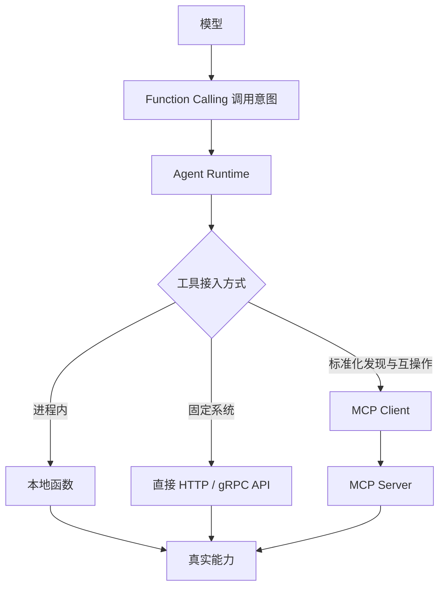

# MCP 与 Function Calling 是什么关系？什么时候直接调用 API？

- ID：Q044
- 难度：基础 / 进阶
- 标签：MCP、Function Calling、API、Integration、Tool Gateway
- 时效性：整理日期为 2026-08-01

<!-- mermaid-diagram:start -->

## 可视化图解



<!-- mermaid-diagram:end -->

## 核心结论

**Function Calling 是模型输出“调用哪个能力、传什么参数”的机制；MCP 是 Host 与外部 Server 发现和交换能力的协议；HTTP/gRPC API 是真实业务服务接口。** 三者位于不同层，可以组合使用，不是互斥选项。

## 一、分层关系

```text
LLM
  │ Function / Tool Call 意图
  ▼
Agent Runtime / Host
  │
  ├── 进程内函数
  ├── 直接 HTTP / gRPC API
  ├── MCP Client → MCP Server → API
  └── Tool Gateway → 多种后端
```

模型通常不关心底层是 MCP 还是 HTTP，只看到稳定 Tool Contract。

## 二、Function Calling 解决什么

- 结构化工具选择；
- 参数生成；
- Tool Result 与后续模型循环；
- 模型和应用之间的动作协议。

它不规定工具如何发现、跨进程通信、授权或复用。

## 三、MCP 解决什么

- Server 能力发现；
- 统一 Resources / Prompts / Tools；
- Capability Negotiation；
- 本地 stdio 与远程 Streamable HTTP；
- 跨 Host、框架和工具提供者复用。

MCP Server 内部最终仍可能调用普通 API。

## 四、什么时候直接 API 更合适

### 1. 核心业务和低延迟链路

内部支付、订单、发布等核心服务已有稳定 SDK/API，直接调用少一层协议转换，延迟和错误路径更清晰。

### 2. 强事务和类型约束

需要事务、幂等、批量操作或高吞吐时，业务 Client 通常比通用 MCP Tool 更容易表达完整语义。

### 3. 单一应用专用能力

没有跨客户端复用需求，额外 MCP Server 只增加部署和维护。

### 4. 严格内部安全域

现有 Service Mesh、鉴权和审计成熟，可通过 Tool Gateway 直接复用。

## 五、什么时候 MCP 更合适

- 同一工具要服务多个 AI Host；
- 第三方或插件生态；
- IDE、本地 CLI 和远程 Agent 都要接入；
- 需要动态发现；
- 希望工具提供方独立发布；
- 需要同时暴露 Resource、Prompt 和 Tool；
- 希望降低框架之间的重复适配。

## 六、企业中的推荐形态

```text
Agent Runtime
  → Candidate Tool Router
  → Enterprise Tool Gateway
       ├── Native API Adapter
       ├── MCP Client Adapter
       ├── Legacy Script Adapter
       └── Audit / Auth / Rate Limit
```

不要强制所有内部服务改造成 MCP。Gateway 可以统一向 Agent 暴露 Tool Contract，底层按场景选择直连或 MCP。

## 七、额外协议层的代价

- 序列化和网络延迟；
- Session 与连接管理；
- 版本兼容；
- Server 发现和健康治理；
- 授权传播；
- Debug 链路变长；
- Tool Schema 与真实 API 漂移。

标准化收益必须大于这些代价。

## 八、安全

无论是否 MCP，都必须：

- Runtime 权限校验；
- 最小权限凭证；
- 参数和业务规则验证；
- 幂等与超时；
- 审计；
- 高风险审批。

MCP Server 不能因为遵循协议就默认可信；直接 API 也不能因为内部网络就跳过授权。

## 常见错误回答

> 内部系统用 Function Calling，第三方用 MCP。

Function Calling 与 MCP 不是同层；内部系统也可以通过 MCP 暴露，第三方工具也可能直接 API。

> MCP 会取代所有 API。

MCP 通常建立在 API、文件或数据库之上，标准化的是 AI 应用集成层，不替代业务协议和事务语义。

## 面试口述版

> Function Calling 是模型生成工具名称和参数的输出机制；MCP 是 Host 与外部 Server 发现 Resources、Prompts、Tools 并通过 JSON-RPC 通信的协议；真实能力最终可能还是 HTTP、gRPC 或本地函数。核心低延迟、强事务、单应用专用能力我更倾向直接 API；需要跨 Host 复用、动态发现和插件生态时使用 MCP。企业里可以通过 Tool Gateway 同时适配 Native API 和 MCP，统一权限、审计和候选路由，而不是要求所有服务只选一种协议。

## 结合个人项目

Jenkins 和 Kubernetes 已有成熟 API，可由平台 Gateway 直连；面向不同 Coding Agent 复用的代码搜索、环境管理能力可以再包装成 MCP Server。