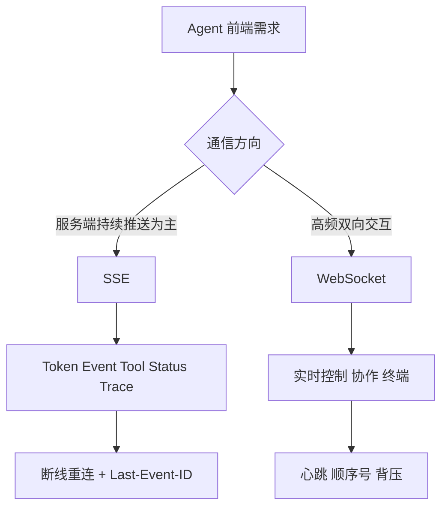

# Agent 与前端通信为什么常用 SSE？什么时候用 WebSocket？

- ID：Q045
- 难度：基础 / 进阶
- 标签：SSE、WebSocket、Streaming、Reconnect、Agent UI

<!-- mermaid-diagram:start -->

## 可视化图解



<!-- mermaid-diagram:end -->

## 核心结论

**SSE 适合“客户端发一次请求，服务端持续推送文本和状态”的主流 Agent 交互；WebSocket 适合持续双向、低延迟和可打断的会话。** 选择依据是交互方向、连接生命周期、基础设施和可靠性，而不是“WebSocket 更高级”。

## 一、SSE 的特点

SSE 基于 HTTP，服务端以 `text/event-stream` 持续推送事件：

```text
Client ── HTTP Request ──> Server
Client <── token/status/tool events ── Server
```

适合：

- Token 流式输出；
- Agent 步骤进度；
- Tool 状态；
- 日志和通知；
- 浏览器端单向更新。

优势：

- HTTP 基础设施兼容好；
- 浏览器支持 EventSource；
- 事件格式简单；
- 可使用 Event ID 和重连；
- 代理、鉴权和监控相对熟悉。

## 二、SSE 的限制

- 服务端到客户端单向；
- 用户的新消息、审批和取消通常走额外 HTTP 请求；
- 原生 EventSource 对自定义 Header 支持有限；
- 长连接经过网关可能被空闲超时；
- 二进制数据不方便；
- 多标签页和大量连接需要资源治理。

SSE 自动重连不等于 Agent 任务自动恢复。事件必须持久化，客户端携带 Last-Event-ID 后才能补发；否则断线期间内容仍会丢失。

## 三、WebSocket 的特点

WebSocket 在一次握手后建立全双工连接：

```text
Client <================> Server
```

适合：

- 实时语音输入输出；
- 用户随时打断模型；
- 高频双向控制；
- 协同编辑；
- 远程终端；
- 多 Agent 实时状态同步；
- 二进制帧。

代价：

- 连接状态和扩缩容更复杂；
- 负载均衡、心跳和断线恢复需要专门设计；
- 消息确认、重放和顺序要自行定义；
- 代理与企业网络兼容性需验证。

## 四、Agent 应用常见组合

```text
POST /runs              创建任务
GET  /runs/{id}/events  SSE 接收事件
POST /runs/{id}/input   用户补充或审批
POST /runs/{id}/cancel  取消
GET  /runs/{id}         查询权威状态
```

这种 REST + SSE 组合简单且可恢复。SSE 只是事件通道，任务状态仍在数据库或 Durable Runtime 中。

需要语音和实时中断时，可以使用 WebSocket：

```text
WS Session
  ├── user_audio
  ├── model_audio
  ├── interrupt
  ├── tool_approval
  └── state_update
```

## 五、事件协议

无论传输方式，都不要只流式返回字符串。事件应结构化：

```json
{
  "event_id": "evt-18",
  "run_id": "run-7",
  "sequence": 18,
  "type": "tool.completed",
  "timestamp": "...",
  "payload": {}
}
```

事件类型可包括：

- `message.delta`；
- `step.started`；
- `tool.requested`；
- `approval.required`；
- `tool.completed`；
- `run.failed`；
- `run.completed`。

## 六、断线与恢复

- Event 有递增序号；
- 服务端持久化或短期保留事件；
- 客户端重连传最后序号；
- 查询接口返回权威状态；
- 重复事件按 ID 去重；
- 连接断开不取消后台任务；
- 前端恢复后补齐缺失事件。

## 七、背压

模型 Token、日志和 Tool 事件产生速度可能超过前端消费速度。需要：

- 合并 Token Delta；
- 限制日志频率；
- 丢弃可重建的低价值进度事件；
- 关键状态和终态永不丢；
- 设置连接缓冲上限；
- 慢客户端断开后通过 Replay 恢复。

## 八、选择方法

选择 SSE：

- 主要是服务端流式输出；
- 用户操作低频，可走 HTTP；
- 希望部署和调试简单；
- 文本事件为主。

选择 WebSocket：

- 高频双向；
- 强实时打断；
- 语音和二进制；
- 单连接承载复杂会话控制。

也可以同时支持，底层共用统一 Event Model。

## 常见错误回答

> SSE 自带重连，所以不会丢消息。

只有服务端保留事件并支持基于 Event ID Replay 才能补回。

> WebSocket 延迟更低，所以 Agent 应该用 WebSocket。

多数文本 Agent 的瓶颈是模型和工具，SSE 的简单性往往更重要。

## 面试口述版

> 文本 Agent 主要是客户端提交任务、服务端持续推送 Token、工具状态和终态，因此 REST + SSE 通常更简单，能复用 HTTP 网关和监控。用户审批、取消和补充输入走单独 POST。需要语音、实时打断或高频双向控制时再用 WebSocket。无论哪种，连接都不是状态源；事件要有 run_id、sequence 和 event_id，后台任务持久化，断线后通过 Last-Event-ID 或查询接口 Replay，关键事件不能只存在连接缓冲中。

## 结合个人项目

Claude Code 平台的文本输出、Diff 和部署进度可用 SSE；如果后续支持实时终端输入、语音或用户随时打断工具执行，再引入 WebSocket。