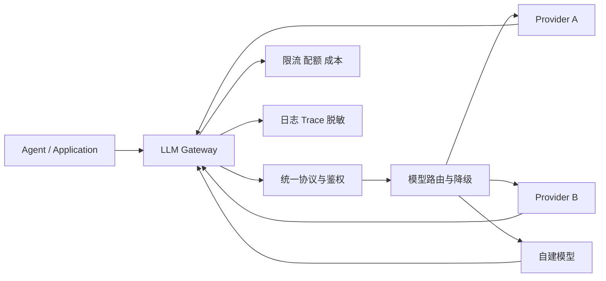

# 大模型网关解决哪些问题？如何设计路由、配额、审计和降级？

- ID：Q047
- 难度：进阶 / 系统设计
- 标签：LLM Gateway、Routing、Quota、Audit、Fallback、Caching

<!-- mermaid-diagram:start -->

## 可视化图解



<!-- mermaid-diagram:end -->

## 核心结论

**大模型网关是业务应用与多个模型提供方之间的策略和治理层。** 它统一协议只是起点，真正价值在于身份、路由、配额、审计、可靠性和成本控制；但它不能隐藏所有模型能力差异，也不应变成一个无边界的“万能中间层”。

## 一、核心职责

> 对应流程已改为上方 Mermaid 图解。

## 二、统一接口但保留能力声明

统一 OpenAI-like 接口很方便，但模型差异包括：

- Tool Calling Schema；
- Structured Output；
- 多模态；
- Context 和输出限制；
- Reasoning 参数；
- Prompt Cache；
- Streaming Event；
- Batch 和异步任务；
- 数据地域和合规。

网关应有 Capability Registry，而不是把不支持的能力静默忽略：

```json
{
  "model_id": "provider/model",
  "capabilities": {
    "tools": true,
    "vision": false,
    "json_schema": true,
    "streaming": true
  }
}
```

路由前校验任务需求，避免降级到不具备必要能力的模型。

## 三、模型路由

路由输入：

- 任务类型和复杂度；
- 所需能力；
- 数据敏感级别和地域；
- 延迟 SLA；
- 用户 / 租户预算；
- 模型健康度和限流；
- 历史评测结果；
- 上下文长度；
- 是否需要确定性工具调用。

路由策略可以是：

1. 静态映射；
2. 规则策略；
3. 轻量分类器；
4. 基于离线评测的策略表；
5. Bandit / 在线学习，但需严格风险边界。

高风险任务不应仅按最低价格路由。

## 四、配额和成本

按：

- 租户；
- 用户；
- 项目；
- API Key；
- 模型；
- 时间窗口；
- Token / 请求 / 金额；
- 并发和在途请求。

实施：

- 预估输入和最大输出成本；
- 请求前 Budget Check；
- 流式过程中累计；
- 超预算提前停止；
- 日/月额度；
- 软告警与硬限制；
- Cost Attribution 到具体 Agent Run。

不能只在账单出来后统计。

## 五、重试和降级

错误分类：

- 网络和临时 5xx：有限重试；
- 限流：遵守 Retry-After、切换区域或队列；
- 参数错误：不盲目重试；
- 内容安全拒绝：不能换模型绕过策略；
- 上下文超限：压缩或换支持模型；
- Tool Schema 不兼容：路由到兼容模型或失败。

降级前检查语义兼容：

```text
原模型支持 Tool Calling + JSON Schema
备用模型只有文本输出
→ 不能透明降级继续执行写操作
```

对于已产生 Tool Call 的 Agent Loop，中途换模型还可能改变行为，需要记录模型切换并重新校验状态。

## 六、熔断和负载均衡

按 Provider、模型、区域维护：

- 成功率；
- P95/P99 延迟；
- 限流率；
- 首 Token 延迟；
- Streaming 中断率；
- 质量回归信号。

技术健康熔断与质量熔断分开。一个模型接口可用，不代表输出质量未退化。

## 七、缓存

### 精确响应缓存

仅适合确定、无用户敏感状态、低温度和允许复用的请求。Cache Key 包含模型、版本、系统 Prompt、工具 Schema、输入和关键参数。

### Prompt / Prefix Cache

利用提供方能力降低重复前缀成本，但网关需要暴露命中指标和缓存失效规则。

### Semantic Cache

风险较高。相似 Query 不一定同答案，涉及时间、权限和用户状态时不应复用。

缓存绝不能绕过 Tenant 和授权边界。

## 八、安全与审计

- 密钥集中管理和轮换；
- 请求 / 响应脱敏；
- 数据地域路由；
- 禁止敏感内容发往不合规 Provider；
- Prompt 和 Tool Schema 版本；
- Trace ID；
- 模型、Token、延迟、成本和错误；
- 审计访问控制和保留期。

日志不能原样记录所有 Prompt，需区分可观测性与隐私。

## 九、网关边界

不建议网关承担：

- 具体业务 Prompt；
- Agent 计划和状态机；
- 业务工具权限；
- 所有输出修复；
- 隐式修改用户语义。

网关提供通用治理，Agent Runtime 保留任务语义。

## 十、评估

- 路由任务成功率；
- 单任务成本；
- 降级后的质量保持率；
- 错误重试放大系数；
- Provider 可用性；
- 配额准确率；
- Cache 命中与错误复用率；
- 数据策略违规率；
- 模型切换导致的 Agent 行为变化。

## 常见错误回答

> 网关解决统一接口、Key 管理、限流和审计。

正确但不够，需要继续讲 Capability、路由、语义兼容降级、成本归属和模型质量治理。

> 模型失败就自动切备用模型。

备用模型可能不支持当前 Tool、Schema、Context 或合规要求，不能盲切。

## 面试口述版

> 大模型网关是多模型的策略和治理层。我会维护模型 Capability Registry，路由时结合任务能力、数据合规、延迟、预算和离线评测，而不是只看价格。配额按租户、项目和 Agent Run 在请求前后计量；重试按错误分类，降级前验证 Tool Calling、Schema 和 Context 等能力兼容。网关还负责密钥、熔断、缓存、脱敏和审计，但不接管业务 Prompt 与 Agent 状态机。这样能统一治理，又不会把模型差异错误地抹平。

## 结合个人项目

企业 Claude Code 平台可通过网关统一对接不同模型、统计每个会话成本和限额；但选择模型时要检查代码能力、上下文、Tool Calling 和数据合规，不能在任务中途无感切换到能力不足的模型。