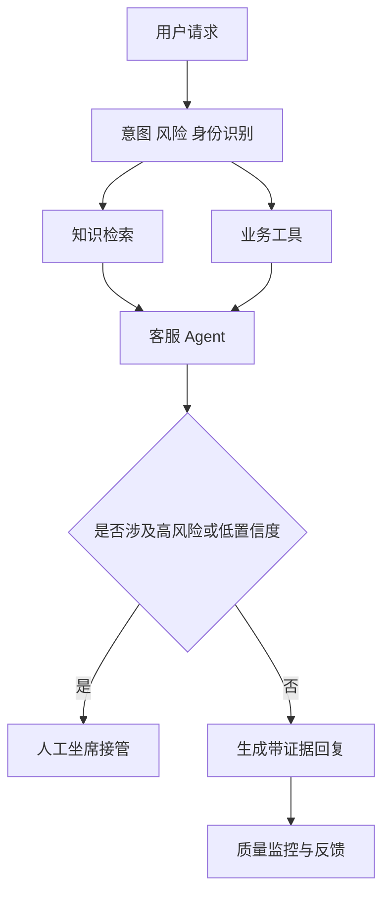

# 如何设计一个生产级智能客服 Agent？

- ID：Q048
- 难度：系统设计
- 标签：Customer Service Agent、Intent、State Machine、Tool、HITL、Evaluation

<!-- mermaid-diagram:start -->

## 可视化图解



<!-- mermaid-diagram:end -->

## 核心结论

**生产客服 Agent 不是“LLM + 知识库”，而是确定性业务流程、检索问答、受控工具、会话状态和人工服务共同组成的混合系统。**

设计目标应先明确：解决率、准确率、合规、平均处理时长、转人工质量和单位成本，而不是只追求对话自然。

## 一、分层架构

```text
Channel / User
  → Identity & Consent
  → Intent / Risk Router
  → Conversation State
  → Policy & Knowledge Retrieval
  → Agent Decision
  → Read Tools / Write Workflows
  → Verification / Approval
  → Response / Human Handoff
  → Trace / Evaluation
```

## 二、意图与风险路由

不要所有问题都进入同一个自主 Agent：

- FAQ / 规则解释：RAG + 引用；
- 订单查询：结构化只读工具；
- 退货资格判断：规则引擎 + 数据；
- 退款、改地址：确定性 Workflow + 二次确认；
- 投诉、威胁、安全事件：专门策略或人工；
- 闲聊和越界问题：能力说明。

路由可结合规则、小模型和 LLM，但高风险意图由确定性规则兜底。

## 三、会话状态和槽位

任务型客服需要显式 State：

```json
{
  "intent": "return_request",
  "order_id": "...",
  "reason": "damaged",
  "eligibility": "unknown",
  "missing_slots": ["evidence_photo"],
  "approval_state": "not_required",
  "next_action": "query_order"
}
```

不要每轮只从自然语言历史重新猜订单、原因和流程阶段。

## 四、知识与规则

- 政策、FAQ 和产品说明进入版本化知识库；
- 资格条件、金额计算和时限尽量由规则引擎或服务计算；
- 回答绑定来源、版本和生效时间；
- 资料不足时拒答或转人工；
- 用户上传材料与官方规则冲突时显式说明。

LLM 负责解释规则，不负责凭记忆创造规则。

## 五、工具设计

### 只读工具

查询订单、物流、历史工单和政策。

### 写工具

创建售后单、取消申请、退款、补发等。写工具要求：

- 最小权限；
- 参数校验；
- 幂等键；
- 当前状态再次读取；
- 用户确认；
- 操作结果验证；
- 审计和补偿。

模型只能提出动作，业务服务决定是否合法。

## 六、Human-in-the-Loop

转人工不是失败兜底，而是系统能力：

触发条件：

- 高风险或法规要求；
- 低置信度；
- 连续失败；
- 用户明确要求；
- 情绪升级；
- 工具不可用；
- 权限与政策冲突。

转人工时提供结构化摘要：用户目标、订单、已确认事实、调用过的工具、失败原因、证据和建议下一步，避免人工重新问一遍。

## 七、安全

- 用户身份与订单权限；
- PII 脱敏；
- Prompt Injection 不得改变工具权限；
- 用户文本和知识库内容视为不可信数据；
- 关键金额和日期由代码校验；
- 输出不得泄露内部 Prompt 和系统字段；
- 高风险动作审批；
- 审计保留和删除策略。

## 八、可靠性

- 模型、检索和工具分别设置超时；
- 只读查询可有限重试；
- 写操作使用幂等与状态对账；
- Provider 故障降级到只读 FAQ 或人工；
- 会话和任务 Checkpoint；
- Streaming 断线不丢任务；
- 知识索引版本可回滚。

## 九、评估

### 质量

- 答案正确性和 Faithfulness；
- Policy Compliance；
- Tool Selection / Argument Accuracy；
- 转人工是否合理；
- 写操作成功且无重复。

### 业务

- 一次解决率；
- 转人工率和人工接管时长；
- 平均处理时间；
- 退款/售后流程完成率；
- CSAT；
- 单会话成本。

### 红线

越权、错误退款、隐私泄露和政策违规必须单独设硬门槛，不能被平均分掩盖。

## 十、上线策略

```text
离线历史会话回放
→ Shadow 模式只给建议
→ 人工坐席 Copilot
→ 低风险 FAQ 自动回复
→ 只读查询
→ 有审批的写流程
→ 小范围自主处理
```

逐级扩大权限，每一级都要有回滚和评测。

## 常见错误回答

> 意图识别 + RAG + Tool Calling + 转人工。

只是组件清单，没有说明确定流程和 Agent 的边界、状态、写操作安全和评估。

## 面试口述版

> 我会把客服系统拆成风险路由、会话状态、知识规则、工具执行和人工接管。FAQ 使用带版本引用的 RAG，订单查询走只读工具，退款和改地址走确定 Workflow，由业务服务校验资格、金额、幂等和权限，模型只负责理解与解释。会话维护显式槽位和流程阶段，低置信度、用户要求、高风险或工具失败时转人工，并携带结构化摘要。上线从 Shadow 和 Copilot 开始，逐步开放低风险能力，红线指标独立门禁。

## 结合个人项目

这套设计与 CI/CD Agent 相同：查询与分析可以自主，重启、回滚和配置修改必须进入确定流程、审批和验证。