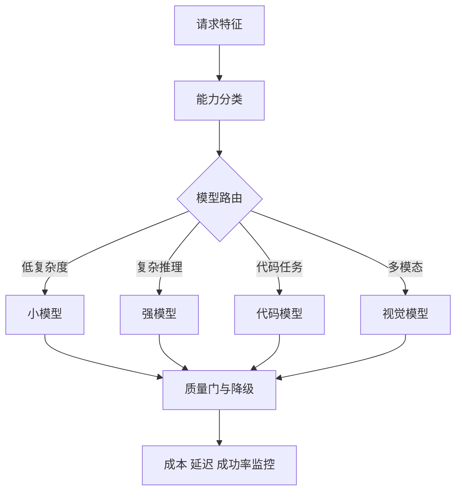

# 如何建立模型能力边界并进行模型路由和选型？

- ID：Q049
- 难度：进阶 / 系统设计
- 标签：Model Evaluation、Capability Boundary、Routing、Fallback、Cost
- 时效性：模型版本变化快，整理日期为 2026-08-01；不记录易过期的“最强模型排行榜”

<!-- mermaid-diagram:start -->

## 可视化图解



<!-- mermaid-diagram:end -->

## 核心结论

**模型能力边界不是厂商规格表，而是在特定任务、工具、上下文和风险约束下，通过评测得到的可用区域。** 选型应基于任务分桶、能力契约、成本和稳定性，不应凭公开榜单或一次体验。

## 一、能力边界的维度

### 输入输出能力

- 文本、图像、音频和文件；
- Context 和最大输出；
- Structured Output；
- Tool Calling 和并行调用；
- Streaming；
- Prompt Cache；
- 支持的语言。

### 任务能力

- 指令遵循；
- 代码理解与修改；
- 数学和逻辑；
- 长文档证据提取；
- 视觉理解；
- 工具选择和参数；
- 长任务稳定性；
- 安全与拒答。

### 工程属性

- P50/P95 延迟；
- 输出速率；
- 限流和可用性；
- 单任务成本；
- 数据地域和保留政策；
- 版本稳定性；
- 可观测性和错误语义。

## 二、建立 Capability Registry

```json
{
  "model": "provider/model-version",
  "verified_capabilities": {
    "tool_calling": {"supported": true, "eval_score": 0.91},
    "vision": {"supported": false},
    "long_context_code": {"supported": true, "max_verified_tokens": 120000}
  },
  "risk_tier": "medium",
  "regions": ["..."],
  "last_evaluated_at": "2026-08-01"
}
```

区分厂商声明和内部验证。`max_verified_tokens` 不等于 API 宣称窗口，而是你的任务在该长度下仍达到质量要求的范围。

## 三、任务分桶

例如 Coding Agent：

- 单函数解释；
- 小范围修复；
- 跨文件功能；
- 大型重构；
- 日志根因分析；
- Tool Calling；
- 长会话恢复；
- 安全代码 Review。

每桶维护 Golden Set、质量阈值、延迟和成本。模型可能在某桶优秀，在另一桶不稳定。

## 四、路由策略

> 对应流程使用 Mermaid 图解展示。

先过滤“不能做”的模型，再在满足质量门槛的候选中优化成本和延迟。

路由可分：

- 规则路由；
- 任务分类器；
- 小模型先判难度；
- 低成本模型尝试，失败后升级；
- 高风险任务直接使用已验证模型。

“先便宜模型，不行再换”只适合可检测失败的任务。若错误看起来很合理却无法自动验证，升级策略可能发现不了。

## 五、Fallback

Fallback 必须满足：

- Tool / Schema 兼容；
- 数据合规；
- Context 足够；
- 输出质量阈值；
- 当前 Agent State 可迁移；
- 不重复已产生副作用。

模型切换后记录原因和版本。对于工具调用中的半完成任务，先恢复状态和对账，不应从头重跑。

## 六、在线动态路由

可以利用：

- Provider 健康；
- Queue；
- 当前预算；
- 历史任务成功率；
- 用户优先级。

但质量反馈有延迟和噪音。在线策略需要保护栏，不能让高风险流量成为探索样本。

## 七、评测方法

每个任务样本不仅看最终文本，还看：

- Task Completion；
- 工具和参数准确率；
- 代码测试结果；
- Faithfulness；
- 轨迹步数；
- P95 延迟；
- Token 和金额；
- 重试；
- 安全违规。

模型升级时跑回归，并保留旧版本可回退。不要自动把 Alias 指向新模型后假设兼容。

## 八、边界表达

面对用户和上层 Agent，要明确：

- 当前支持哪些任务；
- 哪些需要工具或人工；
- 哪些输入过大；
- 哪些结果需要验证；
- 当前使用的模型和限制；
- 失败时如何降级。

能力边界透明比伪装“万能”更可靠。

## 常见错误回答

> A 模型代码强，B 模型长上下文强，按任务选。

模型版本和体验会快速变化，需要说明内部评测、Capability 和路由门槛。

> 大模型处理复杂任务，小模型处理简单任务。

“复杂”必须可定义和检测，还要考虑 Tool、Context、风险与失败是否可验证。

## 面试口述版

> 我会建立版本化 Capability Registry，把厂商声明和内部验证分开。先按任务分桶构造 Golden Set，测最终质量、工具调用、长任务、延迟和成本，得到每个模型的可用边界。路由先做能力与合规硬过滤，再在达到质量阈值的模型中优化成本和延迟。Fallback 还要检查 Tool Schema、Context 和 Agent State 兼容，并避免重复副作用。模型升级必须跑回归和灰度，不能用排行榜或一次体验替代生产评测。

## 结合个人项目

CI/CD 根因诊断可根据日志长度、是否需要源码跨文件推理和是否要调用工具选择模型；30 秒 SLA 下可能先用脚本和较快模型定位候选，再让强模型处理难例。