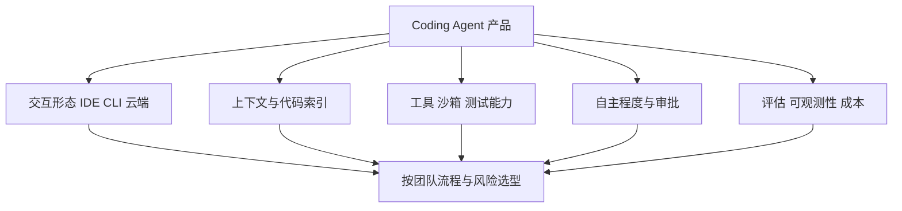

# Claude Code、Codex、Cursor 等 Coding Agent 如何比较？

- ID：Q050
- 难度：进阶 / 选型
- 标签：Coding Agent、Claude Code、Codex、Cursor、CLI、IDE、Cloud Agent
- 时效性：产品变化快，整理日期为 2026-08-01

<!-- mermaid-diagram:start -->

## 可视化图解



<!-- mermaid-diagram:end -->

## 核心结论

**Coding Agent 不应按“谁最强”比较，而应按运行位置、交互方式、上下文获取、工具权限、后台与并行任务、验证闭环、扩展方式和企业治理比较。** 模型只是其中一层，工作环境和反馈系统经常决定实际效果。

## 一、三类产品形态

### Claude Code

偏终端和开发环境中的交互式 Agent，支持会话继续与恢复、代码和终端工具、MCP 及 SDK 集成。

官方资料：

- https://docs.anthropic.com/en/docs/claude-code/getting-started
- https://docs.anthropic.com/en/docs/claude-code/cli-usage

重点评估：仓库规则、权限模式、会话压缩和恢复、MCP 治理、企业模型接入与大仓库成本。

### OpenAI Codex

覆盖 CLI、编辑器、云任务和桌面多 Agent 工作方式，可在独立环境中处理任务，也可在本地交互；Skills 和 Harness 用于沉淀团队方法。

官方资料：

- https://openai.com/codex/
- https://openai.com/index/unrolling-the-codex-agent-loop/
- https://openai.com/index/harness-engineering/

重点评估：环境初始化、任务隔离、仓库指令、并行任务、结果 Review 和企业审计。

### Cursor

AI 原生 IDE，Agent 与编辑器、代码搜索、终端、局部编辑和人工 Review 紧密结合，也提供后台、Web/Mobile 和 CLI 形态。

官方资料：

- https://docs.cursor.com/agent
- https://docs.cursor.com/en/background-agent/web-and-mobile
- https://docs.cursor.com/en/cli/overview

重点评估：代码索引与隐私、Rules、自动运行权限、后台环境、模型路由和团队管理。

## 二、关键比较维度

| 维度 | 核心问题 |
|---|---|
| 运行位置 | 本地、远程沙箱、云任务还是混合？ |
| 上下文 | 如何搜索代码、读取文件、压缩历史和加载规则？ |
| 工具 | Git、终端、浏览器、MCP 和外部系统如何控制？ |
| 安全 | Sandbox、网络、审批、凭证和审计如何治理？ |
| 任务模式 | 实时结对还是长任务委派？ |
| 并行 | 是否支持多任务与工作区隔离？ |
| 验证 | 测试、Lint、Build 和 Diff Review 如何进入闭环？ |
| 扩展 | Skills、Rules、Hooks、SDK、MCP 是否可复用？ |
| 企业能力 | SSO、数据政策、费用和模型接入如何管理？ |
| 体验 | CLI、IDE、Web、Mobile 是否符合团队习惯？ |

## 三、产品与模型不能混为一谈

同一产品可能支持多个模型，同一模型放在不同 Agent Harness 中效果也不同：

```text
Model
+ Repository Context
+ Tools
+ Sandbox
+ Instructions
+ Tests and Feedback
+ Interaction Model
```

因此“某产品一定更适合前端或重构”必须带具体任务、版本和评测日期。

## 四、团队 POC 怎么做

使用真实任务集：

- Bug 修复；
- 跨文件功能；
- 重构；
- 测试补充；
- 依赖升级；
- 日志排障；
- 代码 Review；
- 大仓库理解。

统一代码快照和权限，记录：

- 任务完成率；
- 测试通过率；
- 人工修改量；
- 总耗时；
- Token 和费用；
- 无关改动；
- 权限拦截；
- 上下文超限；
- Review 成本。

不能只比较生成一个简单 Demo。

## 五、本地与云端

本地 Agent 靠近真实开发环境，反馈快，但权限更大、环境不统一。云端 Sandbox 隔离、可并行且可复现，但需要处理内网依赖、环境构建、凭证和结果同步。

企业常见组合是：本地交互 + 远程可复现 Sandbox + Git/PR 交付。

## 六、平台抽象

企业统一平台不应绑定单一 Agent，而应抽象：

- Session；
- Workspace；
- Repository Snapshot；
- Runtime Adapter；
- Tool Gateway；
- Sandbox；
- Artifact / Diff；
- Evaluation；
- Cost / Audit。

不同 Coding Agent 只是 Runtime Adapter。

## 常见错误回答

> Claude Code 质量最好，Codex 性价比高，Cursor 更适合新人。

这类标签主观且快速过期，没有任务和评测依据。

## 面试口述版

> 我会按运行位置、任务形态、代码上下文、工具和 Sandbox、并行隔离、验证闭环、扩展机制与企业治理比较 Coding Agent。Claude Code 偏终端和可嵌入工作流，Codex 横跨本地与云任务和多 Agent 委派，Cursor 与 IDE 和人工实时 Review 结合更深。最终选择要用团队真实 Bug、重构和测试任务做 POC，统计完成率、测试通过、人工修改、成本和权限问题。平台层抽象 Workspace、Runtime Adapter 和 Tool Gateway，避免被单一产品锁定。

## 结合个人项目

OpenSandbox 平台可以用相同 Workspace、日志、Diff、权限和回调协议运行不同 Coding Agent，形成公司自己的任务评测。