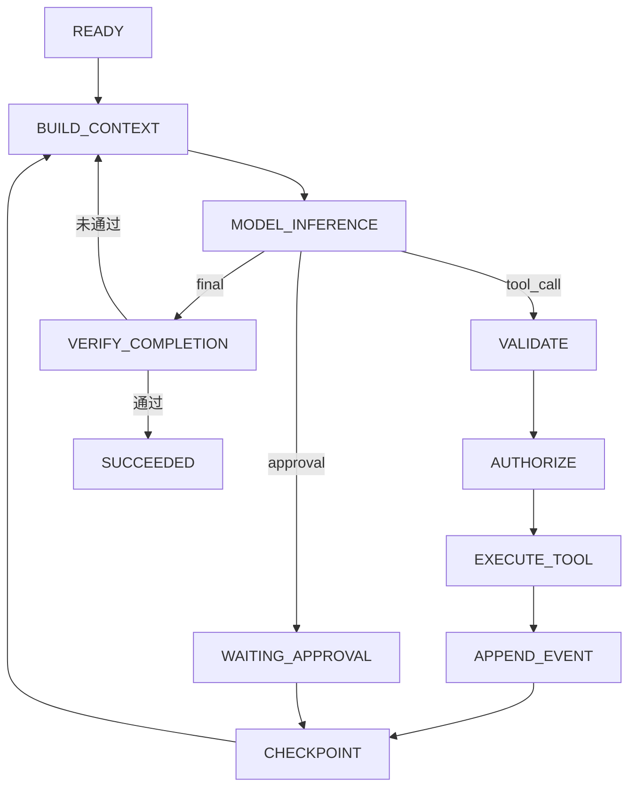

# 从零设计一个最小 Agent Runtime

- ID：Q053
- 难度：基础 / 进阶 / 手撕设计
- 标签：Agent Runtime、Agent Loop、状态机、Tool Calling、Checkpoint、Context

## 同义问法

- 不用 LangChain，手写一个 Agent 怎么做？
- 现场写一个支持 Function Calling 的 Agent Loop。
- Agent Runtime 的核心数据结构和执行流程是什么？
- 如何把一个 `while True` 的 Demo 演进成生产可用的 Agent？
- 设计一个支持工具调用、停止条件和断点恢复的 Agent。

## 来源

### 原始题目线索

用户提供的二手题库中存在以下相关问题：

- `1.9 Agentic Loop 是什么？画一下流程`
- `1.10 LangChain Agent 和从零手写 Agent 的优劣`
- `5.4 Function Calling 的工作原理是什么`
- `5.5 工具调用失败怎么办`
- `12.2 Agent Loop 有哪些核心部分`

这些问题覆盖了局部概念，但没有完整回答“如何从状态、协议和异常路径设计一个 Runtime”。因此单独建立本题。

### 技术依据

- ReAct 将推理与行动交替组织，使模型可以根据环境观察更新后续决策：
  - https://arxiv.org/abs/2210.03629
- OpenAI Agents SDK 的 Runner Loop：模型输出 final、handoff 或 tool calls；工具结果追加后继续下一轮，并支持 max turns：
  - https://openai.github.io/openai-agents-python/running_agents/
- LangGraph 将 Agent 表达为 State、Node 和 Edge，并通过 Checkpoint 支持恢复与持久化：
  - https://langchain-ai.github.io/langgraph/how-tos/state-reducers/
  - https://langchain-ai.github.io/langgraph/reference/checkpoints/

## 面试官真正考察什么

这道题不是考你会不会写一个 `while True`，而是考：

1. 是否理解模型、Runtime、工具和环境的职责边界；
2. 是否会把不确定的模型输出收敛成确定的状态转移；
3. 是否考虑停止、错误、重试、幂等、恢复和审计；
4. 是否能从最小实现逐层演进，而不是一开始堆复杂框架；
5. 是否知道什么应该交给 LLM，什么必须由代码保证。

## 一句话结论

**最小 Agent Runtime 本质上是一个受预算和状态机约束的控制循环：构造上下文、调用模型、解析决策、执行受控动作、记录观察、更新状态，直到通过可验证条件进入终态。**

<!-- mermaid-diagram:start -->

## 可视化图解



<!-- mermaid-diagram:end -->

## 一、先划清职责边界

### 模型负责什么

模型适合负责：

- 理解自然语言目标；
- 在多个候选动作中做语义判断；
- 生成工具调用参数；
- 根据新观察调整计划；
- 生成最终解释。

### Runtime 负责什么

Runtime 必须负责：

- 维护任务状态；
- 组织发给模型的上下文；
- 校验模型输出；
- 执行工具；
- 权限、超时、重试和幂等；
- 停止条件与预算；
- Checkpoint、恢复与审计；
- 验证任务是否真的完成。

核心原则：

> 模型可以提出动作，但不能绕过 Runtime 直接操作环境。

## 二、最小架构

> 对应流程已改为上方 Mermaid 图解。

最小实现只需要五个核心模块：

1. `ModelClient`
2. `ContextBuilder`
3. `ToolRegistry / ToolExecutor`
4. `RunState / StateMachine`
5. `Runner`

生产化再逐步增加：Checkpoint、Guardrail、Approval、Trace、Queue、Sandbox。

## 三、核心状态机

不要只写无限循环，先把状态画清楚。

```text
CREATED
   ↓
RUNNING
   ↓
BUILDING_CONTEXT
   ↓
WAITING_MODEL
   ├── final output ───────────────→ VERIFYING
   ├── tool calls ─────────────────→ VALIDATING_TOOL
   ├── approval required ──────────→ WAITING_APPROVAL
   ├── malformed output ───────────→ REPAIRING_OUTPUT
   └── model failure ──────────────→ RETRYING / FAILED

VALIDATING_TOOL
   ├── valid ──────────────────────→ EXECUTING_TOOL
   └── invalid ────────────────────→ APPENDING_ERROR

EXECUTING_TOOL
   ├── success ────────────────────→ APPENDING_OBSERVATION
   ├── retryable error ────────────→ RETRYING_TOOL
   ├── non-retryable error ────────→ APPENDING_ERROR
   └── side effect uncertain ──────→ RECONCILING

APPENDING_OBSERVATION
   ↓
CHECKPOINTING
   ↓
RUNNING

VERIFYING
   ├── accepted ───────────────────→ SUCCEEDED
   ├── insufficient ───────────────→ RUNNING
   └── failed ─────────────────────→ FAILED
```

最小 Demo 可以减少状态，但脑子里必须有这些分支，否则线上异常会全部落入一个模糊的 `except Exception`。

## 四、核心数据结构

### 1. RunState

`RunState` 是 Runtime 的真实状态，不等同于发给模型的 messages。

```python
from dataclasses import dataclass, field
from enum import Enum
from typing import Any


class RunStatus(str, Enum):
    CREATED = "created"
    RUNNING = "running"
    WAITING_APPROVAL = "waiting_approval"
    SUCCEEDED = "succeeded"
    FAILED = "failed"
    CANCELLED = "cancelled"


@dataclass
class RunBudget:
    max_turns: int = 12
    max_tool_calls: int = 20
    max_total_tokens: int = 100_000
    deadline_ms: int | None = None


@dataclass
class RunState:
    run_id: str
    goal: str
    status: RunStatus
    turn: int = 0
    tool_call_count: int = 0
    messages: list[dict[str, Any]] = field(default_factory=list)
    plan: list[dict[str, Any]] = field(default_factory=list)
    facts: dict[str, Any] = field(default_factory=dict)
    artifacts: list[dict[str, Any]] = field(default_factory=list)
    last_error: dict[str, Any] | None = None
    budget: RunBudget = field(default_factory=RunBudget)
    version: int = 0
```

为什么不能只存 `messages`？

因为对话记录无法可靠表达：

- 当前执行到哪个步骤；
- 哪个工具调用已提交但结果未知；
- 哪些事实已验证；
- 哪些动作等待审批；
- 预算还剩多少；
- 服务重启后从哪里恢复。

### 2. ToolCall 与 ToolResult

```python
@dataclass
class ToolCall:
    call_id: str
    name: str
    arguments: dict[str, Any]
    idempotency_key: str | None = None


@dataclass
class ToolResult:
    call_id: str
    ok: bool
    output: Any | None = None
    error_code: str | None = None
    error_message: str | None = None
    retryable: bool = False
    side_effect_committed: bool | None = None
```

错误不能只返回字符串。Runtime 至少要知道：

- 是否可重试；
- 是否已经产生副作用；
- 是否需要重新生成参数；
- 是否需要人工介入；
- 是否存在可替代工具。

### 3. ModelDecision

```python
@dataclass
class ModelDecision:
    final_output: str | None = None
    tool_calls: list[ToolCall] = field(default_factory=list)
    handoff: str | None = None
```

解析后必须满足互斥或明确优先级。不能同时把一段普通文本当最终答案，又悄悄执行工具。

## 五、最小主循环

```python
class AgentRunner:
    def __init__(self, model, context_builder, tool_registry, checkpoint_store):
        self.model = model
        self.context_builder = context_builder
        self.tool_registry = tool_registry
        self.checkpoint_store = checkpoint_store

    async def run(self, state: RunState) -> RunState:
        state.status = RunStatus.RUNNING

        while state.status == RunStatus.RUNNING:
            self._check_budget(state)

            context = self.context_builder.build(state)
            raw = await self.model.generate(
                messages=context.messages,
                tools=context.tool_schemas,
            )
            decision = parse_and_validate_model_output(raw)
            state.turn += 1

            if decision.final_output is not None:
                if await self._verify_completion(state, decision.final_output):
                    state.status = RunStatus.SUCCEEDED
                    state.artifacts.append({"type": "final", "value": decision.final_output})
                else:
                    state.messages.append({
                        "role": "system",
                        "content": "当前结果未通过完成条件，请继续处理。",
                    })

            elif decision.tool_calls:
                results = await self._execute_tool_calls(state, decision.tool_calls)
                for result in results:
                    state.messages.append(to_tool_message(result))

            else:
                state.last_error = {
                    "code": "EMPTY_DECISION",
                    "message": "模型既未完成，也未产生可执行动作",
                }
                state.status = RunStatus.FAILED

            state.version += 1
            await self.checkpoint_store.save(state)

        return state
```

这个循环展示了最核心的控制权：

- 模型给出候选决策；
- Runtime 判断是否合法；
- Runtime 执行动作；
- Runtime 判断是否完成；
- 每轮保存状态。

## 六、Context Builder 为什么要单独设计

最简单实现会把所有 messages 全塞给模型，但生产环境很快遇到：

- 工具结果太长；
- 历史轮次过多；
- 旧信息与新信息冲突；
- 计划、事实和日志混在一起；
- 关键约束淹没在上下文中。

因此 Context Builder 应根据 Token Budget 选择信息：

```text
System Rules
+ Current Goal
+ Current State / Plan
+ Verified Facts
+ Recent Interaction Window
+ Relevant Historical Evidence
+ Candidate Tool Schemas
+ Current Instruction
```

推荐分层：

1. **不可丢失**：目标、安全约束、审批状态、当前步骤；
2. **结构化压缩**：已验证事实、计划、错误摘要；
3. **最近窗口**：最近若干轮原始交互；
4. **按需检索**：旧工具证据、历史会话、文档；
5. **外置存储**：完整日志和大文件，不直接进入 Prompt。

注意：摘要不是事实源。关键证据仍应保留引用或对象存储位置。

## 七、停止条件不能只靠模型

至少需要四类停止条件。

### 1. 成功停止

- 模型产生候选 final；
- 输出满足 Schema；
- 业务验收器通过；
- 必要工具动作已确认成功；
- 无未完成步骤。

### 2. 预算停止

- 最大模型轮次；
- 最大工具调用次数；
- 最大 Token 或费用；
- 总执行时间 Deadline。

### 3. 无进展停止

- 连续调用相同工具和相似参数；
- 状态摘要连续多轮无变化；
- 同类错误反复出现；
- 计划不断重写但没有完成步骤。

### 4. 安全停止

- 权限不足；
- Guardrail 触发；
- 高风险动作无人审批；
- 副作用状态无法确认；
- 外部系统处于异常状态。

“模型说完成了”只是一个候选信号，不是最终事实。

## 八、工具执行的关键原理

### 参数错误

参数不符合 Schema 时，不应直接执行。可以将结构化错误返回模型修正：

```json
{
  "error_code": "INVALID_ARGUMENT",
  "field": "service_name",
  "expected": "non-empty string"
}
```

### 临时错误

网络超时、限流等可以由代码按策略重试。不要每次重试都重新调用 LLM，因为模型并没有新增决策价值。

### 业务错误

资源不存在、权限不足、状态冲突等应返回明确错误语义，由模型选择替代路径或向用户解释。

### 有副作用工具

例如发布、删除、付款：

- 使用幂等键；
- 执行前审批；
- 记录请求与结果；
- 超时后先查询最终状态，不能盲目重试；
- 必要时设计补偿动作。

## 九、Checkpoint 与恢复

每轮保存全部消息很简单，但不够。

Checkpoint 至少应包含：

- `run_id`、版本号；
- 当前状态和当前步骤；
- 消息引用或压缩结果；
- 已完成工具调用及结果；
- 未决工具调用；
- 审批信息；
- Budget 消耗；
- Prompt、模型、工具版本。

恢复流程：


最危险的情况是：工具实际已经成功，但服务在写 Checkpoint 前宕机。恢复时必须通过幂等键或外部查询确认结果，而不是再次执行。

## 十、从 Demo 到生产的演进

### V0：能跑

- 单 Agent；
- 同步工具；
- 内存状态；
- 最大轮次；
- 基础日志。

### V1：可控

- 参数校验；
- 错误分类；
- Token/时间预算；
- Tool 白名单；
- 结构化 Trace；
- 完成验收器。

### V2：可恢复

- 持久化 Checkpoint；
- 幂等工具；
- 异步任务；
- 暂停/恢复；
- Human-in-the-Loop。

### V3：可运营

- 多租户隔离；
- 配额与限流；
- Prompt/模型/工具版本管理；
- 离线评估和回归；
- 成本、延迟、失败率监控；
- Replay 与故障归因。

## 十一、常见错误回答

### 错误 1：Agent 就是 `while True + LLM`

问题：没有状态、预算、恢复和安全边界，只能做 Demo。

### 错误 2：工具失败全部让模型自己判断

问题：网络重试、幂等和副作用确认是确定性工程问题，不应浪费模型调用或交给概率决策。

### 错误 3：所有状态都保存在消息历史

问题：难以恢复、查询、验证和并发更新，也无法表达未决副作用。

### 错误 4：模型输出 Final 就直接成功

问题：最终文本可能看似完整，但业务动作可能没完成，或者结果没有证据支持。

### 错误 5：一开始就上 Multi-Agent

问题：基础 Runtime 尚不可靠时，多 Agent 只会放大状态、通信和错误传播问题。

## 十二、可直接口述的回答

> 如果让我不依赖框架设计一个最小 Agent Runtime，我会先把它定义成一个显式状态机，而不是无限 while 循环。Runtime 持有 RunState，里面保存目标、当前步骤、消息、已验证事实、工具调用记录、预算和状态版本。每一轮由 Context Builder 从真实状态中选择必要信息发给模型，模型只返回三类候选决策：最终输出、工具调用或 handoff。
>
> 工具调用不会由模型直接执行，而是经过 Registry 查找、Schema 校验、权限判断和错误策略后由 Runtime 执行。工具结果以结构化 Observation 回填，随后保存 Checkpoint 并进入下一轮。成功条件也不只看模型是否输出 Final，而要通过业务验收器确认任务真的完成。
>
> 生产化时我会重点补四件事：第一是最大轮次、Token、时间和重复动作检测；第二是工具的超时、幂等和副作用确认；第三是 Context 压缩与证据外置；第四是 Checkpoint、暂停恢复和全链路 Trace。框架可以帮助实现这些能力，但理解这些状态和控制边界，才能在框架出问题时定位和裁剪。

## 十三、结合个人项目回答

可以结合 CI/CD 故障诊断 Agent：

- `goal`：定位一次发布失败的根因并给出证据；
- Tools：查询 Jenkins、拉取日志、查询发布记录、读取 Git Diff、查询 K8s 状态；
- State：当前假设、已收集证据、待验证步骤、失败分类；
- Completion Verifier：结论必须有日志行、时间线和变更证据支持；
- Stop：证据闭环、预算耗尽、系统不可用或需要人工权限；
- Checkpoint：每次外部查询后保存，避免长日志分析中断后从头开始。

这里的关键不是“LLM 会分析日志”，而是 Runtime 能保证：

1. 不重复拉取全部日志；
2. 工具失败不会被误判为服务不存在；
3. 结论必须引用真实证据；
4. 上下文超长时保留错误时间线和关键栈；
5. 任务中断后能够继续。

## 十四、追问

### Q1：为什么状态机比 `while True` 更好？

因为状态机让合法转移、终态、暂停状态和异常路径显式化，便于测试、恢复和审计。`while True` 可以作为实现细节，但不能替代状态模型。

### Q2：工具返回很慢怎么办？

将工具执行变成长任务：提交后获得 `task_id`，状态进入 `WAITING_TOOL`；通过回调、事件或轮询更新结果；运行状态持久化，避免一直占用同步请求。

### Q3：为什么 Checkpoint 不是 Memory？

Checkpoint 保存“这次任务运行到哪里”，用于恢复；Memory 保存“跨任务值得复用的信息”，用于未来决策。二者生命周期、写入频率和一致性要求不同。

### Q4：如何测试这个 Runtime？

- 用 Fake Model 返回预定决策；
- 用 Fake Tool 模拟成功、超时、参数错误和副作用不确定；
- 对状态转移做表驱动测试；
- 对中断后恢复做故障注入；
- 对重复调用、预算耗尽和审批路径做回归测试。

### Q5：什么时候不需要 Agent Runtime？

当流程确定、分支有限、规则可编码且错误代价高时，普通 Workflow 或函数调用更简单可靠。不要为了使用 Agent 而把确定性流程改造成模型循环。