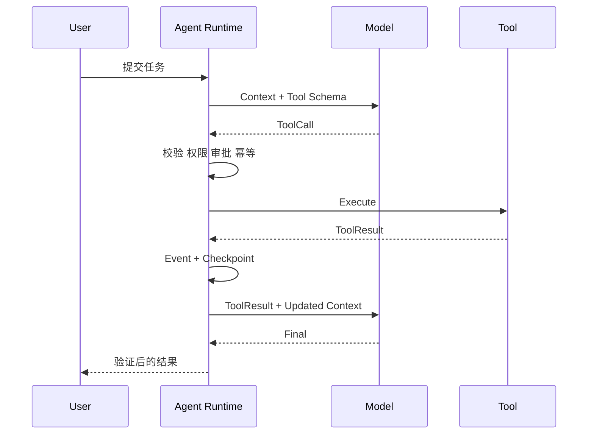

# 手写 Function Calling 完整链路

- ID：Q054
- 难度：进阶 / 手撕设计
- 标签：Function Calling、Tool Calling、Schema、Runtime、幂等、权限

## 同义问法

- Function Calling 的底层流程是什么？
- 模型是怎么“调用”函数的？
- 不依赖框架，如何实现工具调用闭环？
- 如何设计一个支持多工具、参数校验和错误恢复的 Tool Runtime？

## 面试官真正考察什么

这道题不是考会不会写 JSON Schema，而是看你是否理解：

1. 模型并不真正执行函数，只生成结构化调用意图；
2. Runtime 如何把概率输出转成受控执行；
3. 参数错误、工具不存在、权限不足、超时和副作用如何处理；
4. 工具结果如何回填，进入下一轮决策；
5. 哪些能力应由代码保证，不能只写在 Prompt 中。

## 一句话结论

**Function Calling 是模型生成“动作提案”的协议，Tool Runtime 才是动作的执行者和安全边界。完整链路是：工具发现 → Schema 注入 → 模型决策 → 解析校验 → 鉴权审批 → 幂等执行 → 结果标准化 → 回填上下文 → 继续推理。**

<!-- mermaid-diagram:start -->

## 可视化图解



<!-- mermaid-diagram:end -->

## 一、角色边界

```text
LLM
负责：选择工具、生成参数、根据结果继续推理

Runtime
负责：解析、校验、鉴权、执行、超时、重试、审计、状态更新

Tool
负责：完成一个边界清晰的确定性能力

Environment
负责：数据库、文件系统、Git、浏览器、Kubernetes 等真实世界状态
```

核心原则：

> 模型只能提出 `ToolCall`，不能直接接触生产环境。

## 二、最小数据结构

```python
from dataclasses import dataclass
from typing import Any, Literal

@dataclass
class ToolSpec:
    name: str
    description: str
    input_schema: dict[str, Any]
    risk_level: Literal["read", "write", "dangerous"]
    timeout_seconds: int
    idempotent: bool

@dataclass
class ToolCall:
    call_id: str
    tool_name: str
    arguments: dict[str, Any]

@dataclass
class ToolResult:
    call_id: str
    status: Literal[
        "success", "invalid_arguments", "not_found",
        "permission_denied", "timeout", "retryable_error",
        "fatal_error", "pending_approval"
    ]
    output: Any | None
    error_code: str | None
    error_message: str | None
    retryable: bool
```

`call_id` 非常重要。并行执行、重试、恢复和结果回填都依赖它做关联。

## 三、完整状态流转

> 对应流程已改为上方 Mermaid 图解。

## 四、核心伪代码

```python
async def run_tool_loop(state, model, registry, policy):
    while not state.is_terminal():
        context = build_context(state)
        candidates = select_candidate_tools(state, registry)

        decision = await model.generate(
            messages=context,
            tools=[tool_to_schema(t) for t in candidates],
        )

        if decision.final_output is not None:
            if verify_completion(state, decision.final_output):
                state.complete(decision.final_output)
                break
            state.add_feedback("完成条件尚未满足")
            continue

        if not decision.tool_calls:
            state.fail("模型既没有最终输出，也没有工具调用")
            break

        for call in decision.tool_calls:
            result = await dispatch_tool_call(call, state, registry, policy)
            state.append_tool_result(result)

        state.turn += 1
        state.check_budget()

    return state
```

工具调度：

```python
async def dispatch_tool_call(call, state, registry, policy):
    tool = registry.get(call.tool_name)
    if tool is None:
        return ToolResult.not_found(call)

    errors = validate_json_schema(call.arguments, tool.input_schema)
    if errors:
        return ToolResult.invalid_arguments(call, errors)

    auth = policy.authorize(
        user=state.user,
        tool=tool,
        arguments=call.arguments,
        task=state.task,
    )

    if auth.requires_approval:
        state.pause_for_approval(call, auth.reason)
        return ToolResult.pending_approval(call)

    if not auth.allowed:
        return ToolResult.permission_denied(call, auth.reason)

    idempotency_key = make_idempotency_key(
        run_id=state.run_id,
        call_id=call.call_id,
        tool_name=call.tool_name,
        arguments=call.arguments,
    )

    try:
        raw = await execute_with_timeout(
            tool,
            call.arguments,
            timeout=tool.timeout_seconds,
            idempotency_key=idempotency_key,
        )
        return normalize_tool_output(call, raw)
    except TimeoutError:
        return ToolResult.timeout(call, retryable=tool.idempotent)
    except RetryableToolError as e:
        return ToolResult.retryable_error(call, e)
    except Exception as e:
        return ToolResult.fatal_error(call, sanitize(e))
```

## 五、为什么必须做 Schema 校验

模型生成的是概率输出，即使 API 声称支持结构化输出，也不能假设永远正确。

常见问题：

- 缺少必填字段；
- 字段类型错误；
- 枚举值非法；
- 日期、路径、SQL 等格式合法但业务不合法；
- 模型调用了当前上下文中不存在的工具；
- 参数组合违反业务约束。

因此至少有两层校验：


例如 `delete_file(path)` 中，`path` 是字符串只能说明结构合法，还必须校验：

- 是否位于允许目录；
- 是否为符号链接逃逸；
- 用户是否有删除权限；
- 是否需要审批；
- 是否允许递归删除。

## 六、错误应该由谁处理

### 1. 参数错误

把结构化错误返回模型，让其修正参数：

```json
{
  "status": "invalid_arguments",
  "field_errors": {
    "namespace": "required",
    "limit": "must be between 1 and 100"
  }
}
```

### 2. 瞬时错误

网络抖动、限流、临时 5xx 可以由 Runtime 在明确上限内重试。不要每次重试都重新调用 LLM，否则既浪费 Token，又可能改变动作。

### 3. 业务错误

资源不存在、库存不足、权限拒绝等不应盲目重试，应作为观察返回模型，由模型决定替代方案。

### 4. 未知错误

记录完整内部错误，向模型只返回脱敏、稳定的错误码，避免泄露堆栈和密钥。

## 七、副作用、幂等与“幽灵成功”

危险场景：


解决：

- 每次调用有稳定 `idempotency_key`；
- 工具服务端记录执行结果；
- 重试同一 key 返回原结果，而不是再次执行；
- 写操作采用 outbox、事务日志或状态查询确认；
- 无法幂等的操作默认不自动重试。

## 八、并行工具调用

模型一次可以返回多个 `ToolCall`，但“模型认为可并行”不等于业务上真的可并行。

Runtime 需要检查：

- 是否存在参数依赖；
- 是否读写同一资源；
- 是否有顺序要求；
- 工具是否声明并发安全；
- 是否会超出并发、配额或成本预算。

结果必须按 `call_id` 回填，不能依赖完成顺序。

## 九、工具结果如何回填

不要把完整日志、网页或数据库结果原样塞回 Context。

建议工具同时返回：

```json
{
  "summary": "发现 2 个 CrashLoopBackOff Pod",
  "structured": {
    "pods": ["a-123", "a-456"],
    "namespace": "prod"
  },
  "evidence_refs": ["obs://run-1/tool-7/raw.json"],
  "truncated": true
}
```

模型看到摘要与结构化字段，原始证据外置保存，必要时再读取。

## 十、生产级检查清单

- [ ] 工具是否按任务动态筛选，而非全部暴露？
- [ ] Schema 和业务校验是否分层？
- [ ] 权限是否在代码层执行？
- [ ] 写操作是否有审批和幂等键？
- [ ] 超时是否小于整轮 Agent 超时？
- [ ] 重试是否按错误类型而非统一重试？
- [ ] Tool Result 是否结构化、脱敏、可追溯？
- [ ] 是否记录工具版本、输入摘要、输出引用和耗时？
- [ ] 并行调用是否经过依赖与冲突检测？

## 面试口述版

> Function Calling 不是模型真正调用函数，而是模型基于工具 Schema 生成一个结构化动作提案。Runtime 收到后要完成工具解析、JSON Schema 和业务校验、权限判断、必要审批、超时与幂等执行，再把标准化 Tool Result 以 call_id 关联回填模型，进入下一轮决策。生产环境的关键不在于把工具描述写得多漂亮，而在于 Runtime 能否把模型的不确定输出收敛为可验证、可审计、可恢复的执行。参数错误可以回给模型修正，瞬时错误优先由代码重试，业务错误作为观察让模型换策略；有副作用的操作必须有幂等键和审批，不能让模型直接执行。