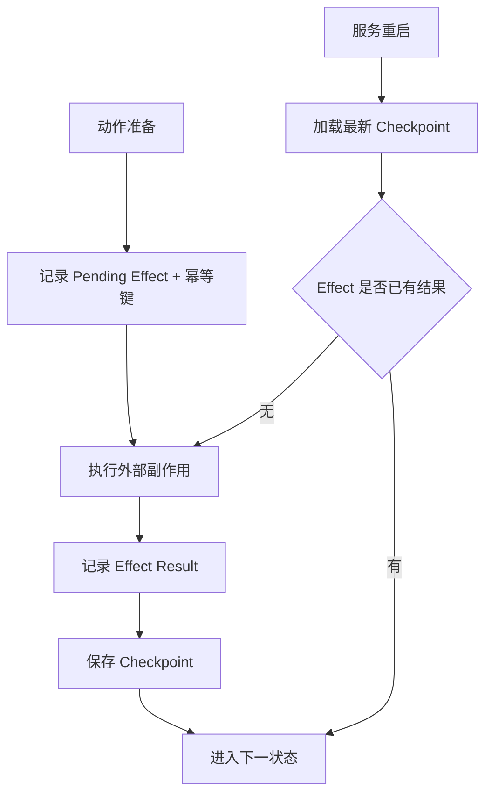

# 设计 Checkpoint、暂停、恢复与幂等

- ID：Q058
- 难度：进阶 / 系统设计 / 手撕设计
- 标签：Checkpoint、Durable Execution、Pause/Resume、Idempotency、Recovery

## 同义问法

- Agent 服务重启后如何继续执行？
- 如何支持人工审批后恢复原任务？
- 工具执行成功但状态没保存怎么办？
- 长任务如何避免重复执行副作用？

## 一句话结论

**Checkpoint 不是简单保存 messages，而是保存一个“可安全恢复的执行边界”：当前状态版本、正在执行的节点、待处理动作、已经发生的副作用、预算和事件位置。恢复时必须先对账，再决定继续、重试或补偿。**

<!-- mermaid-diagram:start -->

## 可视化图解



<!-- mermaid-diagram:end -->

## 一、为什么恢复比保存更难

最危险的故障窗口：

```text
工具实际执行成功
→ 进程在写 Checkpoint 前崩溃
→ 恢复后系统看不到成功记录
→ 再次执行工具
→ 重复发布、重复扣款、重复删除
```

所以“每一步后把 messages 存数据库”并不能保证安全。真正要解决的是：

- 当前运行到了哪里；
- 哪些动作已经执行；
- 外部系统的真实状态是什么；
- 哪些动作可以安全重试；
- 恢复后从哪个节点继续。

## 二、Checkpoint 数据结构

```python
from dataclasses import dataclass
from typing import Any, Literal

@dataclass
class Checkpoint:
    checkpoint_id: str
    run_id: str
    state_version: int
    current_node: str
    status: Literal[
        "running", "waiting_external", "waiting_approval",
        "paused", "completed", "failed"
    ]
    state_snapshot: dict[str, Any]
    last_event_sequence: int
    pending_action: dict[str, Any] | None
    completed_effects: list[dict[str, Any]]
    budget_snapshot: dict[str, Any]
    created_at: int
    schema_version: int
    checksum: str
```

关键字段：

- `state_version`：防止并发覆盖；
- `current_node`：恢复位置；
- `last_event_sequence`：从事件日志继续重放；
- `pending_action`：是否存在尚未确认结果的外部动作；
- `completed_effects`：已确认的副作用；
- `schema_version`：支持状态结构升级；
- `checksum`：检测快照损坏。

## 三、什么时候写 Checkpoint

不是每条日志都需要快照。优先在以下边界持久化：

```text
接收任务后
模型决策后
执行副作用前
工具结果持久化后
进入等待审批前
进入等待外部任务前
计划切换后
任务完成前
```

原则：

> 任何“即将产生副作用”或“即将等待外部事件”的边界，都应该有可恢复状态。

## 四、暂停与恢复状态机

```text
RUNNING
  ├── 等待人工审批 → WAITING_APPROVAL
  ├── 等待长工具   → WAITING_EXTERNAL
  ├── 用户暂停     → PAUSED
  ├── 完成         → COMPLETED
  └── 失败         → FAILED

WAITING_APPROVAL
  ├── approve → READY_TO_RESUME
  ├── reject  → REPLAN / CANCELLED
  └── expire  → FAILED / ESCALATED

WAITING_EXTERNAL
  ├── result received → READY_TO_RESUME
  ├── timeout         → RETRY / FAILED
  └── cancel          → CANCELLED

READY_TO_RESUME
  → RECONCILING
  → RUNNING
```

恢复前增加 `RECONCILING`，不能直接继续。它负责对账：

- 外部动作是否已经成功；
- Checkpoint 是否为最新版本；
- 等待事件是否重复到达；
- 当前代码和工具版本是否兼容旧状态；
- 预算是否仍有效。

## 五、副作用执行记录

```python
@dataclass
class EffectRecord:
    effect_id: str
    run_id: str
    step_id: str
    tool_call_id: str
    idempotency_key: str
    request_hash: str
    status: Literal[
        "prepared", "executing", "succeeded",
        "failed", "unknown", "compensated"
    ]
    external_resource_id: str | None
    result_ref: str | None
    updated_at: int
```

执行过程：

```text
1. PREPARE：先记录动作意图
2. EXECUTE：调用外部工具
3. RECORD：记录结果或 unknown
4. COMMIT：更新 Agent State
```

如果第 2 步完成后崩溃，第 3 步没有写入，恢复时会看到 `prepared/executing`，进入对账，而不是直接重试。

## 六、幂等键

```python
import hashlib
import json

def make_idempotency_key(run_id, step_id, tool_name, arguments):
    normalized = json.dumps(arguments, sort_keys=True, separators=(",", ":"))
    raw = f"{run_id}:{step_id}:{tool_name}:{normalized}"
    return hashlib.sha256(raw.encode()).hexdigest()
```

要求：

- 同一个逻辑动作重试时 key 不变；
- 参数规范化后再计算；
- 工具服务端也要识别该 key；
- key 对应的结果应持久化；
- 无法幂等的动作默认不自动重试。

## 七、恢复算法

```python
async def resume_run(run_id):
    checkpoint = load_latest_checkpoint(run_id)
    verify_checksum(checkpoint)
    migrate_if_needed(checkpoint)

    state = restore_state(checkpoint)
    events = load_events_after(
        run_id,
        sequence=checkpoint.last_event_sequence,
    )
    state = replay_events(state, events)

    if state.pending_action:
        result = await reconcile_pending_action(state.pending_action)

        if result.status == "succeeded":
            state.record_effect(result)
        elif result.status == "not_executed":
            state.mark_safe_to_retry()
        else:
            state.pause("effect_state_unknown")
            return state

    state.status = "running"
    save_checkpoint(state)
    return await runner.continue_from(state.current_node, state)
```

## 八、对账策略

### 1. 外部系统支持幂等查询

通过 `idempotency_key` 查询原请求结果。

### 2. 外部系统返回资源 ID

检查资源是否存在、版本是否匹配。

### 3. 无法查询原动作

状态只能标记为 `unknown`，不能贸然重试。可转人工或执行领域补偿。

### 4. 补偿事务

例如发布流程：

```text
创建 Deployment 成功
→ 更新流量失败
→ 补偿：删除新 Deployment 或回滚流量
```

补偿不是数据库事务的完全替代，而是分布式副作用的显式反向动作。

## 九、重复事件与并发恢复

审批回调、Webhook 和消息队列都可能重复投递。

```python
def handle_event(event):
    if event.event_id in processed_event_ids:
        return "duplicate_ignored"

    with optimistic_lock(event.run_id):
        state = load_state(event.run_id)
        validate_event_for_state(event, state)
        state = apply_event(state, event)
        save_state_and_event_atomically(state, event)
```

同时只能有一个恢复者推进同一 Run。可以使用：

- 数据库乐观锁；
- 租约锁；
- 单分区消息队列；
- Actor 模型。

## 十、Checkpoint 与 Event Log 的关系

```text
Event Log：完整事实，适合审计和重放
Checkpoint：某个时点的加速快照
```

只有事件没有快照，恢复成本可能很高；只有快照没有事件，难以审计和定位故障。常见组合：

```text
周期性 Checkpoint + Append-only Event Log
```

## 十一、生产边界

- Checkpoint 写入必须与关键事件尽量原子化；
- 原始工具证据单独保存，快照只存引用；
- 状态结构升级必须有迁移策略；
- 超长等待任务要设置过期时间；
- 恢复后要重新校验权限，不能沿用已经失效的授权；
- 模型、Prompt 或工具版本变化后，旧任务可能不兼容，需要固定版本或迁移；
- 最终状态必须不可逆，除非显式创建新 Run。

## 面试口述版

> Checkpoint 不是保存一份 messages，而是保存一个可以安全恢复的执行边界，包括状态版本、当前节点、事件位置、待处理动作、已完成副作用和预算。暂停时进入明确状态，如等待审批或等待外部任务；恢复时先进入 reconciliation，对账外部系统真实状态，再决定继续或重试。副作用执行采用先记录意图、再执行、再记录结果、最后提交状态的过程，并为每个逻辑动作生成稳定幂等键。工具成功但状态未落盘时，恢复系统先查询幂等结果或资源状态，无法确认时标记 unknown 并暂停，而不是盲目重试。事件日志用于审计和重放，Checkpoint 用于快速恢复，两者结合才能实现 durable execution。