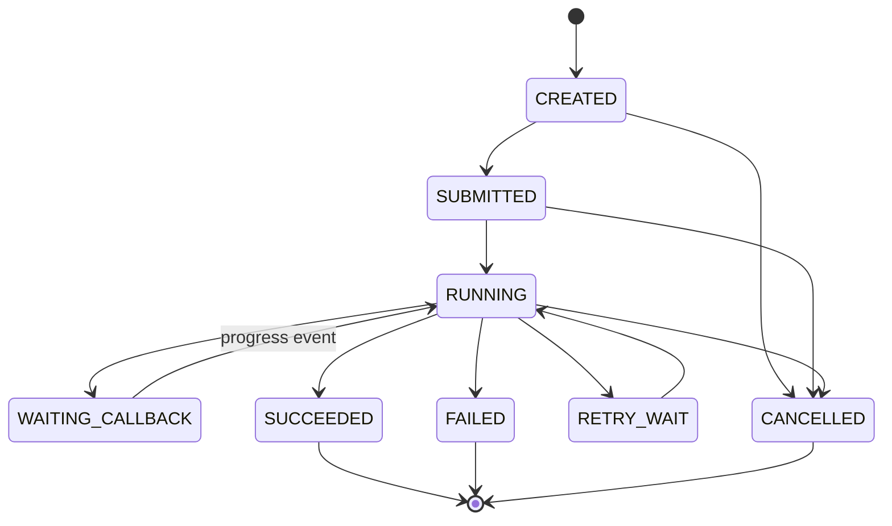

# 设计异步长工具状态机

- ID：Q059
- 难度：进阶 / 系统设计 / 手撕设计
- 标签：Async Tool、Long-running Task、Polling、Webhook、Recovery、Cancellation

## 同义问法

- Agent 调用一个需要几分钟甚至几小时的工具时怎么处理？
- 长工具应该阻塞等待，还是异步回调？
- 如何支持轮询、Webhook、超时、取消和恢复？
- Agent 等待外部任务时还能不能继续做别的事情？

## 一句话结论

**长工具不应该占住一次 LLM 请求或一个同步线程等待完成，而应被建模为有生命周期的外部任务：提交、等待、接收进度、完成、失败、取消、超时。Agent Runtime 保存任务句柄并暂停或并行推进其他无依赖工作。**

<!-- mermaid-diagram:start -->

## 可视化图解



<!-- mermaid-diagram:end -->

## 一、为什么同步等待有问题

如果工具执行需要 10 分钟：

- HTTP 请求可能超时；
- Worker 线程被占用；
- 服务重启后结果丢失；
- 用户无法查看进度或取消；
- Agent 无法执行其他独立步骤；
- 重试容易重复创建外部任务；
- LLM 没必要一直参与等待过程。

## 二、外部任务数据结构

```python
from dataclasses import dataclass
from typing import Any, Literal

@dataclass
class ExternalTask:
    task_id: str
    run_id: str
    step_id: str
    tool_name: str
    external_job_id: str | None
    idempotency_key: str
    status: Literal[
        "created", "submitted", "queued", "running",
        "succeeded", "failed", "cancel_requested",
        "cancelled", "timed_out", "unknown"
    ]
    progress: float | None
    result_ref: str | None
    error: dict[str, Any] | None
    submitted_at: int | None
    deadline_at: int
    last_heartbeat_at: int | None
    version: int
```

## 三、状态机

> 对应流程使用 Mermaid 图解展示。

`UNKNOWN` 很重要：无法确认任务状态时，不应立即当作失败并重新提交。

## 四、提交接口

```python
async def submit_long_tool(call, state, tool):
    key = make_idempotency_key(state.run_id, call.call_id, call.arguments)

    existing = task_store.find_by_idempotency_key(key)
    if existing:
        return existing

    task = ExternalTask(
        task_id=new_id(),
        run_id=state.run_id,
        step_id=state.current_step_id,
        tool_name=call.tool_name,
        external_job_id=None,
        idempotency_key=key,
        status="created",
        progress=None,
        result_ref=None,
        error=None,
        submitted_at=None,
        deadline_at=calculate_deadline(tool),
        last_heartbeat_at=None,
        version=1,
    )
    task_store.save(task)

    response = await tool.submit(
        arguments=call.arguments,
        idempotency_key=key,
        callback_url=build_callback_url(task.task_id),
    )

    task.external_job_id = response.job_id
    task.status = "submitted"
    task.submitted_at = now()
    task_store.save(task)
    return task
```

## 五、三种结果获取方式

### 1. Polling

Runtime 定期查询：

```python
async def poll_task(task):
    status = await tool.get_status(task.external_job_id)
    apply_external_status(task, status)
```

优点：实现简单、客户端可控。缺点：浪费请求、延迟由轮询周期决定。

应使用指数退避并加抖动：


### 2. Webhook / Callback

工具完成后主动通知 Runtime。

必须处理：

- 签名验证；
- 重放攻击；
- 重复事件；
- 乱序事件；
- 回调到达时 Run 已取消；
- 回调失败后的重试。

### 3. Message Queue

工具把状态事件写入队列，Runtime 按 `task_id` 消费。适合内部系统、高并发和可靠投递。

生产中常见组合：

```text
Webhook / MQ 为主
Polling 为兜底对账
```

## 六、Agent 如何等待

不要让 LLM 自己每隔几秒决定“再查一下”。Runtime 应暂停当前依赖分支：


无其他可执行步骤时，整个 Run 进入 `WAITING_EXTERNAL` 并写 Checkpoint。外部事件到达后恢复。

## 七、依赖调度

```python
def get_runnable_steps(plan, external_tasks):
    runnable = []
    for step in plan.steps:
        if step.status != "pending":
            continue
        if all_dependency_succeeded(step, plan, external_tasks):
            runnable.append(step)
    return runnable
```

长工具等待期间，调度器可以推进无依赖步骤，而不是让 Agent 空转。

## 八、取消语义

取消不是把本地状态改成 `cancelled` 就结束。


外部任务可能已经无法取消。此时要：

- 标记“取消未生效”；
- 等待完成后丢弃结果；
- 或执行补偿动作；
- 不能向用户谎称已经停止。

## 九、超时与心跳

区分：

- 提交超时：不知道任务是否创建成功，先按幂等键查询；
- 执行超时：任务超过业务 deadline；
- 心跳超时：任务可能仍在运行，但状态未知；
- 回调超时：可能只是通知丢失，需要轮询对账。

```python
def evaluate_timeout(task):
    if now() > task.deadline_at:
        return "timed_out"
    if task.status == "running" and heartbeat_stale(task):
        return "unknown"
    return None
```

## 十、事件处理与幂等

```python
async def on_task_event(event):
    verify_signature(event)

    if event_store.exists(event.event_id):
        return

    task = task_store.load_for_update(event.task_id)

    if event.sequence <= task.last_sequence:
        return

    validate_transition(task.status, event.status)
    apply_event(task, event)
    save_task_and_event_atomically(task, event)

    if task.status in {"succeeded", "failed", "cancelled", "timed_out"}:
        enqueue_run_resume(task.run_id)
```

## 十一、结果回填

长工具结果通常很大。回填给 Agent 的应该是：

```json
{
  "task_id": "task-1",
  "status": "succeeded",
  "summary": "构建成功，生成镜像 sha256:abc",
  "structured": {
    "image": "repo/app:123",
    "digest": "sha256:abc"
  },
  "artifact_refs": ["artifact://build/task-1/logs"]
}
```

## 十二、典型故障

### 提交接口超时

不能直接再次提交。先用幂等键查询是否已创建。

### 回调重复或乱序

按 `event_id` 去重、按 sequence/version 拒绝旧事件。

### Runtime 重启

扫描 `submitted/running/unknown` 任务并对账，恢复对应 Run。

### Run 已取消但工具成功

结果不再进入正常流程，根据业务选择忽略或补偿。

### 外部任务永久卡住

deadline + 心跳 + 兜底轮询 + 人工介入。

## 面试口述版

> 对分钟级或小时级工具，我不会让一次模型调用或同步请求阻塞等待，而会把它建模为 ExternalTask，状态包括 submitted、running、succeeded、failed、cancelled、timed_out 和 unknown。提交时使用幂等键并保存外部 job_id，结果通过 Webhook 或消息队列接收，Polling 负责兜底对账。当前依赖分支进入 waiting_external 并写 Checkpoint，调度器继续执行其他无依赖步骤。回调要做签名、去重、顺序校验和状态机校验；取消也必须等待外部系统确认。恢复时先对账外部任务真实状态，不能因为本地超时就重复提交。