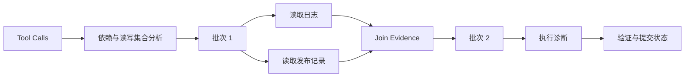

# 设计 Parallel Tool Calling 依赖调度器

- ID：Q060
- 难度：进阶 / 系统设计 / 手撕设计
- 标签：Parallel Tool Calling、DAG、Dependency、Concurrency、Consistency

## 同义问法

- 模型一次返回多个工具调用，怎么判断能不能并行？
- Parallel Tool Calling 如何处理依赖和冲突？
- 如何设计一个工具 DAG 调度器？
- 多个写工具并行时如何保证一致性？

## 一句话结论

**模型给出的并行 Tool Calls 只能视为候选计划。Runtime 必须根据数据依赖、资源冲突、副作用、幂等性和并发预算构建执行 DAG，再由调度器并行执行无依赖且无冲突的节点。**

<!-- mermaid-diagram:start -->

## 可视化图解



<!-- mermaid-diagram:end -->

## 一、为什么不能直接 `gather`

错误示例：

```python
results = await asyncio.gather(
    *[execute(call) for call in model.tool_calls]
)
```

风险：

- 后一个工具依赖前一个工具的输出；
- 两个工具同时修改同一资源；
- 一个删除、一个读取同一文件；
- 并行写导致顺序不可预测；
- 某个失败后其他副作用已经发生；
- 工具服务或租户并发配额被打满；
- 模型生成的调用本身互相矛盾。

## 二、节点数据结构

```python
from dataclasses import dataclass, field
from typing import Any, Literal

@dataclass
class ToolNode:
    node_id: str
    call_id: str
    tool_name: str
    arguments: dict[str, Any]
    dependencies: set[str] = field(default_factory=set)
    read_resources: set[str] = field(default_factory=set)
    write_resources: set[str] = field(default_factory=set)
    risk_level: Literal["read", "write", "dangerous"] = "read"
    idempotent: bool = True
    concurrency_group: str | None = None
    status: Literal[
        "pending", "ready", "running", "succeeded",
        "failed", "blocked", "cancelled"
    ] = "pending"
```

## 三、依赖从哪里来

### 1. 显式引用

模型参数引用前置结果：

```json
{
  "tool": "deploy_image",
  "arguments": {
    "image": "${build_image.output.image}"
  }
}
```

### 2. 工具声明

工具元数据声明：

```json
{
  "name": "restart_service",
  "requires": ["service_exists"],
  "writes": ["service:{namespace}:{name}"]
}
```

### 3. 资源读写集合

- Read–Read：通常可并行；
- Read–Write：可能冲突；
- Write–Write：默认串行或加锁。

### 4. 业务规则

例如“审批通过后才能发布”，即使模型没有声明，也要由 Runtime 添加依赖。

## 四、构建 DAG

```python
def build_execution_graph(calls, registry, policy):
    nodes = [resolve_node(call, registry) for call in calls]

    for node in nodes:
        node.dependencies |= parse_argument_references(node.arguments)
        node.dependencies |= policy.required_predecessors(node)

    for a in nodes:
        for b in nodes:
            if a.node_id == b.node_id:
                continue
            if has_resource_conflict(a, b):
                add_ordering_edge(a, b, policy)

    ensure_acyclic(nodes)
    return nodes
```

资源冲突：

```python
def has_resource_conflict(a, b):
    return bool(
        (a.write_resources & b.write_resources)
        or (a.write_resources & b.read_resources)
        or (a.read_resources & b.write_resources)
    )
```

## 五、如何决定冲突顺序

可依据：

1. 显式业务顺序；
2. 模型原始顺序；
3. 风险优先：先读后写；
4. 资源版本：先验证再修改；
5. 无法安全排序时拒绝并要求重规划。

不要随机选一个顺序，否则同一输入可能产生不同副作用。

## 六、调度算法

```python
async def execute_graph(graph, limits):
    results = {}

    while not graph.is_terminal():
        ready = [
            n for n in graph.nodes
            if n.status == "pending"
            and all(graph.get(d).status == "succeeded" for d in n.dependencies)
            and not conflicts_with_running(n, graph)
        ]

        if not ready and graph.has_pending_nodes():
            mark_blocked_or_deadlocked(graph)
            break

        batch = apply_concurrency_limits(ready, limits)
        for node in batch:
            node.status = "running"

        batch_results = await run_batch(batch)

        for node, result in batch_results:
            results[node.call_id] = result
            node.status = "succeeded" if result.ok else "failed"

            if node.status == "failed":
                handle_downstream_failure(graph, node, result)

    return results
```

## 七、并发限制

至少从四个层面控制：

```text
全局并发
租户并发
工具级并发
资源级并发
```

例如：

```python
limits = {
    "global": 100,
    "tenant": 10,
    "tool:search_logs": 20,
    "tool:deploy": 2,
    "resource:prod-cluster": 1,
}
```

高风险写操作通常不追求并行。

## 八、失败传播策略

### Fail Fast

关键前置失败，取消所有依赖节点。

### Partial Success

独立分支继续执行，最终汇总成功和失败。

### Retry Node

仅对可重试且幂等节点重试，不重新执行整个 DAG。

### Replan

失败改变了原计划假设，交给 Replanner 生成新图。

```python
def handle_downstream_failure(graph, failed, result):
    for node in graph.descendants(failed.node_id):
        if node.requires_success(failed.node_id):
            node.status = "blocked"
```

## 九、并行副作用与补偿

假设两个独立写操作并行：

```text
创建数据库成功
创建服务失败
```

需要事先定义：

- 是否允许部分成功；
- 是否执行补偿删除数据库；
- 是否进入人工处理；
- 补偿失败怎么办。

不能等失败后再让模型临时编造补偿方案。补偿动作应在工具或工作流定义中显式注册。

## 十、结果关联与回填

并行结果完成顺序不固定，必须按 `call_id` 关联：

```python
ordered_results = [
    results[call.call_id]
    for call in original_calls
]
```

回填时同时提供：

- 每个 call 的状态；
- 被阻塞原因；
- 依赖关系；
- 已发生的副作用；
- 是否需要重规划。

## 十一、死锁和环检测

模型可能产生循环依赖：

```text
A 依赖 B
B 依赖 A
```

构图阶段使用拓扑排序检测。运行时如果存在 pending 节点却没有 ready/running 节点，则说明：

- DAG 有环；
- 依赖节点失败但未传播；
- 资源锁死锁；
- 状态丢失。

此时应停止并输出结构化诊断，而不是让 LLM 继续循环。

## 十二、面试口述版

> Parallel Tool Calling 不能直接把模型返回的 calls 全部 asyncio.gather。模型只提供候选并行计划，Runtime 要根据参数引用、工具声明、业务规则和资源读写集合构建 DAG。Read–Read 可以并行，Read–Write 和 Write–Write 默认需要排序或资源锁。调度器每轮选择依赖已成功且与运行节点无冲突的 ready 节点，同时应用全局、租户、工具和资源级并发限制。节点失败后按 fail-fast、partial success、节点重试或 replan 处理；有副作用的并行分支要预先定义补偿策略。所有结果按 call_id 关联，不能依赖完成顺序。