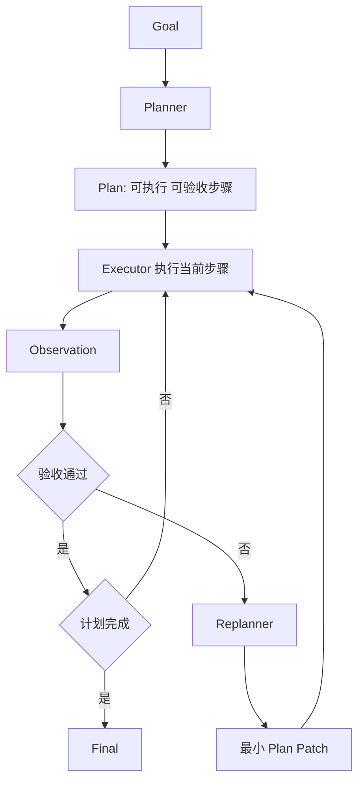

# 设计 Planner–Executor–Replanner

- ID：Q061
- 难度：进阶 / 系统设计 / 手撕设计
- 标签：Planning、Plan-and-Execute、Replanning、DAG、Verification

## 同义问法

- Plan-and-Execute 怎么实现？
- Agent 的计划什么时候需要重做？
- Planner 和 Executor 为什么要分离？
- 如何避免计划过粗、过细或执行过程中不断改计划？

## 一句话结论

**Planner 负责生成可执行、可验收的步骤和依赖；Executor 只执行当前可运行步骤并产出事实；Replanner 根据环境变化和验证结果做最小必要修改。三者通过结构化状态交互，而不是共享一段自由文本。**

<!-- mermaid-diagram:start -->

## 可视化图解



<!-- mermaid-diagram:end -->

## 一、为什么需要分层

单一 ReAct Loop 的问题：

- 每轮只看局部，容易缺少全局结构；
- 长任务中不断重新思考整个目标，成本高；
- 工具结果和计划混在消息里，难以恢复；
- 失败后不清楚是步骤执行失败，还是计划本身错误；
- 无法提前并行无依赖步骤。

Planner–Executor–Replanner 的价值是把：

```text
全局任务结构
与
局部动作执行
与
环境变化后的调整
```

分开处理。

## 二、计划数据结构

```python
from dataclasses import dataclass, field
from typing import Any, Literal

@dataclass
class PlanStep:
    step_id: str
    objective: str
    dependencies: list[str]
    expected_output_schema: dict[str, Any]
    completion_checks: list[dict[str, Any]]
    allowed_tools: list[str]
    risk_level: Literal["read", "write", "dangerous"]
    status: Literal[
        "pending", "ready", "running", "succeeded",
        "failed", "blocked", "skipped"
    ] = "pending"
    attempts: int = 0
    result_refs: list[str] = field(default_factory=list)

@dataclass
class Plan:
    plan_id: str
    version: int
    goal: str
    assumptions: list[str]
    constraints: list[str]
    steps: list[PlanStep]
    acceptance_criteria: list[dict[str, Any]]
    created_by: str
```

关键点：计划步骤不只是自然语言描述，还要包含：

- 依赖关系；
- 允许工具；
- 输出 Schema；
- 完成检查；
- 风险级别；
- 假设和约束。

## 三、Planner 输入与输出

Planner 输入：

```text
用户目标
当前已知事实
硬约束
可用工具能力摘要
预算
历史失败经验
```

Planner 输出必须是结构化计划，而不是长篇思维过程。

```json
{
  "goal": "定位发布失败根因",
  "assumptions": ["日志可访问"],
  "steps": [
    {
      "step_id": "S1",
      "objective": "确定失败阶段",
      "dependencies": [],
      "allowed_tools": ["get_build_summary"],
      "completion_checks": ["stage_identified"]
    },
    {
      "step_id": "S2",
      "objective": "提取首个稳定根因异常",
      "dependencies": ["S1"],
      "allowed_tools": ["search_logs", "read_log_range"],
      "completion_checks": ["root_exception_has_evidence"]
    }
  ]
}
```

## 四、步骤粒度

过粗：

```text
分析整个系统并修复问题
```

无法判断完成，也无法局部重试。

过细：

```text
打开文件
读取第一行
读取第二行
```

导致大量模型调用和状态噪声。

合适粒度满足：

1. 一个步骤有明确目标；
2. 输入输出可结构化；
3. 可以独立验收；
4. 失败后可局部重试；
5. 需要的上下文内聚；
6. 通常能在有限工具调用内完成。

可概括为：

> 以“可验收工作单元”为粒度，而不是以自然语言动作数量为粒度。

## 五、Executor 职责

Executor 不应随意修改全局计划。它负责：

- 获取当前 ready step；
- 构建该步骤所需最小上下文；
- 调用允许的工具；
- 记录观察和证据；
- 执行 completion checks；
- 返回结构化结果或失败分类。

```python
@dataclass
class StepResult:
    step_id: str
    status: Literal["succeeded", "failed", "needs_replan"]
    facts: dict[str, Any]
    artifact_refs: list[str]
    validation: list[dict[str, Any]]
    error_type: str | None
    error_message: str | None
```

执行伪代码：

```python
async def execute_step(state, step, runtime):
    context = build_step_context(state, step)

    result = await runtime.run_agent_loop(
        goal=step.objective,
        allowed_tools=step.allowed_tools,
        context=context,
        local_budget=derive_step_budget(state, step),
    )

    verification = verify_step(step, result)

    if verification.passed:
        return StepResult.succeeded(step, result, verification)

    if verification.recoverable_without_replan:
        return StepResult.failed(step, "execution_error", verification)

    return StepResult.needs_replan(step, verification)
```

## 六、什么时候重规划

不是每次失败都重规划。

### 不需要重规划

- 网络超时；
- 参数格式错误；
- 可重试工具故障；
- 单步内部还有替代工具；
- 验收失败但目标与依赖仍成立。

### 需要重规划

- 关键假设被证伪；
- 依赖资源不存在；
- 权限不允许原路径；
- 新信息改变任务目标；
- 计划存在循环或缺失步骤；
- 当前方案成本超过预算；
- 多次局部重试仍无进展；
- 用户修改约束。

## 七、Replanner 的输入

```python
@dataclass
class ReplanRequest:
    current_plan: Plan
    completed_steps: list[StepResult]
    failed_step: StepResult
    new_facts: dict[str, Any]
    invalidated_assumptions: list[str]
    remaining_budget: dict[str, Any]
```

Replanner 输出不应默认生成全新计划，而应输出 Patch：

```python
@dataclass
class PlanPatch:
    base_plan_version: int
    add_steps: list[PlanStep]
    update_steps: list[dict[str, Any]]
    remove_step_ids: list[str]
    new_assumptions: list[str]
    reason: str
```

这样可以保留已经完成的工作和证据。

## 八、最小变更原则

错误做法：任一失败后让模型“重新规划整个任务”。

风险：

- 已完成步骤被重复执行；
- 计划来回抖动；
- 新计划丢失原约束；
- 追踪和恢复困难；
- Token 成本高。

正确策略：

> 对应流程使用 Mermaid 图解展示。

## 九、重规划抖动控制

```python
@dataclass
class ReplanPolicy:
    max_replans: int
    min_steps_between_replans: int
    repeated_plan_similarity_threshold: float
```

检测：

- 新旧计划结构高度相似却没有新事实；
- A 方案和 B 方案周期切换；
- 连续重规划但验收项没有减少；
- Replanner 重复引入已失败步骤。

触发后可：

- 禁止最近失败策略；
- 升级模型；
- 要求人工决策；
- 终止任务。

## 十、计划验证

计划生成后，Runtime 先做静态验证：

```python
def validate_plan(plan, registry, policy):
    ensure_unique_step_ids(plan)
    ensure_acyclic_dependencies(plan)
    ensure_tools_exist(plan, registry)
    ensure_tools_allowed(plan, policy)
    ensure_all_steps_have_checks(plan)
    ensure_acceptance_criteria_covered(plan)
    ensure_budget_feasible(plan)
```

必要时增加 Critic，但 Critic 只能提供建议，最终规则校验由代码完成。

## 十一、完整调度流程

```python
async def run_plan(state):
    if state.plan is None:
        state.plan = await planner.create_plan(build_planner_input(state))
        validate_plan(state.plan, registry, policy)

    while not goal_verified(state):
        ready_steps = find_ready_steps(state.plan)

        if not ready_steps:
            if has_failed_or_blocked_steps(state.plan):
                patch = await replanner.replan(build_replan_request(state))
                state.plan = apply_plan_patch(state.plan, patch)
                validate_plan(state.plan, registry, policy)
                continue
            raise PlanDeadlock()

        results = await scheduler.execute(ready_steps)
        apply_step_results(state, results)

        if should_replan(state, results):
            patch = await replanner.replan(build_replan_request(state))
            state.plan = apply_plan_patch(state.plan, patch)
            validate_plan(state.plan, registry, policy)

        checkpoint(state)

    return finalize(state)
```

## 十二、面试口述版

> Planner–Executor–Replanner 中，Planner 不是生成一段待办列表，而是生成带依赖、允许工具、输出 Schema、验收条件和假设的结构化计划。Executor 只执行当前 ready step，使用局部上下文和局部预算，并通过代码验收输出。失败先区分执行故障和计划故障，网络超时或参数错误优先局部重试；只有关键假设被证伪、依赖不存在、权限或目标变化时才重规划。Replanner 输出基于版本的 Plan Patch，尽量保留已完成步骤，遵循最小变更原则，并限制重规划次数与计划振荡。Runtime 负责 DAG、权限、预算和验收，不能把所有控制权交给 Planner。