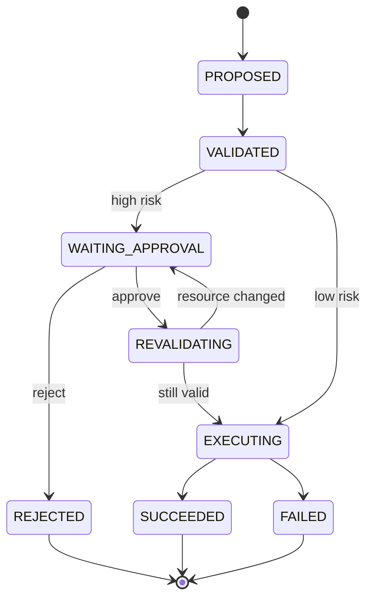

# 设计 Human-in-the-Loop 审批状态机

- ID：Q062
- 难度：进阶 / 系统设计 / 手撕设计
- 标签：Human-in-the-Loop、Approval、Risk Control、Pause/Resume、Authorization

## 同义问法

- Agent 执行危险操作前如何让人确认？
- Human-in-the-Loop 如何设计状态机？
- 审批通过后怎么恢复原任务？
- 如何防止审批内容和实际执行参数不一致？

## 一句话结论

**Human-in-the-Loop 不是在前端弹一个“确认”按钮，而是把高风险动作转化为不可变审批请求，冻结动作参数和风险摘要，暂停 Run；审批结果经过鉴权、版本和过期校验后，Runtime 只执行被批准的那一个动作。**

<!-- mermaid-diagram:start -->

## 可视化图解



<!-- mermaid-diagram:end -->

## 一、哪些场景需要审批

常见触发条件：

- 删除、覆盖、发布、退款、转账等不可逆或高代价操作；
- 修改生产环境；
- 访问敏感数据；
- 工具参数超出常规范围；
- 模型置信度低且错误代价高；
- 策略要求双人复核；
- Agent 需要扩大权限或突破当前边界。

审批粒度应尽量落到具体动作，而不是批准“Agent 接下来随便做”。

## 二、审批请求数据结构

```python
from dataclasses import dataclass
from typing import Any, Literal

@dataclass
class ApprovalRequest:
    approval_id: str
    run_id: str
    step_id: str
    tool_call_id: str
    tool_name: str
    frozen_arguments: dict[str, Any]
    arguments_hash: str
    risk_level: Literal["medium", "high", "critical"]
    risk_summary: str
    expected_effect: str
    evidence_refs: list[str]
    requested_by: str
    required_roles: list[str]
    required_approvals: int
    status: Literal[
        "pending", "approved", "rejected", "expired", "cancelled"
    ]
    created_at: int
    expires_at: int
    policy_version: str
```

审批内容必须包含：

- 将执行什么工具；
- 参数是什么；
- 影响哪些资源；
- 为什么需要；
- 依据和风险；
- 审批有效期；
- 谁可以批准；
- 需要几个人批准。

## 三、状态机

```text
RUNNING
  → RISK_DETECTED
  → APPROVAL_REQUESTED
  → WAITING_APPROVAL
      ├── approved → REVALIDATING
      │                ├── valid → EXECUTING_APPROVED_ACTION
      │                └── stale/changed → APPROVAL_REQUESTED
      ├── rejected → REPLAN / CANCELLED
      ├── expired  → EXPIRED
      └── run cancelled → CANCELLED

EXECUTING_APPROVED_ACTION
  ├── success → RUNNING
  └── failure → ERROR_POLICY / REPLAN
```

审批后增加 `REVALIDATING`，因为等待期间外部状态、权限和任务目标可能变化。

## 四、审批前冻结动作

```python
def create_approval(call, state, policy):
    normalized_args = normalize_arguments(call.arguments)
    args_hash = stable_hash(normalized_args)

    request = ApprovalRequest(
        approval_id=new_id(),
        run_id=state.run_id,
        step_id=state.current_step_id,
        tool_call_id=call.call_id,
        tool_name=call.tool_name,
        frozen_arguments=normalized_args,
        arguments_hash=args_hash,
        risk_level=policy.risk_level(call),
        risk_summary=policy.explain_risk(call, state),
        expected_effect=describe_effect(call),
        evidence_refs=current_evidence_refs(state),
        requested_by="agent-runtime",
        required_roles=policy.required_roles(call),
        required_approvals=policy.required_approvals(call),
        status="pending",
        created_at=now(),
        expires_at=policy.expiry(call),
        policy_version=policy.version,
    )

    save_request_and_pause_run_atomically(request, state)
    return request
```

冻结意味着审批后不能让模型悄悄换参数。如果参数变化，必须重新审批。

## 五、审批结果

```python
@dataclass
class ApprovalDecision:
    decision_id: str
    approval_id: str
    approver_id: str
    approver_roles: list[str]
    decision: Literal["approve", "reject"]
    comment: str | None
    decided_at: int
    request_version: int
    signature: str
```

处理逻辑：

```python
def handle_approval(decision):
    verify_signature(decision)

    request = load_approval_for_update(decision.approval_id)
    if request.status != "pending":
        return "already_decided_or_expired"

    verify_approver_identity(decision)
    verify_required_role(decision, request)
    verify_not_self_approval(decision, request)
    record_decision_idempotently(decision)

    if enough_rejections(request):
        reject_request_and_resume_for_replan(request)
    elif enough_approvals(request):
        approve_request_and_enqueue_resume(request)
```

## 六、审批后重新校验

```python
async def resume_after_approval(request):
    state = load_run(request.run_id)

    if now() > request.expires_at:
        expire(request)
        return

    call = reconstruct_call(request)

    if stable_hash(normalize_arguments(call.arguments)) != request.arguments_hash:
        cancel_as_tampered(request)
        return

    auth = policy.authorize_again(
        user=state.user,
        tool=call.tool_name,
        arguments=call.arguments,
    )
    if not auth.allowed:
        invalidate_approval(request, "permission_changed")
        return

    preconditions = await verify_external_preconditions(call)
    if not preconditions.passed:
        invalidate_approval(request, "external_state_changed")
        enqueue_replan(state.run_id)
        return

    await execute_approved_call(call, request.approval_id)
```

需要重查：

- 当前用户和审批人权限；
- 参数哈希；
- 外部资源版本；
- Run 是否仍有效；
- 策略是否更新；
- 审批是否过期。

## 七、TOCTOU 问题

Time-of-check to time-of-use：审批时看到的资源状态，到执行时可能已经变化。

例如：

```text
审批时：Deployment version=10
等待 20 分钟后：version=12
Agent 仍按 version=10 的计划执行回滚
```

解决：

- 审批请求记录目标资源版本；
- 执行前使用 compare-and-swap；
- 条件不满足则审批失效并重新规划；
- 不允许静默使用新状态继续执行。

## 八、多级审批

高风险场景可能要求：

```text
业务负责人批准
+
运维负责人批准
```

审批规则由 Policy 决定，不应由模型决定。

```python
@dataclass
class ApprovalPolicy:
    required_roles: set[str]
    minimum_distinct_approvers: int
    forbid_requester_approval: bool
    expires_in_seconds: int
```

防止：

- 同一个人重复批准；
- 请求人自批；
- 不具备角色的人批准；
- 过期批准被接受。

## 九、拒绝之后怎么办

拒绝不等于一定结束任务。拒绝结果应作为结构化事实返回：

```json
{
  "approval_status": "rejected",
  "reason": "禁止在高峰期重启生产集群",
  "allowed_alternatives": [
    "只读诊断",
    "生成操作方案",
    "预约维护窗口"
  ]
}
```

Agent 可以：

- 重新规划低风险方案；
- 请求用户补充信息；
- 输出人工执行步骤；
- 终止任务。

不能不断重复申请同一个被拒绝的动作。

## 十、用户体验

审批页面应展示：

- 简洁人类可读说明；
- 精确机器参数；
- 影响范围；
- 风险与回滚方案；
- 证据；
- 过期时间；
- 批准与拒绝后会发生什么。

不要只显示模型生成的长篇解释，也不要只显示难懂 JSON。

## 十一、审计

记录完整链路：

```text
谁提出动作
Runtime 为什么判定需要审批
审批时冻结了什么参数
谁在何时批准/拒绝
执行前重校验结果
实际执行结果
是否发生补偿或回滚
```

审批记录不能被模型修改。

## 十二、面试口述版

> Human-in-the-Loop 应设计成一套审批状态机，而不是一个确认按钮。Runtime 识别高风险工具后，创建不可变 ApprovalRequest，冻结工具名、规范化参数、参数哈希、目标资源版本、风险说明和证据，并将 Run 持久化为 waiting_approval。审批回调要校验身份、角色、去重、有效期和多级审批规则。批准后不能直接执行，还要重新校验参数哈希、权限、策略和外部资源版本，防止 TOCTOU；任何变化都使原审批失效。拒绝结果作为结构化约束交给 Agent 重规划，但不能重复申请同一动作。最终执行的必须是被批准的精确动作，而不是模型之后重新生成的另一个动作。