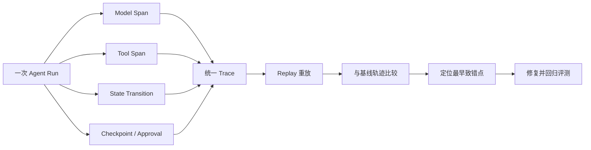

# 设计 Agent Trace、Replay 与故障归因

- ID：Q063
- 难度：进阶 / 系统设计 / 手撕设计
- 标签：Observability、Trace、Replay、Failure Attribution、Evaluation

## 同义问法

- Agent 出错后怎么知道是哪一步的问题？
- 如何设计 Agent 可观测性？
- 如何 Replay 一次 Agent 执行？
- Badcase 如何区分是模型、Prompt、检索、工具还是状态问题？

## 一句话结论

**Agent Trace 不能只记录最终问答，而要记录每次决策所见上下文、模型与配置版本、结构化动作、工具证据、状态变化和验证结果。Replay 的目标不是机械重跑，而是能复现、对比和定位“从哪一步开始偏离”。**

<!-- mermaid-diagram:start -->

## 可视化图解



<!-- mermaid-diagram:end -->

## 一、为什么普通应用日志不够

传统服务通常有：

```text
请求 → 若干函数 → 响应
```

Agent 则是：

```text
Context 选择
→ 模型概率决策
→ 工具执行
→ 外部环境变化
→ 状态更新
→ 再次决策
```

最终结果错误，根因可能在：

- 输入理解；
- Context 缺失或污染；
- 模型选错工具；
- 参数错误；
- 工具返回错误数据；
- 工具结果被错误摘要；
- 状态合并丢失；
- Planner 计划错误；
- 验收器误判；
- 外部环境在过程中变化。

只保存最终输出无法归因。

## 二、Trace 层次

```text
Trace：一次完整 Agent Run
Span：一次模型调用、工具调用、节点执行或验证
Event：Span 内的状态变化和关键事实
Artifact：大日志、文件、Prompt、模型输出等外置证据
```

## 三、核心结构

```python
from dataclasses import dataclass
from typing import Any, Literal

@dataclass
class Trace:
    trace_id: str
    run_id: str
    tenant_id: str
    task_type: str
    started_at: int
    ended_at: int | None
    status: Literal["running", "completed", "failed", "cancelled"]
    root_span_id: str
    model_policy_version: str
    runtime_version: str

@dataclass
class Span:
    span_id: str
    trace_id: str
    parent_span_id: str | None
    kind: Literal[
        "agent_turn", "model_call", "tool_call", "retrieval",
        "planner", "replanner", "approval", "verification",
        "context_build", "state_transition"
    ]
    name: str
    started_at: int
    ended_at: int | None
    status: Literal["ok", "error", "cancelled"]
    attributes: dict[str, Any]
    input_ref: str | None
    output_ref: str | None
    error: dict[str, Any] | None
```

## 四、模型调用应该记录什么

不应只记录 prompt 文本。至少包括：

```json
{
  "provider": "...",
  "model": "...",
  "model_version": "...",
  "temperature": 0,
  "tool_schema_version": "v12",
  "system_prompt_hash": "...",
  "context_manifest_ref": "artifact://trace/context-7.json",
  "input_tokens": 18230,
  "output_tokens": 942,
  "latency_ms": 4210,
  "finish_reason": "tool_calls",
  "decision_type": "tool_calls"
}
```

`context_manifest` 应记录：

- 候选上下文项；
- 最终选中项；
- 被丢弃项；
- 每项来源、Token、相关性和可信度；
- 是否被压缩；
- 工具 Schema 列表。

这样才能判断模型错，是因为能力不够，还是根本没看到关键信息。

## 五、工具 Span

```json
{
  "tool_name": "search_logs",
  "tool_version": "3.2.1",
  "call_id": "call-8",
  "idempotency_key": "...",
  "arguments_hash": "...",
  "risk_level": "read",
  "attempt": 1,
  "timeout_ms": 30000,
  "status": "success",
  "raw_result_ref": "artifact://trace/call-8/raw.json",
  "normalized_result_ref": "artifact://trace/call-8/normalized.json",
  "truncated": true,
  "latency_ms": 830
}
```

原始结果和标准化结果都要保存引用，才能判断是工具错，还是摘要/解析错。

## 六、状态迁移 Span

```json
{
  "from": "running",
  "to": "waiting_approval",
  "state_version_before": 17,
  "state_version_after": 18,
  "patch_ref": "artifact://trace/state-patch-18.json",
  "reason": "dangerous_tool_requires_approval"
}
```

状态变化需要显式原因，不能只存最终快照。

## 七、Trace 和业务证据分离

Trace 中不要直接塞：

- 完整代码仓库；
- 几十 MB 日志；
- 用户敏感数据；
- 密钥；
- 大型 PDF。

Trace 保存元数据和 Artifact 引用。Artifact 层负责：

- 加密；
- 访问控制；
- 脱敏；
- 生命周期；
- Hash 校验；
- 不同租户隔离。

## 八、Replay 类型

### 1. Exact Replay

使用原始模型输出和工具结果，只重放状态机。

用途：

- 验证 Runtime 是否确定；
- 检查 Reducer、状态迁移和恢复逻辑；
- 不依赖模型随机性。

### 2. Model Replay

固定原始 Context 和工具结果，重新调用新模型或新 Prompt。

用途：

- 比较模型版本；
- 评估 Prompt 改动；
- 判断原错误是否来自决策层。

### 3. Tool Replay

固定模型 Tool Call，重新运行工具。

用途：

- 检查工具版本变化；
- 复现参数和外部依赖问题。

有副作用工具必须运行在沙箱或 Mock 环境，不能直接重放生产写操作。

### 4. Counterfactual Replay

替换某一步输出，观察后续是否恢复。

例如：

- 把错误检索结果替换为正确证据；
- 把工具错误参数替换为正确参数；
- 把摘要替换为原始结果。

用于定位“最早致错点”。

## 九、可重现性限制

完整重现模型输出通常做不到，因为：

- 模型服务版本可能变化；
- 即使 temperature=0 也不保证绝对确定；
- 外部环境会变化；
- 搜索结果、数据库和网页会变化；
- 工具版本可能变化。

所以 Replay 需要保存或固定：

- 模型标识和版本；
- Prompt 与 Schema Hash；
- Context Artifact；
- Tool Result Artifact；
- Runtime 版本；
- 时间和环境快照；
- 随机种子（支持时）。

目标通常是“解释性复现”和“对比实验”，不是保证字节级一致。

## 十、故障归因分类

```python
FailureType = Literal[
    "user_input_ambiguous",
    "routing_error",
    "context_missing",
    "context_noise",
    "retrieval_miss",
    "retrieval_wrong_rank",
    "planner_error",
    "tool_selection_error",
    "tool_argument_error",
    "tool_execution_error",
    "tool_result_parse_error",
    "state_update_error",
    "memory_pollution",
    "verification_error",
    "policy_or_permission_error",
    "model_reasoning_error",
    "external_state_changed",
]
```

## 十一、最早致错点

归因时不要只标记最后失败步骤。应寻找：

> 第一个使后续成功概率显著下降、且如果纠正可改变最终结果的步骤。

分析流程：

```text
最终结果错误
→ 验收器是否正确识别？
→ 最终回答是否忠于已有证据？
→ 证据是否完整正确？
→ 工具结果是否正确解析？
→ 工具选择与参数是否正确？
→ Context 是否包含完成决策所需信息？
→ 路由与任务理解是否正确？
```

## 十二、自动归因伪代码

```python
def attribute_failure(trace, expected):
    spans = trace.topological_spans()

    if verification_should_have_failed(trace, expected):
        return "verification_error"

    if final_answer_not_supported(trace):
        return "model_reasoning_error"

    if required_evidence_missing(trace):
        retrieval = inspect_retrieval_spans(trace)
        if retrieval.query_bad:
            return "routing_error"
        if retrieval.candidates_missing:
            return "retrieval_miss"
        if retrieval.relevant_but_dropped:
            return "context_missing"

    for tool_span in trace.tool_spans():
        if tool_span.arguments_invalid:
            return "tool_argument_error"
        if tool_span.raw_correct_but_normalized_wrong:
            return "tool_result_parse_error"
        if tool_span.execution_failed:
            return "tool_execution_error"

    return "needs_human_review"
```

真实系统需要规则、Judge 和人工联合，不应让一个 LLM Judge 单独决定根因。

## 十三、Metrics、Logs、Traces 的关系

```text
Metrics：整体趋势
- 成功率、延迟、Token、工具错误率、循环次数

Logs：离散事件和错误细节
- 状态变化、异常、策略命中

Traces：一次 Run 的因果链
- 谁看到什么、做了什么、为什么失败
```

三者都需要，不能互相替代。

## 十四、隐私与安全

- Prompt 和工具结果默认可能包含敏感数据；
- 记录前做字段级脱敏；
- Trace 查询按租户、用户和角色鉴权；
- 高敏 Artifact 使用短期访问令牌；
- 定义保留周期和删除策略；
- 不记录模型隐藏推理，只记录可观察决策、结构化理由和证据；
- 调试便利不能突破数据合规边界。

## 十五、面试口述版

> Agent 可观测性要以 Trace 为核心，记录每次模型调用实际看到的 Context Manifest、模型与 Prompt 版本、结构化动作、工具原始与标准化结果、状态 Patch 和验收结果。Trace 下分模型、工具、检索、规划、审批和状态迁移等 Span，大结果放 Artifact，只保存引用。Replay 分为固定原输出重放 Runtime、固定上下文比较新模型、工具重放和反事实重放；有副作用的工具只能在沙箱中。故障归因重点找最早致错点，区分上下文缺失、检索、规划、工具选择、参数、工具执行、解析、状态和验收错误。Metrics 看趋势，Logs 看事件，Trace 看因果链，三者结合才能让 badcase 可复现、可归因、可回归。